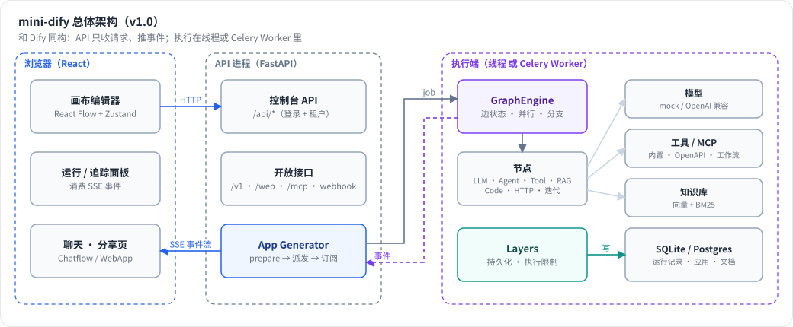

# 第 0 章 本书怎么读

> 本章目标：知道这本书要带你做成什么、按什么顺序读、需要准备什么环境。

## 0.1 我们要造的东西

读完这本书，你会亲手写出一个叫 **mini-dify** 的平台。它能做到：

- 在浏览器里**拖拽节点**编排工作流（LLM、条件分支、代码、HTTP、迭代、Agent、知识检索……），点“运行”后**实时看到每个节点亮起**、LLM 一个字一个字地输出；
- 做**多轮对话**的 Chatflow，带会话记忆；
- 让 **Agent** 自己决定调用哪些工具（内置工具、OpenAPI 自定义工具、别的工作流、MCP Server）；
- 上传文档建**知识库**，做向量 / 全文 / 混合检索，把检索结果喂给 LLM（RAG）；
- 多用户多工作空间、角色权限；把工作流**发布成 API**、**分享链接**、**MCP Server**；用 **Webhook / 定时任务**触发；
- 用 **Docker Compose** 一条命令部署：Postgres + Redis + API + Celery Worker + Scheduler + Nginx。

它的整体结构刻意和 Dify 保持一致，只是每一层都降了一档复杂度：



*图 0-1：mini-dify v1.0 总体架构。API 只收请求、推事件；运行作为 job 交给执行端；事件经队列或 Redis Stream 回来。*

## 0.2 这本书的结构

| Part | 内容 | 读完后 mini-dify 的版本 |
|---|---|---|
| 0 导读 | 本章 | — |
| I 全景（浅） | 第 1–3 章：AI 应用有哪几种形态；Dify 的架构；**一次工作流运行从点击到出结果的完整链路** | 在本机跑起 Dify |
| II 模型层 | 第 4–6 章：模型抽象、提示词与记忆、流式输出协议 | **v0.1** 流式聊天 |
| III 工作流引擎 | 第 7–13 章：DSL、变量池、**图引擎**、节点、迭代、健壮性、持久化 | **v0.2** DAG 引擎 + 控制台 API |
| IV 前端画布 | 第 14–17 章：React Flow、编辑器状态、面板与变量选择、运行调试 | **v0.3** 可视化编排 |
| V Agent | 第 18–21 章：ReAct 与 Function Calling、工具体系、MCP、Agent 节点 | **v0.4** |
| VI RAG | 第 22–23 章：索引管线、检索与融合 | **v0.5** |
| VII 平台化（深） | 第 24–28 章：多租户与开放 API、异步与扩展、插件、安全、触发器与部署 | **v1.0** |
| 附录 | 源码地图、术语表、横向对比、练习答案 | — |

每个 Part 结尾有一个 **Lab**，把这一部分讲的东西串起来动手跑一遍。

**每一章的固定结构**：

1. **问题与概念**：为什么需要它，核心概念是什么，配一张图；
2. **Dify 是怎么做的**：按调用顺序读真实源码，给出 `文件:行号`；
3. **从零实现**：mini-dify 里对应的代码，以及“我们省略了什么、为什么”；
4. **运行与验证**：可以直接复制的命令和预期输出；
5. **练习**：巩固题、扩展题、读源码题各一道（答案在附录 D）。

## 0.3 怎么选读

- **只想搞懂工作流引擎**：第 3 → 7 → 8 → 9 → 10 章，配合 Lab 2。这条线是全书的骨架，★ 最多。
- **前端工程师**：第 3、6 章打底，然后直接读 Part IV（14–17 章）。
- **想做 Agent**：第 4、6 章打底，然后 Part V（18–21 章）。
- **想做 RAG**：第 4 章 + Part VI。
- **要上生产**：Part VII 每章都是独立话题，按需读。

不想读源码分析时，可以跳过每章第 2 节，只看第 1、3、4 节，照样能把 mini-dify 写出来。

## 0.4 环境准备

| 工具 | 版本 | 用途 |
|---|---|---|
| Python | ≥ 3.11 | 后端 |
| [uv](https://docs.astral.sh/uv/) | 最新 | Python 依赖管理（Dify 也用 uv） |
| Node.js | ≥ 20 | 前端 |
| Docker | 带 Compose v2 | 跑 Dify、部署 mini-dify v1.0 |
| 一个 OpenAI 兼容的模型 | 可选 | 不配也行，mock 模型足够把全书跑通 |

**关于模型**：mini-dify 内置一个 `mock/echo` 模型，它会一个字一个字地“流式”回复，能模拟工具调用、ReAct 推理，还能生成哈希向量（用于 RAG）。全书所有 Lab 都能在**没有任何 API Key** 的情况下跑通。想换真实模型时，任何 OpenAI 兼容接口都可以，例如：

```bash
# 本地免费：Ollama
ollama pull qwen2.5:7b
export OPENAI_BASE_URL=http://localhost:11434/v1 OPENAI_API_KEY=ollama
# 然后把节点模型设为 provider=openai, name=qwen2.5:7b
```

## 0.5 配套代码怎么用

配套代码在 `code/mini-dify/`，是一个独立的 git 仓库，每个版本对应一个 tag：

```bash
cd code/mini-dify
git tag                       # v0.1 v0.2 v0.3 v0.4 v0.5 v1.0
git checkout v0.2             # 切到 Part III 结束时的状态
git diff v0.1 v0.2 --stat     # 这一版改了哪些文件
git diff v0.2 v0.3 -- frontend/src/workflow/store.ts   # 看某个文件的演进
```

**强烈建议**：每读完一个 Part，先 `git checkout` 到对应 tag 跑起来，再对照书看代码。`git diff` 相邻两个 tag，比任何讲解都更能说明“这一版加了什么”。

运行方法（任意版本通用）：

```bash
# 后端
cd code/mini-dify/backend && cp .env.example .env && uv sync
uv run uvicorn app.main:app --reload --port 5001
# 前端（另一个终端）
cd code/mini-dify/frontend && npm install && npm run dev   # http://localhost:3000
# 测试
cd code/mini-dify/backend && uv run pytest -q
```

## 0.6 对照阅读 Dify 源码

本书引用的 Dify 版本：`langgenius/dify` main 分支 commit `f3ecedab56`（2026-10）。目录约定：

- `api/...`：Dify 后端（Python, Flask）
- `web/...`：Dify 前端（Next.js / React）
- `graphon/...`：Dify 的**图执行引擎**。它不在 Dify 仓库里，而是一个独立的 PyPI 包 `graphon==0.7.0`（见 `api/pyproject.toml`）。读它的源码：

```bash
pip download graphon==0.7.0 --no-deps -d /tmp/graphon
cd /tmp/graphon && python -m zipfile -e graphon-0.7.0-py3-none-any.whl src
ls src/graphon/graph_engine     # 引擎在这里
```

附录 A 是一张“概念 → 源码位置”的速查表，读源码迷路时去查。

## 0.7 一点心态建议

Dify 的后端有几十万行代码。第一次打开会迷路，这很正常。本书的方法是：**先抓一条主链路**（第 3 章），然后每章只深挖链路上的一个环节，并用不到 Dify 百分之一的代码量把这个环节重写一遍。重写过一遍，再回头看 Dify 的代码，你会发现那些复杂度大多来自生产环境的要求：多租户、兼容旧版、可观测性、性能、各种边界情况。核心思想其实很少，也很漂亮。
