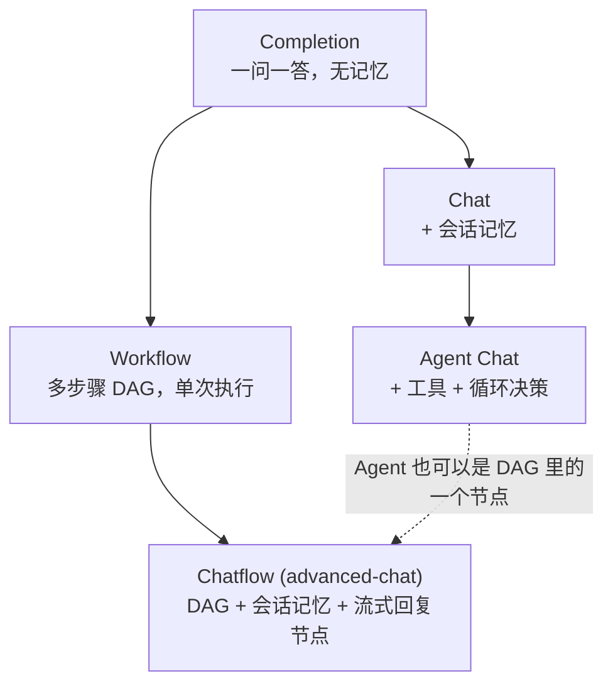
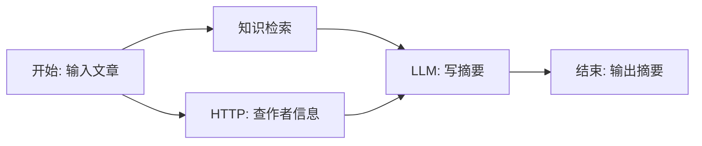

# 第 1 章 LLM 应用的五种形态

> 本章目标：分清 Completion / Chat / Agent / Workflow / Chatflow 五种应用，理解它们为什么最终都收敛成“图”。
> 前置：无。对应代码：Dify `api/core/app/apps/`；mini-dify v0.1–v0.4。

## 1.1 问题：一个“AI 平台”到底在托管什么？

用户在 AI 平台上创建的每一个“应用”，本质上都是一段**围绕 LLM 调用的程序**：

```
输入（用户的问题 / 表单）→ [组装提示词] → LLM → [处理输出] → 输出
```

区别只在于方括号里放了多少逻辑，以及这段程序**有没有状态**（记不记得上一轮对话）。按复杂度从低到高，Dify 把应用分成五种基础形态。看源码里的枚举：

```python
# api/models/model.py:387
class AppMode(StrEnum):
    COMPLETION = "completion"
    WORKFLOW = "workflow"
    CHAT = "chat"
    ADVANCED_CHAT = "advanced-chat"
    AGENT_CHAT = "agent-chat"
    # New Agent App type backed by the Dify Agent runtime ...
    AGENT = "agent"
    CHANNEL = "channel"
    RAG_PIPELINE = "rag-pipeline"
```

前五个是经典形态，也是本书的主线。后三个是较新的扩展：`agent` 由独立的 `dify-agent` 运行时驱动（第 21 章会讲），`rag-pipeline` 用工作流来编排知识库的索引过程，`channel` 用来把应用接入 IM 渠道。

## 1.2 五种形态逐个看



### ① Completion（文本生成）

最简单的形态：一个提示词模板 + 一组表单变量。

```
模板："把下面这段话翻译成{{language}}：{{text}}"
输入：{language: "英文", text: "你好"}
输出：一次 LLM 调用的结果
```

没有记忆，每次调用相互独立。适合翻译、改写、摘要这类“一次性”任务。

### ② Chat（聊天助手）

在 Completion 的基础上加**会话记忆**：每次调用时，把这个会话的历史消息一起发给模型。

```
messages = [system 提示词] + [最近 N 轮历史] + [本次问题]
```

难点不在调用本身，而在**历史怎么取**：模型的上下文窗口有限，历史太长时要截断。截断的方式是丢掉最旧的消息，同时保证不能把一轮问答拆开（第 5 章细讲）。

### ③ Agent Chat（智能体）

在 Chat 的基础上加**工具**和**循环**：模型不直接回答，而是先判断“要不要调用工具、调哪个、参数是什么”。平台执行工具，把结果告诉模型，再让模型决定下一步，直到它给出最终答案。

```
loop:
    model(messages, tools) → 要么 tool_call，要么最终回答
    如果是 tool_call: 执行工具，把结果追加到 messages，继续循环
    如果是最终回答: 结束
```

控制流由**模型**决定，程序只是在执行它的决定。这也是“Agent”和普通程序最本质的区别（第 18 章）。

### ④ Workflow（工作流）

控制流由**人**设计：把任务拆成若干步骤（节点），用连线（边）表示先后顺序和数据流动，组成一个**有向无环图（DAG）**。节点可以是 LLM 调用、代码、HTTP 请求、条件分支、循环、知识检索……



Workflow 每次执行都是**独立的一次运行**（run），有输入、有输出，没有会话。适合批处理、数据加工、自动化流程。

### ⑤ Chatflow（advanced-chat，对话流）

把 Workflow 和 Chat 合在一起：每一轮对话都触发一次工作流运行，而且

- 工作流里可以读取系统变量 `sys.query`（本轮问题）和 `sys.conversation_id`；
- LLM 节点可以打开**记忆**，自动注入会话历史；
- 用**直接回复（Answer）节点**代替结束节点，它的内容会**流式**推给用户，而且可以有多个 Answer 节点、放在不同分支上。

客服机器人、带检索和多步推理的问答助手，大多是 Chatflow。

## 1.3 为什么最后都收敛到“图”

把五种形态并排放在一起，会发现：

| 形态 | 用图来表示 |
|---|---|
| Completion | `开始 → LLM → 结束` |
| Chat | `开始 → LLM(带记忆) → 回复`，每轮运行一次 |
| Agent Chat | `开始 → Agent 节点 → 回复`（Agent 节点内部是循环） |
| Workflow | 任意 DAG |
| Chatflow | 任意 DAG + 记忆 + Answer 节点 |

**图是最通用的那个形态**，前三种都只是图的特例。所以 Dify 的演进方向就是：**把引擎做成通用的图执行引擎**，其他形态要么直接用图实现，要么在产品层保留简单的配置界面，底层仍然复用同一套组件（模型调用、记忆、工具）。

Dify 甚至提供了“把旧的 Chat 应用转换成工作流”的接口：

```python
# api/controllers/console/app/workflow.py:1429
@console_ns.route("/apps/<uuid:app_id>/convert-to-workflow")
```

**mini-dify 的取舍**：只实现两类。一类是简单的 Chat / Agent Chat，在 v0.1 和 v0.4 的“聊天 Playground”里，让你看清最朴素的实现；另一类是 Workflow / Chatflow 这两种图应用，从 v0.2 开始实现，它们是全书的主体。Completion 不单独实现，它只是“没有记忆的 Chat”。

## 1.4 Dify 是怎么做的：每种形态一个 Generator

打开 `api/core/app/apps/`：

```
api/core/app/apps/
├── completion/        # ① Completion
├── chat/              # ② Chat
├── agent_chat/        # ③ Agent Chat
├── workflow/          # ④ Workflow
├── advanced_chat/     # ⑤ Chatflow
├── agent_app/         # 新 Agent 应用
├── pipeline/          # RAG Pipeline
├── base_app_generator.py
├── base_app_queue_manager.py
├── base_app_runner.py
├── message_based_app_generator.py
└── workflow_app_runner.py
```

每个目录的结构几乎一样，以 `workflow/` 为例：

| 文件 | 作用 |
|---|---|
| `app_config_manager.py` | 把数据库里的配置读成内存对象 |
| `app_generator.py` | **入口**：准备运行环境，开工作线程，返回事件流 |
| `app_runner.py` | 在工作线程里**真正执行**（调用图引擎） |
| `app_queue_manager.py` | 工作线程与 HTTP 线程之间的**队列** |
| `generate_task_pipeline.py` | 把内部事件**转换成 SSE 事件**、落库 |
| `generate_response_converter.py` | 区分流式 / 阻塞两种响应格式 |

所有请求都从一个统一的分发入口进来，按应用类型选对应的 Generator：

```python
# api/services/app_generate_service.py:189 起（节选）
match app_model.mode:
    case AppMode.COMPLETION:
        ...CompletionAppGenerator().generate(...)
    case AppMode.AGENT_CHAT:
        ...AgentChatAppGenerator().generate(...)
    case AppMode.CHAT:
        ...ChatAppGenerator().generate(...)
    case AppMode.ADVANCED_CHAT:
        ...AdvancedChatAppGenerator().generate(...)
    case AppMode.WORKFLOW:
        ...WorkflowAppGenerator().generate(...)
```

> **读源码小技巧**：`message_based_app_generator.py` 是 Completion / Chat / Agent Chat 的公共父类，“基于消息”的意思是每次调用都会在 `messages` 表里写一条记录。Workflow 不写消息，只写 `workflow_runs`；Chatflow 两种都写。从这个区别也能看出各形态的本质：**有没有会话**。

## 1.5 从零实现：mini-dify 里的对应关系

| 形态 | mini-dify 入口 | 版本 |
|---|---|---|
| Chat | `POST /api/chat-messages`，`backend/app/api/chat.py` | v0.1 |
| Agent Chat | 同上，请求里带 `tools` 就切到 Agent 模式 | v0.4 |
| Workflow | `App.mode = "workflow"`，`POST /api/apps/{id}/workflows/draft/run` | v0.2 |
| Chatflow | `App.mode = "advanced-chat"`，同一个运行接口，带 `query` 和 `conversation_id` | v0.2 |

两种图应用共用同一个引擎，区别只有三点：

1. Workflow 用 **End** 节点汇总输出，Chatflow 用 **Answer** 节点流式回复（`validate_graph` 会检查）；
2. Chatflow 每次运行前会加载会话历史，放进 `RunContext.history`，供开启了记忆的 LLM 节点使用；
3. 事件协议不同：Workflow 推送 `text_chunk`，Chatflow 推送 `message` 和 `message_end`（和 Dify 完全一致，第 6 章讲）。

## 1.6 运行与验证

先不写代码，跑一下最终版感受五种形态（任何版本 ≥ v0.4 都可以）：

```bash
cd code/mini-dify && git checkout v1.0
# 按第 0 章的方法启动前后端，浏览器打开 http://localhost:3000 注册账号
```

1. **Chat**：顶栏“聊天 Playground”，发两句话，第二句的回复会提到“第 2 轮对话”（mock 模型会数用户轮数，以此证明记忆生效）；
2. **Agent Chat**：同一页左侧勾选“计算器”，问“帮我算 (12+8)*3”，能看到 🔧 calculator 的调用过程；
3. **Workflow**：工作室 → 创建 Workflow → 运行；
4. **Chatflow**：创建 Chatflow → 预览，连续对话。

## 1.7 练习

1. **巩固**：用自己的话写出 Chat 和 Chatflow 的三个区别。
2. **扩展**：在 mini-dify 里，只用 `开始 → LLM → 结束` 三个节点、不开记忆，实现一个“Completion 翻译应用”（输入 text、language 两个字段）。
3. **读源码**：打开 Dify 的 `api/core/app/apps/message_based_app_generator.py`，找到写入 `Message` 记录的地方，说说为什么 Workflow 应用的 Generator 不继承它。

## 1.8 延伸阅读

- Dify 文档“应用类型”章节：<https://docs.dify.ai/>
- `api/core/app/apps/advanced_chat/app_generator.py`：对比它和 `workflow/app_generator.py`，看 Chatflow 比 Workflow 多做了什么（会话、消息记录）。
