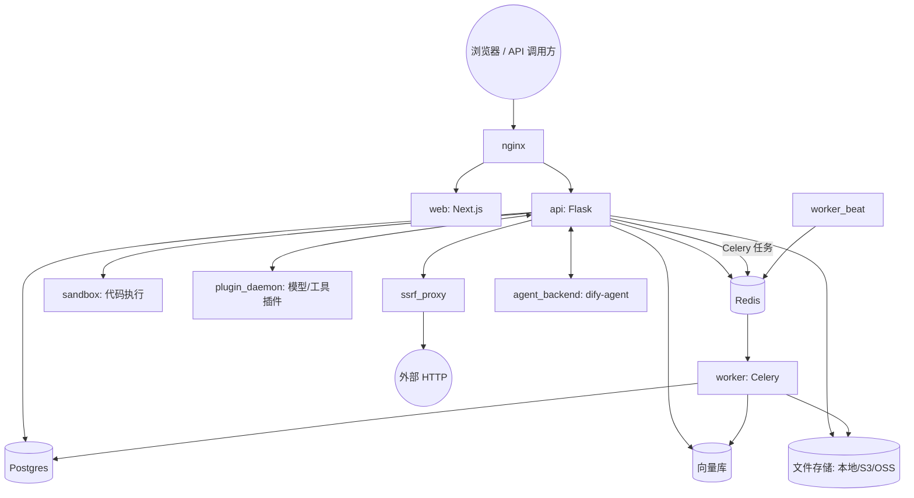

# 第 2 章 Dify 架构鸟瞰

> 本章目标：知道 Dify 由哪些进程和服务组成、后端代码怎么分层、前端代码在哪；在本机把 Dify 跑起来。
> 前置：第 1 章。对应代码：Dify `docker/`、`api/`、`web/`。

## 2.1 先看部署：Dify 由哪些服务组成

理解一个平台，最快的入口是它的 `docker-compose`。打开 `docker/docker-compose.yaml`，核心服务如下（行号为该文件中的位置）：

| 服务 | 行号 | 是什么 | mini-dify 对应 |
|---|---|---|---|
| `api` | 227 | Flask 后端，提供控制台 API / Service API / Web API | `api`（FastAPI） |
| `worker` | 306 | Celery Worker：文档索引、异步工作流、邮件、追踪上报…… | `worker`（Celery） |
| `worker_beat` | 353 | Celery Beat：定时任务调度 | `scheduler` |
| `web` | 387 | Next.js 前端 | `web`（Vite 构建 + nginx） |
| `db_postgres` / `db_mysql` | 425 / 462 | 业务数据库 | `db`（Postgres） |
| `redis` | 492 | 缓存、Celery Broker、分布式锁、跨进程事件 | `redis` |
| `sandbox` | 510 | 代码执行沙箱（`dify-sandbox`，seccomp 隔离） | 子进程 + rlimit（第 27 章） |
| `plugin_daemon` | 573 | 插件守护进程：独立运行所有插件（模型、工具……） | 进程内插件加载器（第 26 章） |
| `agent_backend` | 660 | 新一代 Agent 运行时（`dify-agent`） | 第 21 章介绍 |
| `ssrf_proxy` | 727 | Squid 代理，拦截对内网地址的请求 | 进程内 SSRF 检查（第 27 章） |
| `nginx` | 772 | 统一入口，反向代理 api / web | `web` 里的 nginx |
| `weaviate` / `qdrant` / `pgvector` / `milvus` … | 817 起 | 向量数据库，二选一 | SQLite/Postgres 存向量 + numpy（第 23 章） |

画成图：



从这张图可以读出几个架构决策：

1. **API 无状态、可水平扩展**：会话、任务状态都在 Postgres / Redis 里，任何一个 API 实例都能处理任何请求。
2. **重活交给 Worker**：文档索引动辄几分钟，绝不能占着 HTTP 请求。
3. **不受信的代码隔离运行**：用户写的 Python、第三方插件、用户配置的 HTTP 请求，都跑在单独的进程或服务里。
4. **向量库可插拔**：Dify 支持近 30 种向量库，通过工厂模式切换（`api/core/rag/datasource/vdb/vector_factory.py`）。

## 2.2 后端代码分层

`api/` 的顶层目录：

```
api/
├── app.py / app_factory.py   # 创建 Flask 应用，初始化扩展
├── configs/                  # 配置（pydantic-settings），通过 dify_config 读取
├── controllers/              # ① HTTP 层：路由、参数解析、序列化
│   ├── console/              #    控制台（编辑器、设置）用的 API
│   ├── service_api/          #    对外开放的 API（/v1，用 App Key 鉴权）
│   ├── web/                  #    分享出去的 WebApp 用的 API
│   ├── mcp/                  #    把应用暴露成 MCP Server
│   ├── trigger/              #    Webhook 等触发器入口
│   └── inner_api/            #    给 plugin_daemon 等内部服务回调
├── services/                 # ② 业务编排：一个用例一个函数
├── core/                     # ③ 领域核心：应用生成、工作流、Agent、RAG、工具、模型……
├── models/                   # ④ SQLAlchemy 模型（表结构）
├── repositories/             #    数据访问抽象（可切换存储后端）
├── tasks/                    #    Celery 任务
├── extensions/               #    基础设施初始化：db、redis、celery、storage、otel……
├── libs/                     #    与业务无关的工具函数
└── migrations/               #    Alembic 数据库迁移
```

调用方向是**单向**的：

```
controllers  →  services  →  core  →  models / repositories / extensions
（解析请求）     （编排用例）    （领域逻辑）     （存储与基础设施）
```

Dify 在 `api/AGENTS.md` 里把这条规则写成了明确的约定（节选）：

> Keep transport parsing and serialization in controllers, orchestration in services, and domain policy in its domain owner. ... Keep `libs/` business-agnostic ...
> Scope tenant-owned reads and writes by the complete owner chain, and propagate `tenant_id` across every affected layer.
> Keep write transactions explicit and bounded. Do not perform external I/O inside an open transaction ...
> route outbound HTTP through the existing SSRF-safe owner in `core.helper.ssrf_proxy`.

这几条在本书后面都会遇到，而且 mini-dify 会**亲身踩到其中两条的坑**：第 28 章的定时器因为在事务里发起了另一次写操作而锁库（违反了“不要在开着的事务里做外部 I/O”）；第 24 章所有查询都必须带上 `tenant_id`。

> 注：`api/AGENTS.md` 还提到 `core/` 正在被逐步拆分，新代码不再放进 `core/`。本书引用的大多数核心逻辑目前仍在 `core/` 下，读源码时以本书给出的路径为准。

### 一个请求在分层中的样子

以“运行草稿工作流”为例：

| 层 | 文件 | 做什么 |
|---|---|---|
| controller | `api/controllers/console/app/workflow.py:1149` `DraftWorkflowRunApi.post` | 解析请求体、校验登录和权限、调用 service，把结果包成 HTTP 响应 |
| service | `api/services/app_generate_service.py:101` `AppGenerateService.generate` | 限流、按应用类型选 Generator |
| core | `api/core/app/apps/workflow/app_generator.py` → `app_runner.py` → `core/workflow/workflow_entry.py` | 准备变量池、构建图、跑引擎、转换事件 |
| models | `api/models/workflow.py` `Workflow`、`WorkflowRun`、`WorkflowNodeExecutionModel` | 草稿、运行记录、节点执行记录 |

第 3 章会把这条链路完整走一遍。

## 2.3 前端代码在哪

`web/` 是 Next.js（App Router）项目。和本书相关的目录：

```
web/
├── app/
│   ├── (commonLayout)/        # 控制台页面：应用列表、编辑器、知识库……
│   ├── (shareLayout)/         # 分享出去的 WebApp 页面
│   └── components/
│       ├── workflow/          # ★ 工作流画布编辑器（全书前端部分的主角）
│       │   ├── index.tsx      #   画布入口（基于 reactflow）
│       │   ├── nodes/         #   每种节点：node.tsx（画布上）+ panel.tsx（配置面板）+ default.ts
│       │   ├── store/         #   Zustand 状态
│       │   ├── hooks/         #   交互逻辑：拖拽、连线、同步草稿、运行事件处理……
│       │   └── run/           #   运行面板、追踪
│       ├── workflow-app/      # 工作流应用页的外壳（草稿同步、运行入口）
│       ├── datasets/          # 知识库
│       └── tools/             # 工具管理
└── service/                   # 调用后端的函数，base.ts 里有 ssePost
```

## 2.4 其他重要组成

- **graphon**：图执行引擎，独立的 PyPI 包（`api/pyproject.toml` 第 48 行：`"graphon==0.7.0"`）。把引擎拆成独立包，说明 Dify 把它当作一个**通用组件**：它不知道“应用”“租户”“数据库”这些概念，只负责“给我一张图和一个变量池，我把它跑完并吐出事件”。第 9 章会细读它。
- **dify-agent / agenton**（`dify-agent/`）：新一代 Agent 运行时，用“层（Layer）组合”的方式构建 Agent，作为 `agent_backend` 服务独立部署。第 21 章介绍。
- **dify-agent-runtime**（`dify-agent-runtime/`）：Go 写的 Agent 执行环境组件。
- **cli/**：命令行工具 `difyctl`；**sdks/**：各语言的 Service API SDK；**e2e/**：Cucumber + Playwright 端到端测试。

## 2.5 动手：在本机跑起 Dify

```bash
git clone https://github.com/langgenius/dify.git
cd dify/docker
cp .env.example .env
docker compose up -d
# 等所有容器 healthy 后，打开 http://localhost/install 创建管理员
```

`docker/README.md` 写明需要 Docker Compose v2.24.0 以上。首次启动要拉不少镜像，请耐心等待。

**用 Dify 做一个 3 节点工作流**，后面所有章节都会以它为参照：

1. 设置 → 模型供应商：配置一个模型（OpenAI / DeepSeek / Ollama 都可以）；
2. 工作室 → 创建空白应用 → 选择 **工作流**；
3. 画布上默认已有“开始”节点。在开始节点添加输入字段 `query`（段落）；
4. 点开始节点右侧的 `+`，添加 **LLM** 节点，用户提示词写 `{{#开始.query#}}`（在输入框里键入 `{` 或 `/` 可以弹出变量选择）；
5. 在 LLM 后添加 **结束** 节点，输出变量 `result` 选择 `LLM.text`；
6. 点右上角“运行”，输入一段话，观察：节点依次变绿，结果区的文字逐字出现。

**打开浏览器开发者工具 → Network**，再运行一次，找到 `workflows/draft/run` 这个请求，看它的 Response。你会看到一行行的：

```
data: {"event": "workflow_started", "task_id": "...", "workflow_run_id": "...", "data": {...}}
data: {"event": "node_started", ...}
data: {"event": "text_chunk", ...}
...
data: {"event": "workflow_finished", ...}
```

**这就是第 3 章要追踪的那条链路的出口。** 记住这几个事件名，mini-dify 会原样实现它们。

## 2.6 从零实现：mini-dify 的同构骨架

mini-dify 的目录（v1.0）和 Dify 一一对应：

| Dify | mini-dify | 说明 |
|---|---|---|
| `api/controllers/console/` | `backend/app/api/apps.py`、`datasets.py`、`tools.py`、`auth.py` | 控制台 API |
| `api/controllers/service_api/`、`web/`、`trigger/` | `backend/app/api/service.py` | /v1、WebApp、Webhook |
| `api/controllers/mcp/` | `backend/app/mcp/server.py` | MCP Server |
| `api/services/` | `backend/app/services/` | 草稿/发布、DSL、单步调试 |
| `api/core/app/apps/` | `backend/app/apps/` | Generator、事件转换、持久化 |
| graphon | `backend/app/workflow/` | 图引擎 + 节点 |
| `api/core/agent/`、`core/tools/`、`core/mcp/` | `backend/app/agent/`、`tools/`、`mcp/` | |
| `api/core/rag/` | `backend/app/rag/` | |
| `api/models/` | `backend/app/models.py` | 一个文件放下所有表 |
| `api/tasks/`、`extensions/ext_celery.py` | `backend/app/tasks/` | Celery、事件总线、命令通道 |
| `web/app/components/workflow/` | `frontend/src/workflow/` | 画布编辑器 |

刻意的简化：

- Flask → **FastAPI**：Pydantic 请求模型和依赖注入写起来更短。但我们的 handler 依然是**同步函数**，和 Dify 一样用“工作线程 + 队列”来做流式输出，原理完全相同。
- Next.js → **Vite + React**：画布编辑器是纯客户端组件，不需要服务端渲染。
- Postgres → 开发时用 **SQLite**，部署时用 Postgres（通过 `DATABASE_URL` 切换）。
- 不做数据库迁移，启动时 `create_all()` 建表。

## 2.7 练习

1. **巩固**：画出 Dify 中“用户上传一个 PDF 到知识库”涉及的服务和它们之间的调用（提示：api → redis → worker → 向量库）。
2. **扩展**：在 Dify 的运行请求里找到 `ping` 事件，算算它多久出现一次，猜猜它的作用（第 3 章揭晓）。
3. **读源码**：打开 `api/app_factory.py`，列出 Flask 应用初始化时加载的扩展（`ext_*.py`）及顺序，说说为什么 `ext_database` 要在 `ext_celery` 之前。

## 2.8 延伸阅读

- `docker/README.md`：部署说明、环境变量组织方式（`.env` + `envs/*.env.example`）
- `api/AGENTS.md`：后端分层与编码约定
- `docker/docker-compose.middleware.yaml`：只起中间件（db/redis/向量库），本地开发 Dify 源码时用
