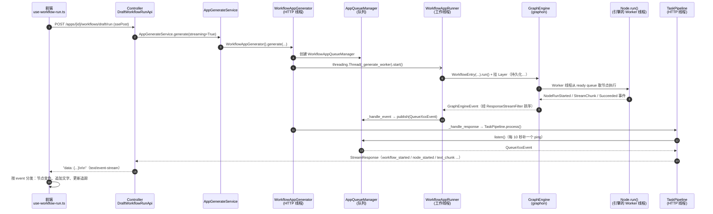
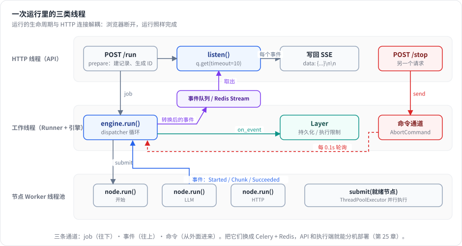

# 第 3 章 一次 Workflow 运行的完整生命周期 ★

> 本章目标：从“点击运行”到“最后一个字出现在屏幕上”，把 Dify 的整条调用链走一遍，画出一张时序图。后面所有章节，都是在拆这张图上的某一段。
> 前置：第 2 章（建议已在本机跑过 Dify 的 3 节点工作流）。

## 3.1 鸟瞰：一张时序图

先把结论放在最前面。下图是一次草稿工作流运行的完整路径，每个方框都标了源码位置：



全链路一共有**三类线程**：

1. **HTTP 线程**：处理请求，最后变成“从队列里取事件、转成 SSE 写回去”；
2. **工作线程**：Generator 新开的一个线程，负责跑图；
3. **引擎的 Worker 线程池**：图引擎内部的线程，负责并行执行节点。

把这三类线程分开，是整个设计的关键：**运行的生命周期不再和 HTTP 连接绑定**。



*图 3-1：三类线程与三条通道：job 往下、事件往上、命令从外面进来。*


下面按编号逐段读源码。

## 3.2 ①：前端发起请求

`web/app/components/workflow-app/hooks/use-workflow-run.ts:188` 定义了 `handleRun`。它先保存草稿，再调用 `ssePost`（第 438 行），并传入一组回调：

```ts
// web/app/components/workflow-app/hooks/use-workflow-run.ts（节选）
ssePost(url, { body: { inputs, ... } }, {
  onWorkflowStarted, onNodeStarted, onNodeFinished,
  onTextChunk, onIterationStart, ..., onWorkflowFinished, onError,
})
```

`ssePost` 在 `web/service/base.ts`，它用 `fetch` 读取响应流，逐行解析 `data: ` 开头的 JSON，按 `event` 字段分发给对应回调（第 433–531 行）：

```ts
// web/service/base.ts:433 起（节选）
if (message.startsWith('data: ')) {
  bufferObj = JSON.parse(message.substring(6))
  ...
  else if (bufferObj.event === 'workflow_started') { onWorkflowStarted?.(bufferObj) }
  else if (bufferObj.event === 'node_started')     { onNodeStarted?.(bufferObj) }
  else if (bufferObj.event === 'text_chunk')       { onTextChunk?.(bufferObj) }
  ...
}
```

> 为什么不用浏览器原生的 `EventSource`？因为它只支持 GET 请求，不能带 JSON 请求体，也不能加自定义的鉴权 header。第 6 章会细讲。

## 3.3 ②③：Controller 和 Service

```python
# api/controllers/console/app/workflow.py:1149
@console_ns.route("/apps/<uuid:app_id>/workflows/draft/run")
class DraftWorkflowRunApi(Resource):
    ...
    def post(self, payload, session, current_user, app_model):     # 1170
        ...
        response = AppGenerateService.generate(                    # 1181
            app_model=app_model, user=current_user, args=args,
            invoke_from=InvokeFrom.DEBUGGER, streaming=True,
        )
        return helper.compact_generate_response(response)          # 1190
```

Controller 只做三件事：校验权限、解析参数、调用 Service，然后用 `compact_generate_response` 把结果包成 HTTP 响应。这个函数会区分两种情况：结果是 dict 就返回 JSON；结果是生成器就返回 `text/event-stream` 流（`api/libs/helper.py:416`）。

`AppGenerateService.generate`（`api/services/app_generate_service.py:101`）负责限流（防止一个租户同时跑太多任务），然后按应用类型分发（第 303 行 `case AppMode.WORKFLOW:`），交给 `WorkflowAppGenerator`。

## 3.4 ④⑤：Generator 开线程

这是整条链路上最重要的一段胶水代码：

```python
# api/core/app/apps/workflow/app_generator.py（_generate 方法，第 319 行起）
queue_manager = WorkflowAppQueueManager(task_id=..., user_id=..., ...)   # 357

context = contextvars.copy_context()
db.session.close()   # 释放数据库连接：接下来的线程可能运行很久

worker_thread = threading.Thread(                                         # 381
    target=self._generate_worker,
    kwargs={"flask_app": current_app._get_current_object(),
            "application_generate_entity": ..., "queue_manager": queue_manager,
            "context": context, ...},
)
worker_thread.start()                                                     # 398

response = self._handle_response(..., queue_manager=queue_manager, stream=streaming)   # 407
```

几个值得注意的细节：

- `contextvars.copy_context()` 加上 `preserve_flask_contexts`：把请求上下文复制给新线程，否则线程里拿不到 `current_app`、当前用户等信息；
- `db.session.close()`：HTTP 线程接下来只是从队列读事件，**不需要占着数据库连接**。否则运行一个 10 分钟的工作流，就会占用一个连接 10 分钟，连接池很快耗尽；
- `_handle_response` 在 HTTP 线程里执行，它创建 `WorkflowAppGenerateTaskPipeline`（第 729 行），然后返回一个**生成器**。HTTP 框架每迭代一次，就往响应里写一段。

工作线程的入口 `_generate_worker`（第 614 行）：重新查出 Workflow，构建 `WorkflowAppRunner`，调用 `runner.run()`（第 686 行）。所有异常都通过 `queue_manager.publish_error(...)` 送回 HTTP 线程，最终变成前端收到的 `error` 事件。

## 3.5 ⑥：Runner 组装运行环境

```python
# api/core/app/apps/workflow/app_runner.py:81  WorkflowAppRunner.run（节选）
variable_pool = VariablePool(...)                # 系统变量、用户输入、环境变量
graph = self._init_graph(graph_config=..., ...)  # 把 JSON 图构建成运行时 Graph
workflow_entry = WorkflowEntry(                  # 183
    graph=graph, graph_runtime_state=..., command_channel=..., ...
)
workflow_entry.graph_engine.layer(persistence_layer)        # 212 写 workflow_runs / node_executions
for layer in self._graph_engine_layers:
    workflow_entry.graph_engine.layer(layer)                # 227
generator = workflow_entry.run()
for event in generator:                                     # 231
    self._handle_event(workflow_entry, event)               # 232
```

三个要点：

1. **变量池**（VariablePool）是这次运行的“共享内存”：所有节点都从这里读输入、往这里写输出（第 8 章）。
2. **Layer** 是挂在引擎上的观察者：持久化、执行限制、可观测性都以 Layer 的形式挂上去。引擎本身完全不知道数据库的存在（第 13 章）。
3. Runner 拿到的是**引擎事件流**，`_handle_event`（`api/core/app/apps/workflow_app_runner.py:467`）把每个引擎事件翻译成**队列事件**发布出去。例如：

```python
# api/core/app/apps/workflow_app_runner.py:657
case NodeRunStreamChunkEvent():
    self._publish_event(
        QueueTextChunkEvent(text=event.chunk, from_variable_selector=list(event.selector), ...)
    )
```

`WorkflowEntry.run()`（`api/core/workflow/workflow_entry.py:187`）并不是直接把引擎事件往外送，而是先经过 `iter_dify_graph_engine_events`（第 56 行）套上一层**过滤器**，其中最关键的是 `ResponseStreamFilter`。它保证多个 LLM 的输出按“回复模板里的顺序”流式输出，不会交错（第 10 章，mini-dify 的 `response.py`）。

## 3.6 ⑦⑧：图引擎跑节点

`WorkflowEntry` 内部创建了 graphon 的 `GraphEngine`（`workflow_entry.py:152`）。引擎的 `run()`（`graphon/graph_engine/graph_engine.py:222`）做的事情可以概括成：

```
发出 GraphRunStartedEvent
启动 WorkerPool（若干个 Worker 线程，从 ready queue 取节点来跑）
把根节点（开始节点）放进 ready queue
启动 Dispatcher 线程：不断从事件队列取事件 → 处理（存输出、决定下游哪些节点就绪）→ 收集
把收集到的事件 yield 给调用方
发出 GraphRunSucceeded / Failed / Aborted 事件
```

每个节点由 Worker 线程调用 `Node.run()`（`graphon/nodes/base/node.py:634`），它也是一个生成器：先产生 `NodeRunStartedEvent`，然后是节点自己的事件（比如 LLM 的流式片段），最后是 `NodeRunSucceededEvent` 或 `NodeRunFailedEvent`。

第 9 章会把这个引擎从头到尾拆开，并用约 300 行代码重写。这里只需要记住一点：**引擎唯一的输出就是一串事件**。

## 3.7 ⑨–⑬：从队列到 SSE

回到 HTTP 线程。`WorkflowAppGenerateTaskPipeline._process_stream_response`（`generate_task_pipeline.py:709`）循环读取队列：

```python
for queue_message in self._base_task_pipeline.queue_manager.listen():   # 718
    event = queue_message.event
    # 按事件类型分发给 _handle_xxx_event，每个返回若干 StreamResponse
```

`listen()` 在 `api/core/app/apps/base_app_queue_manager.py:76`：

```python
while True:
    try:
        message = self._q.get(timeout=1)
        if message is None:
            break
        yield message
    except queue.Empty:
        continue
    finally:
        ...
        if elapsed_time // 10 > last_ping_time:                    # 104
            self.publish(QueuePingEvent(), PublishFrom.TASK_PIPELINE)
```

**每 10 秒补发一个 ping**。原因是：如果某个节点要跑一分钟（比如一个很慢的 HTTP 请求），这一分钟里连接上没有任何数据，nginx、负载均衡、浏览器都可能认为连接已经断了而主动关闭。ping 就是心跳（回答了第 2 章练习 2）。

各个 handler 把队列事件转换成对外的 `StreamResponse`，例如：

| 队列事件 | handler（generate_task_pipeline.py） | SSE 事件 |
|---|---|---|
| `QueueWorkflowStartedEvent` | `_handle_workflow_started_event`（333） | `workflow_started` |
| `QueueNodeStartedEvent` | `_handle_node_started_event`（366） | `node_started` |
| `QueueNodeSucceededEvent` | `_handle_node_succeeded_event`（380） | `node_finished` |
| `QueueTextChunkEvent` | `_handle_text_chunk_event`（570） | `text_chunk` |
| `QueueWorkflowSucceededEvent` | `_handle_workflow_succeeded_event`（485） | `workflow_finished` |
| `QueuePingEvent` | `_handle_ping_event`（324） | `ping` |

事件名的完整定义在 `api/core/app/entities/task_entities.py:62` `class StreamEvent`。

最后由 `BaseAppGenerator.convert_to_event_stream`（`api/core/app/apps/base_app_generator.py:313`）把每个响应序列化成 SSE 格式：

```python
for message in generator:
    if isinstance(message, Mapping | dict):
        yield f"data: {orjson_dumps(message)}\n\n"
    else:
        yield f"event: {message}\n\n"        # ping 走这里
```

## 3.8 ⑭：前端更新画布

前端每收到一个事件，就交给 `web/app/components/workflow/hooks/use-workflow-run-event/` 下对应的 hook 处理。以 `use-workflow-node-started.ts` 为例：

1. 在 `workflowRunningData.tracing` 里追加一条，状态为 Running（运行面板的追踪列表）；
2. 把视口平移，让正在运行的节点居中；
3. 把这个节点的 `data._runningStatus` 设成 Running，节点边框变成蓝色；
4. 把指向这个节点的入边也标记为运行中。

`node_finished` 再把状态改成 succeeded 或 failed（变绿或变红），`text_chunk` 把文字追加到结果区。

## 3.9 停止：反方向的那条路

用户点击“停止”时，请求打到另一个接口：

```python
# api/controllers/console/app/workflow.py:1195
@console_ns.route("/apps/<uuid:app_id>/workflow-runs/tasks/<string:task_id>/stop")
```

这个请求可能被**另一个** API 实例处理，所以它不能直接拿到运行中的引擎对象。Dify 的做法是：

- 在 Redis 里设置一个停止标记（`AppQueueManager.set_stop_flag`，`base_app_queue_manager.py:189`），`listen()` 循环会检查它；
- 通过**命令通道**给引擎发 `AbortCommand`（`api/core/app/apps/workflow/command_channels.py`，底层是 graphon 的 `RedisChannel`）。引擎的 Dispatcher 在处理事件的间隙轮询命令通道（`graphon/graph_engine/orchestration/dispatcher.py` 的 `_process_commands`）。

“事件往外流、命令往里流”，两个方向都是**消息**，而不是直接调用对象的方法。这个设计让 API 和执行端可以部署在不同机器上（第 25 章）。

## 3.10 从零实现：mini-dify 的同一条链路

mini-dify v0.2 用不到 Dify 百分之一的代码量复刻了这条链路，每一段都能对上：

| Dify | mini-dify v0.2 |
|---|---|
| `DraftWorkflowRunApi.post` | `backend/app/api/apps.py` `run_draft` |
| `WorkflowAppGenerator._generate` + `_generate_worker` | `backend/app/apps/generator.py` `generate()` 里的 `worker` 线程 |
| `AppQueueManager.listen`（含 ping） | `generator.py` 里的 `stream()`：`q.get(timeout=10)`，超时就产出 ping |
| `WorkflowAppRunner.run` + `WorkflowEntry` | `generate()` 里构建 `VariablePool`、`RunContext`、`Graph`、`GraphEngine` |
| graphon `GraphEngine` | `backend/app/workflow/engine.py` |
| `ResponseStreamFilter` | `backend/app/workflow/response.py` `ResponseCoordinator` |
| `WorkflowPersistenceLayer` | `backend/app/apps/persistence.py` `PersistenceLayer` |
| `_handle_event` + `GenerateTaskPipeline` | `backend/app/apps/converter.py` `EventConverter`（引擎事件直接转成 SSE 字典，省掉了中间的队列事件这一层） |
| `convert_to_event_stream` + `compact_generate_response` | `backend/app/sse.py` `sse_response` |
| `web/service/base.ts` `ssePost` | `frontend/src/lib/sse.ts` `ssePost` |
| `use-workflow-run-event/*` | `frontend/src/workflow/hooks/useWorkflowRun.ts`（一个 switch 处理所有事件） |
| 停止：Redis 标记 + RedisChannel | v0.2：`TaskRegistry` + `InMemoryChannel`；v1.0：`RedisCommandChannel` |

mini-dify 的 `generate()` 核心只有几十行，第 13 章 Lab 2 会完整讲解。这里先看骨架：

```python
# backend/app/apps/generator.py（v0.2，节选）
def generate(req: GenerateRequest) -> Iterator[dict]:
    ...                                   # 1. 建 run 记录、加载会话历史
    pool = VariablePool(system={...}, environment=...)
    ctx = RunContext(pool=pool, graph_config=config, inputs=req.inputs, ...)
    graph = Graph.build(config, ctx)      # 2. 构建运行时图
    engine = GraphEngine(graph, ctx, command_channel=channel,
                         layers=[PersistenceLayer(run_id), ExecutionLimitsLayer()])
    q = queue.Queue()

    def worker():                         # 3. 工作线程：跑引擎，事件转换后入队
        try:
            for event in engine.run():
                for payload in converter.convert(event, engine=engine):
                    q.put(payload)
        finally:
            q.put(None)

    threading.Thread(target=worker, daemon=True).start()

    def stream():                         # 4. HTTP 线程：从队列取，超时发 ping
        while True:
            try:
                item = q.get(timeout=PING_INTERVAL)
            except queue.Empty:
                yield {"event": "ping"}
                continue
            if item is None:
                return
            yield item
    return stream()
```

## 3.11 运行与验证：亲眼看到这条链路

```bash
cd code/mini-dify && git checkout v0.2
cd backend && uv sync && uv run uvicorn app.main:app --port 5001
```

另开一个终端：

```bash
# 创建一个 workflow 应用（默认图：开始 → LLM → 结束）
APP=$(curl -s -X POST localhost:5001/api/apps -H 'Content-Type: application/json' \
      -d '{"name":"demo"}' | python3 -c 'import sys,json;print(json.load(sys.stdin)["id"])')

# 流式运行，观察 SSE
curl -N -X POST localhost:5001/api/apps/$APP/workflows/draft/run \
     -H 'Content-Type: application/json' -d '{"inputs":{"query":"你好"}}'
```

预期输出（节选）：

```
data: {"event": "workflow_started", "task_id": "...", "workflow_run_id": "...", "data": {...}}
data: {"event": "node_started", ..., "data": {"node_id": "start", "node_type": "start", ...}}
data: {"event": "node_finished", ..., "data": {"node_id": "start", "status": "succeeded", ...}}
data: {"event": "node_started", ..., "data": {"node_id": "llm", ...}}
data: {"event": "text_chunk", ..., "data": {"text": "（", "from_variable_selector": ["llm", "text"]}}
data: {"event": "text_chunk", ..., "data": {"text": "m", ...}}
...
data: {"event": "workflow_finished", ..., "data": {"status": "succeeded", "outputs": {"result": "（mock）我收到了：你好"}, ...}}
```

再查运行记录（PersistenceLayer 写入的）：

```bash
curl -s localhost:5001/api/apps/$APP/workflow-runs | python3 -m json.tool | head -20
```

> v1.0 以后接口需要登录，命令要加 `-H "Authorization: Bearer <token>"`，见第 24 章。

## 3.12 练习

1. **巩固**：不看本章，画出“三类线程”以及它们之间传递的东西（job、事件、命令）。
2. **扩展**：在 mini-dify v0.2 的 `generator.py` 里，把 `PING_INTERVAL` 改成 1 秒，再在 LLM 节点前加一个 `import time; time.sleep(3)` 的代码节点，用 curl 观察 ping 事件。
3. **读源码**：在 Dify 的 `generate_task_pipeline.py` 里找到 `workflow_finished` 之后的收尾逻辑，它除了发送事件还做了哪些落库操作？

## 3.13 延伸阅读

- `api/core/app/apps/advanced_chat/generate_task_pipeline.py`：Chatflow 版本，多了 `message` 和 `message_end` 事件以及消息落库；
- `graphon/graph_engine/filters/response_stream.py`：回复流排序过滤器，第 10 章会用到。
