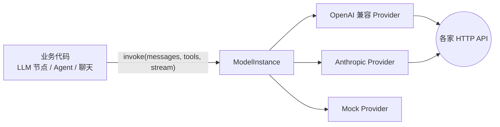
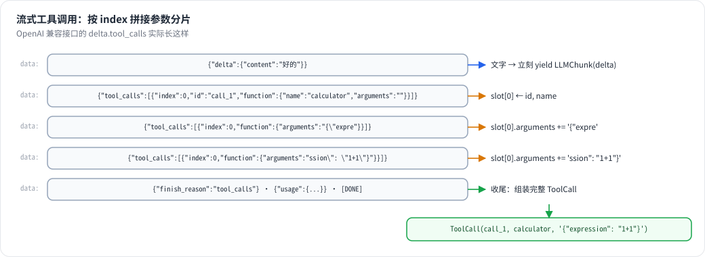

# 第 4 章 模型抽象：Provider / Model / Credential

> 本章目标：设计一个“换模型不改业务代码”的模型调用层；读懂 Dify 的 ModelInstance → Provider → 插件 这条调用路径；从零写出 mini-dify 的 `app/llm/`。
> 前置：第 3 章。对应代码：mini-dify **v0.1** `backend/app/llm/`。

## 4.1 问题：平台为什么需要一层“模型抽象”

各家模型 API 大同小异，但“小异”处处是坑：

| 差异点 | 举例 |
|---|---|
| 请求格式 | OpenAI `messages`；Anthropic 把 `system` 单独放；Gemini 叫 `contents` |
| 流式格式 | 都是 SSE，但 chunk 结构不同；工具调用的参数是**分片**传回来的 |
| 工具调用 | `tool_calls` / `tool_use` / `functionCall`…… |
| 用量统计 | 有的在最后一个 chunk 里，有的要单独开启（`stream_options.include_usage`） |
| 凭证 | API Key、AK/SK、OAuth、自建服务的 base_url…… |

一个平台要同时支持几十家模型供应商，业务代码（LLM 节点、Agent、RAG）**绝不能**直接面对这些差异。于是需要一层抽象：



这层抽象的设计目标：

1. **统一数据结构**：消息、工具定义、流式片段、用量统计，都使用平台自己的类型；
2. **统一调用接口**：一个 `invoke()`，永远返回流（要阻塞结果时自己收集一下即可）；
3. **按名字解析**：业务代码只写 `"openai/gpt-4o-mini"` 这样的字符串，由管理器负责找到 Provider、填上凭证；
4. **可扩展**：新增一家供应商，只需要加一个类（或者一个插件），不改业务代码。

## 4.2 Dify 是怎么做的

### 4.2.1 统一的数据结构：graphon.model_runtime.entities

Dify 的模型数据结构定义在 graphon 包里：

```
graphon/model_runtime/entities/
├── message_entities.py   PromptMessage（System/User/Assistant/Tool 四种）、PromptMessageTool、ToolCall
├── llm_entities.py       LLMResult、LLMResultChunk、LLMResultChunkDelta、LLMUsage
├── model_entities.py     模型元信息（上下文长度、支持的特性……）
└── provider_entities.py  供应商元信息、凭证表单 schema
```

关键的三个类型：

```python
# graphon/model_runtime/entities/message_entities.py
class PromptMessageTool(BaseModel):          # 33  给模型看的工具：name/description/parameters(JSON Schema)
class PromptMessage(ABC, BaseModel):          # 171 角色 + 内容（内容可以是多模态的列表）
class AssistantPromptMessage(PromptMessage):  # 233
    class ToolCall(BaseModel): ...            # 236 模型发起的工具调用

# graphon/model_runtime/entities/llm_entities.py
class LLMResultChunkDelta(BaseModel):         # 266
    index: int
    message: AssistantPromptMessage           # 本次增量（文字片段 / 工具调用片段）
    usage: LLMUsage | None = None             # 通常只在最后一个 chunk 里有
    finish_reason: str | None = None
class LLMResultChunk(BaseModel):              # 275
    model: str
    delta: LLMResultChunkDelta
```

`LLMUsage`（第 90 行）不只记录 token 数，还有单价和总价（`prompt_unit_price`、`prompt_price`……），因为 Dify 要做计费和用量统计。

### 4.2.2 统一的调用入口：ModelInstance

业务代码拿到的是 `ModelInstance`（`api/core/model_manager.py:45`），调用的是 `invoke_llm`：

```python
# api/core/model_manager.py:181（签名）
def invoke_llm(
    self,
    prompt_messages: Sequence[PromptMessage],
    model_parameters: dict[str, Any] | None = None,   # temperature、max_tokens……
    tools: Sequence[PromptMessageTool] | None = None,
    stop: Sequence[str] | None = None,
    stream: bool = True,
    callbacks: list[Callback] | None = None,
    ...
) -> Union[LLMResult, Generator]:
    ...
    return self._round_robin_invoke(self.model_type_instance.invoke, model=..., credentials=self.credentials, ...)
```

注意 `_round_robin_invoke`（第 429 行）：当一个模型配置了**多组凭证**时（负载均衡），它会轮流使用；某组凭证被限流（`InvokeRateLimitError`）就冷却它、换下一组。这是生产环境才需要的能力，mini-dify 不做。

同一个类里还有 `invoke_text_embedding`（第 242 行）、`invoke_rerank`、`invoke_tts` 等方法。**一个 ModelInstance 对应“某租户的某个模型”**，凭证已经绑定在里面。

### 4.2.3 谁来创建 ModelInstance：ProviderManager

```python
# api/core/provider_manager.py
class ProviderManager:                                                        # 559
    def get_configurations(self, tenant_id: str) -> ProviderConfigurations:  # 610
    def get_provider_model_bundle(self, tenant_id, provider, model_type):    # 827
```

`get_configurations` 读取这个租户配置过的所有供应商：凭证（加密存储，`api/core/helper/encrypter.py` 的 `encrypt_token` / `decrypt_token`）、系统托管额度、负载均衡配置……再把结果组装成 `ProviderModelBundle`。`ModelManager.get_model_instance(tenant_id, provider, model_type, model)` 是业务代码常用的入口。

### 4.2.4 真正发 HTTP 请求的是谁：插件

自从 Dify 1.0 引入插件系统，**几乎所有模型供应商都是插件**（OpenAI、Anthropic、通义……都在 Marketplace 上）。`LargeLanguageModel.invoke`（`graphon/model_runtime/model_providers/base/large_language_model.py:307`）最终会通过插件运行时，向 `plugin_daemon` 服务发请求：

```python
# api/core/plugin/impl/model.py:170
def invoke_llm(self, tenant_id, user_id, plugin_id, provider, model, credentials, prompt_messages, ...):
    response = self._request_with_plugin_daemon_response_stream(
        method="POST",
        path=f"plugin/{tenant_id}/dispatch/llm/invoke",          # 190
        ...
    )
```

所以完整的调用链是：

```
LLM 节点 → ModelInstance.invoke_llm → LargeLanguageModel.invoke
        → PluginModelClient.invoke_llm →(HTTP)→ plugin_daemon → 模型插件进程 →(HTTP)→ OpenAI
```

把模型做成插件的好处：供应商可以独立发版，不用等 Dify 发布新版本；每个插件的依赖互不冲突；第三方也可以自己写供应商插件。第 26 章讲插件系统。

## 4.3 从零实现：mini-dify 的 `app/llm/`

我们保留 Dify 的分层，但每层都尽量做薄：

```
backend/app/llm/
├── entities.py       Message / ToolCall / ToolSpec / Usage / LLMChunk   ← 统一数据结构
├── base.py           ModelProvider 抽象类 + collect()                   ← 统一接口
├── openai_compat.py  OpenAICompatProvider（裸 httpx 实现）               ← 真模型
├── mock.py           MockProvider                                        ← 离线假模型
├── tokens.py         估算 token 数
└── manager.py        register_provider / get_model("provider/model")    ← 按名字解析
```

### 4.3.1 数据结构

```python
# backend/app/llm/entities.py
@dataclass
class ToolCall:
    id: str
    name: str
    arguments: str          # 模型产出的原始 JSON 字符串

@dataclass
class Message:
    role: Literal["system", "user", "assistant", "tool"]
    content: str = ""
    tool_calls: list[ToolCall] = field(default_factory=list)   # 只有 assistant 消息有
    tool_call_id: str | None = None                            # 只有 tool 消息有

@dataclass
class ToolSpec:             # 给模型看的工具定义 = Dify 的 PromptMessageTool
    name: str
    description: str
    parameters: dict        # JSON Schema

@dataclass
class LLMChunk:             # 一个流式片段 = Dify 的 LLMResultChunk
    delta: str = ""
    tool_calls: list[ToolCall] = field(default_factory=list)   # 只在最后一片里出现，且已拼装完整
    finish_reason: str | None = None
    usage: Usage | None = None
```

我们做了一个简化：**工具调用只在最后一片里给出，而且已经拼好**。各家 API 是把工具调用的参数一段一段推过来的，“拼装”这件事交给 Provider 去做，业务代码就不用管了。

### 4.3.2 统一接口

```python
# backend/app/llm/base.py
class ModelProvider(ABC):
    name: str

    @abstractmethod
    def invoke(self, model: str, messages: list[Message], *,
               tools: list[ToolSpec] | None = None,
               params: dict | None = None) -> Iterator[LLMChunk]:
        """永远是生成器；要阻塞结果就用 collect() 收集。"""

    def embed(self, model: str, texts: list[str]) -> list[list[float]]:
        raise LLMError(f"provider {self.name} does not support embeddings")


def collect(chunks: Iterator[LLMChunk]) -> LLMChunk:
    """把流收集成一个完整结果：文字拼起来，保留最后的 tool_calls 和 usage。"""
```

只提供流式这一种接口，是一个刻意的决定：流式是更通用的形态，阻塞调用只是“把流收集完”。Dify 的 `invoke_llm(stream=...)` 两种模式都支持，返回类型因此是 `Union[LLMResult, Generator]`，调用方每次都要判断类型。

### 4.3.3 OpenAI 兼容 Provider：手写流式解析

我们故意**不用 openai SDK**，直接用 httpx 发请求。这样可以亲眼看到流式响应在网络上长什么样：

```python
# backend/app/llm/openai_compat.py（核心循环）
body = {"model": model, "messages": [m.to_openai() for m in messages],
        "stream": True, "stream_options": {"include_usage": True}, **(params or {})}
if tools:
    body["tools"] = [t.to_openai() for t in tools]

partial_calls: dict[int, dict[str, str]] = {}      # 工具调用按 index 分片到达
with httpx.stream("POST", f"{self.base_url}/chat/completions", json=body, headers=...) as resp:
    for line in resp.iter_lines():
        if not line.startswith("data:"):
            continue
        data = line[5:].strip()
        if data == "[DONE]":
            break
        payload = json.loads(data)
        if payload.get("usage"):
            usage = Usage(payload["usage"]["prompt_tokens"], payload["usage"]["completion_tokens"])
        for choice in payload.get("choices", []):
            delta = choice.get("delta") or {}
            if delta.get("content"):
                yield LLMChunk(delta=delta["content"])          # 文字：立刻往外推
            for tc in delta.get("tool_calls") or []:            # 工具调用：先攒着
                slot = partial_calls.setdefault(tc.get("index", 0), {"id": "", "name": "", "arguments": ""})
                slot["id"] = tc.get("id") or slot["id"]
                slot["name"] += (tc.get("function") or {}).get("name") or ""
                slot["arguments"] += (tc.get("function") or {}).get("arguments") or ""
            ...
calls = [ToolCall(id=c["id"], name=c["name"], arguments=c["arguments"] or "{}") for _, c in sorted(partial_calls.items())]
yield LLMChunk(tool_calls=calls, finish_reason=finish_reason or "stop", usage=usage)
```

网络上实际传输的是这样的（以 OpenAI 为例）：

```
data: {"choices":[{"delta":{"role":"assistant","content":""}}]}
data: {"choices":[{"delta":{"content":"你"}}]}
data: {"choices":[{"delta":{"content":"好"}}]}
data: {"choices":[{"delta":{"tool_calls":[{"index":0,"id":"call_1","function":{"name":"calculator","arguments":""}}]}}]}
data: {"choices":[{"delta":{"tool_calls":[{"index":0,"function":{"arguments":"{\"expre"}}]}}]}
data: {"choices":[{"delta":{"tool_calls":[{"index":0,"function":{"arguments":"ssion\": \"1+1\"}"}}]}}]}
data: {"choices":[{"finish_reason":"tool_calls","delta":{}}]}
data: {"choices":[],"usage":{"prompt_tokens":52,"completion_tokens":18}}
data: [DONE]
```

可以看到，工具调用的 `arguments` 被拆成了好几段（`{"expre` + `ssion": "1+1"}`），必须按 `index` 拼起来才是合法的 JSON。



*图 4-1：流式工具调用的参数分片到达，Provider 按 index 拼接，流结束时才得到完整的 ToolCall。*


“OpenAI 兼容”是一个非常划算的选择：OpenAI、DeepSeek、通义千问、Moonshot、智谱、Ollama、vLLM、LM Studio……都提供这套接口，**一个 Provider 能接几十种模型**。

### 4.3.4 Mock Provider：让全书离线可跑

```python
# backend/app/llm/mock.py（v0.1）
class MockProvider(ModelProvider):
    name = "mock"

    def invoke(self, model, messages, *, tools=None, params=None):
        reply = self._reply(messages)
        for ch in reply:                          # 一个字一个字地“流式”
            if settings.mock_delay:
                time.sleep(settings.mock_delay)
            yield LLMChunk(delta=ch)
        yield LLMChunk(finish_reason="stop", usage=Usage(...))

    @staticmethod
    def _reply(messages):
        user_turns = [m for m in messages if m.role == "user"]
        reply = f"（mock）我收到了：{user_turns[-1].content}"
        if len(user_turns) > 1:
            reply += f"。这是我们第 {len(user_turns)} 轮对话"    # 用来验证“记忆”是否生效
        return reply
```

v0.4 会让它学会“假装调用工具”，v0.5 会让它能生成“哈希向量”。这是测试 LLM 应用的一个实用技巧：**行为确定的假模型**让每个功能都能写成自动化测试，不花钱，也不受网络波动影响。

### 4.3.5 按名字解析：ModelManager

```python
# backend/app/llm/manager.py
_providers: dict[str, ModelProvider] = {}

def register_provider(provider: ModelProvider) -> None:
    _providers[provider.name] = provider

register_provider(MockProvider())
register_provider(OpenAICompatProvider())

@dataclass
class ModelInstance:                 # 和 Dify 同名：Provider + 模型名，绑在一起
    provider: ModelProvider
    model: str
    def invoke(self, messages, *, tools=None, params=None):
        return self.provider.invoke(self.model, messages, tools=tools, params=params)

def get_model(spec: str | None = None) -> ModelInstance:
    provider_name, _, model = (spec or settings.default_model).partition("/")
    provider = _providers.get(provider_name)
    if provider is None:
        raise LLMError(f"unknown model provider: {provider_name!r}")
    return ModelInstance(provider=provider, model=model or "default")
```

到了 v1.0，`get_model` 多了一个参数 `tenant_id`：它会读出这个工作空间配置的 base_url 和 API Key（加密存储），临时构造一个 `OpenAICompatProvider`。这就是 Dify `ProviderManager` 的简化版（第 24 章）。

### 4.3.6 我们省略了什么

| Dify 有 | mini-dify | 原因 |
|---|---|---|
| 几十家供应商 + 插件化 | mock + OpenAI 兼容 | 覆盖绝大多数场景；插件机制在第 26 章单独讲 |
| 多模态消息（图片、音频、文件） | 只有文本 | 原理一样，多加几种 content 类型即可 |
| 负载均衡 / 凭证轮换 | 无 | 生产特性 |
| 精确 token 计数（各家 tokenizer） | 估算 | 估算足够用来截断历史 |
| 计费、额度、托管模型 | 无 | 商业特性 |
| Rerank / TTS / STT / Moderation 模型 | 只有 LLM + Embedding | 本书用不到 |

## 4.4 运行与验证

```bash
cd code/mini-dify && git checkout v0.1 && cd backend && uv sync

# 1. mock 模型
uv run python -c "
from app.llm import get_model, Message, collect
r = collect(get_model('mock/echo').invoke([Message('user', '你好')]))
print(r.delta, r.usage)"
# → （mock）我收到了：你好 Usage(prompt_tokens=2, completion_tokens=...)

# 2. 真实模型（以 Ollama 为例；换成 OpenAI/DeepSeek 只需改 base_url 和 key）
ollama pull qwen2.5:0.5b
OPENAI_BASE_URL=http://localhost:11434/v1 OPENAI_API_KEY=ollama uv run python -c "
from app.llm import get_model, Message
for c in get_model('openai/qwen2.5:0.5b').invoke([Message('user','用一句话介绍你自己')]):
    print(c.delta, end='', flush=True)
"
```

本书写作时用 qwen2.5:0.5b 实测的输出：`我是来自阿里云的超大规模语言模型，我叫通义千问……`，usage 为 `prompt_tokens=33, completion_tokens=47`。

## 4.5 练习

1. **巩固**：为什么 `LLMChunk.tool_calls` 只在最后一片里出现？如果改成每片都带“工具调用增量”，业务代码要多做什么？
2. **扩展**：写一个 `AnthropicProvider`（调用 `/v1/messages`），注意 system 提示词要单独放，流式事件的类型是 `content_block_delta`。注册后用 `anthropic/claude-...` 调用。
3. **读源码**：读 Dify 的 `ModelInstance._round_robin_invoke`，说说遇到 `InvokeRateLimitError` 和 `InvokeAuthorizationError` 时，处理方式有什么不同，为什么。

## 4.6 延伸阅读

- `graphon/model_runtime/README.md`：model runtime 的设计说明
- Dify 插件文档中的“模型插件”部分：如何写一个模型供应商插件
- OpenAI Chat Completions 流式响应格式文档
