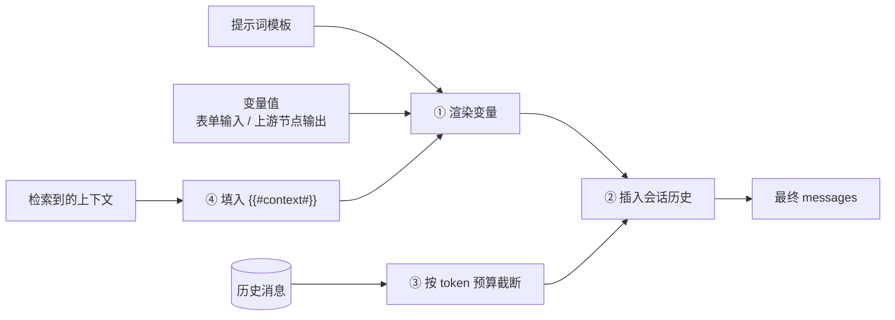

# 第 5 章 Prompt、模板与记忆

> 本章目标：理解平台怎样把“用户配置的提示词模板 + 变量 + 会话历史”组装成发给模型的 messages；实现模板渲染和带 token 预算的会话记忆。
> 前置：第 4 章。对应代码：mini-dify **v0.1** `backend/app/prompt/template.py`、`backend/app/memory.py`；v0.2 的 LLM 节点记忆。

## 5.1 问题：一次调用的 messages 从哪里来

用户在平台上配置的不是 messages，而是**模板**：

```
SYSTEM: 你是{{company}}的客服，回答要简洁。
USER:   {{#sys.query#}}
```

每次运行时，平台要做四件事：



1. **渲染变量**：把 `{{company}}`、`{{#sys.query#}}` 替换成实际值；
2. **插入历史**：Chat / Chatflow 要把之前的对话放进去；
3. **截断历史**：模型的上下文窗口有限，要给历史分配一个 token 预算；
4. **插入上下文**：RAG 检索到的内容填进 `{{#context#}}`（第 23 章）。

## 5.2 模板语法：两种变量

Dify 有两种变量写法，对应两个时代：

| 写法 | 例子 | 用在哪 |
|---|---|---|
| `{{name}}` | `{{company}}` | 简单应用（Completion / Chat）的表单变量 |
| `{{#node_id.var#}}` | `{{#1711527768326.text#}}`、`{{#sys.query#}}` | 工作流：引用任意节点的输出（**变量选择器**） |
| `{{#context#}}` `{{#query#}}` `{{#histories#}}` | — | 特殊占位符 |

两种写法的规则都由正则定义：

```python
# api/core/prompt/utils/prompt_template_parser.py
REGEX = re.compile(r"\{\{([a-zA-Z_][a-zA-Z0-9_]{0,29}|#histories#|#query#|#context#)\}\}")
WITH_VARIABLE_TMPL_REGEX = re.compile(
    r"\{\{([a-zA-Z_][a-zA-Z0-9_]{0,29}|#[a-zA-Z0-9_]{1,50}\.[a-zA-Z0-9_\.]{1,100}#|#histories#|#query#|#context#)\}\}"
)
```

工作流里的变量模板在 graphon 中又定义了一次：

```python
# graphon/nodes/base/variable_template_parser.py:9
REGEX = re.compile(r"\{\{(#[a-zA-Z0-9_]{1,50}(\.[a-zA-Z_][a-zA-Z0-9_]{0,29}){1,10}#)\}\}")
```

`#node_id.var.path#` 中 node_id 最长 50 个字符，后面最多跟 10 段属性路径（可以取到对象的嵌套字段，例如 `{{#http.body.items#}}`）。

`PromptTemplateParser.format` 有一个值得学习的细节：**找不到的变量保持原样**（`inputs.get(key, match.group(0))`），不会替换成空字符串。变量名写错时，模型能看到 `{{compnay}}` 这串原文，用户也就能发现问题，而不是让错误悄无声息地被吞掉。另外，用户输入的值里如果碰巧也带有 `{{xxx}}`，会被转义成 `{xxx}`（`remove_template_variables`），防止**模板注入**。

## 5.3 Dify 是怎么组装 messages 的

### 5.3.1 两种提示词编排

- `api/core/prompt/simple_prompt_transform.py`：简单模式。用户只写一段“前缀提示词”，平台用内置模板拼出完整提示词，模板在 `core/prompt/prompt_templates/common_chat.json`：

```json
{
  "context_prompt": "Use the following context as your learned knowledge, inside <context></context> XML tags.\n\n<context>\n{{#context#}}\n</context>\n...",
  "histories_prompt": "Here is the chat histories between human and assistant, inside <histories></histories> XML tags.\n\n<histories>\n{{#histories#}}\n</histories>\n\n",
  "system_prompt_orders": [...]
}
```

- `api/core/prompt/advanced_prompt_transform.py`：专家模式。用户自己写每一条 SYSTEM / USER / ASSISTANT 消息，**工作流的 LLM 节点用的就是这种**。`_get_chat_model_prompt_messages`（第 147 行）的逻辑：

```python
for prompt_item in prompt_template:
    match prompt_item.edition_type or "basic":
        case "basic":   # {{#x.y#}} 变量模板
            raw_prompt = raw_prompt.replace("{{#context#}}", context or "")
            prompt = convert_template(vp, raw_prompt).text
        case "jinja2":  # 也支持 Jinja2 模板
            prompt = Jinja2Formatter.format(template=prompt, inputs=prompt_inputs)
    match prompt_item.role:
        case USER: prompt_messages.append(UserPromptMessage(content=prompt))
        case SYSTEM: ...
        case ASSISTANT: ...
# 然后：如果开了记忆，把历史消息插到合适的位置，并把本轮 query 作为最后一条 USER
```

### 5.3.2 记忆：TokenBufferMemory

`api/core/memory/token_buffer_memory.py:139` `TokenBufferMemory` 负责取历史。它分两步：

**第一步，读出历史**（`load_history`，第 202 行）：

```python
stmt = select(Message).where(Message.conversation_id == conversation.id).order_by(Message.created_at.desc())
message_limit = min(message_limit, 500) if message_limit and message_limit > 0 else 500
messages = session.scalars(stmt.limit(message_limit)).all()

# 只要“当前这条分支”上的消息（用户可能点过“重新生成”，会话变成一棵树）
thread_messages = extract_thread_messages(messages)

# 刚创建、还没有回答的那条消息不算历史
if thread_messages and not thread_messages[0].answer and thread_messages[0].answer_tokens == 0:
    thread_messages.pop(0)
messages = list(reversed(thread_messages))
```

“会话是一棵树”这一点很容易被忽略：用户对某条回答点“重新生成”，会产生一个新的分支。记忆只能沿着**当前分支**往回取，否则模型会看到两个互相矛盾的回答。

**第二步，按 token 预算截断**（`PreparedHistory.get_prompt_messages`，第 92 行）：

```python
curr_message_tokens = model_instance.get_llm_num_tokens(prompt_messages)
while curr_message_tokens > max_token_limit and len(prompt_messages) > 1:
    prompt_messages.pop(0)                # 从最旧的开始丢
    curr_message_tokens = model_instance.get_llm_num_tokens(prompt_messages)
```

预算 `max_token_limit` 怎么定？看 `api/core/prompt/prompt_transform.py` 的 `_calculate_rest_token`（第 58 行）：

```
rest_tokens = 模型上下文长度 - max_tokens(给回答预留) - 当前提示词已经占用的 token
```

也就是说，**历史只能使用剩下的空间**。这是一个很好的设计：系统提示词和本轮问题优先，历史排在最后、按需截断。

## 5.4 从零实现

### 5.4.1 模板渲染（v0.1）

```python
# backend/app/prompt/template.py
SIMPLE_VAR = re.compile(r"\{\{([a-zA-Z_][a-zA-Z0-9_]{0,29})\}\}")

def extract_variables(template: str) -> list[str]:
    return list(dict.fromkeys(SIMPLE_VAR.findall(template)))   # 去重并保持顺序

def render(template: str, inputs: Mapping[str, Any]) -> str:
    def replace(match):
        key = match.group(1)
        if key not in inputs:
            return match.group(0)          # 和 Dify 一样：找不到就保持原样
        value = inputs[key]
        return value if isinstance(value, str) else str(value)
    return SIMPLE_VAR.sub(replace, template)
```

工作流用的 `{{#node.var#}}` 渲染放在变量池里（v0.2 的 `VariablePool.render`，第 8 章），因为它需要从变量池取值。

### 5.4.2 带 token 预算的记忆（v0.1）

```python
# backend/app/memory.py
def history_within_budget(messages: list[Message], max_tokens: int) -> list[Message]:
    kept, used = [], 0
    for msg in reversed(messages):              # 从最新的往回走
        cost = estimate_tokens(msg.content)
        if used + cost > max_tokens:
            break                               # 一旦超出预算就停，更旧的全部丢弃
        kept.append(msg)
        used += cost
    kept.reverse()
    while kept and kept[0].role != "user":      # 不要以一条“失去问题的回答”开头
        kept.pop(0)
    return kept
```

和 Dify 相比有两个差异：

1. 我们是“从新往旧累加，超了就停”，Dify 是“从旧往新删除，直到不超”。两者结果一样，但我们只需要算一次每条消息的 token；Dify 每删一条都要重新计算整个列表的 token（因为它用的是模型真实的 tokenizer，计算时会把消息格式本身的开销也算进去）。
2. 额外保证历史以 user 消息开头。有些模型 API（如 Anthropic）要求消息必须以 user 开头，否则直接报错。

token 估算（`backend/app/llm/tokens.py`）：中文约 1 字 1 token，其余约 4 个字符 1 token。这个精度足够用来截断历史。要精确计数，可以接 `tiktoken` 等 tokenizer。

### 5.4.3 v0.1 的聊天接口把它们串起来

```python
# backend/app/api/chat.py（v0.1）
messages = [Message("system", render(req.system_prompt, req.inputs))]           # ① 渲染
messages += history_within_budget(conv.messages, settings.memory_max_tokens)    # ②③ 历史 + 截断
messages.append(Message("user", req.query))
for chunk in get_model(req.model).invoke(messages):
    ...
conversations.append(conv.id, Message("user", req.query), Message("assistant", answer))   # 成功后才写入历史
```

注意最后一行：**只有成功的轮次才写入历史**。如果模型调用中途报错，这一轮不会留在记忆里，否则下一轮的上下文就是坏的。

v0.1 的会话存在内存里（`ConversationStore`），重启就没了。v0.2 的 Chatflow 改为存在数据库的 `conversations` / `messages` 表里，每次运行前加载最近 20 轮（`generator.py` 里的 `HISTORY_MESSAGES`）。

### 5.4.4 工作流 LLM 节点的记忆（v0.2）

```python
# backend/app/workflow/nodes/llm.py
class MemoryWindow(BaseModel):
    enabled: bool = True
    size: int = 10            # 注入最近多少条消息

def build_messages(self) -> list[Message]:
    rendered = [Message(p.role, self.pool.render(p.text)) for p in self.data.prompt_template]
    memory = self.data.memory
    if memory and memory.window.enabled and self.ctx.history:
        history = self.ctx.history[-memory.window.size:]
        # 插在开头的 system 消息之后、其余消息之前
        n_system = next((i for i, m in enumerate(rendered) if m.role != "system"), len(rendered))
        rendered = rendered[:n_system] + list(history) + rendered[n_system:]
    return rendered
```

Dify 的 LLM 节点记忆配置同样有 `window.enabled` / `window.size`，另外还有 `query_prompt_template`（默认 `{{#sys.query#}}`），用来决定本轮问题以什么形式追加。

## 5.5 运行与验证

```bash
cd code/mini-dify && git checkout v0.1 && cd backend
uv run pytest -q tests/test_chat.py
```

`test_history_budget_drops_oldest_turns` 验证了截断逻辑：

```python
msgs = [Message("user", "一二三四"), Message("assistant", "五六七八"), Message("user", "九十")]
assert [m.content for m in history_within_budget(msgs, 6)] == ["九十"]   # 预算 6：只放得下最后一条
```

手动验证记忆：

```bash
uv run uvicorn app.main:app --port 5001 &
C=$(curl -sN -X POST localhost:5001/api/chat-messages -H 'Content-Type: application/json' \
    -d '{"query":"我叫小明"}' | head -1 | sed 's/data: //' | python3 -c 'import sys,json;print(json.load(sys.stdin)["conversation_id"])')
curl -sN -X POST localhost:5001/api/chat-messages -H 'Content-Type: application/json' \
    -d "{\"query\":\"我叫什么\",\"conversation_id\":\"$C\"}" | tail -3
# mock 模型的回复会带上“这是我们第 2 轮对话”，说明历史被带上了
```

## 5.6 练习

1. **巩固**：为什么只有成功的轮次才能写入历史？举一个反例说明不这样做的后果。
2. **扩展**：给 `history_within_budget` 加一个 `max_messages` 参数，同时按条数和 token 两个维度限制。再给 Chatflow 的 LLM 节点面板加上“记忆窗口大小”的输入框。
3. **读源码**：读 Dify 的 `extract_thread_messages`（`api/core/prompt/utils/extract_thread_messages.py`），解释它如何从一组消息中找出“当前分支”（提示：`parent_message_id`）。

## 5.7 延伸阅读

- `api/core/prompt/simple_prompt_transform.py`：看简单模式如何按 `system_prompt_orders` 拼出完整系统提示词
- `graphon/model_runtime/memory/prompt_message_memory.py`：graphon 侧的记忆抽象
