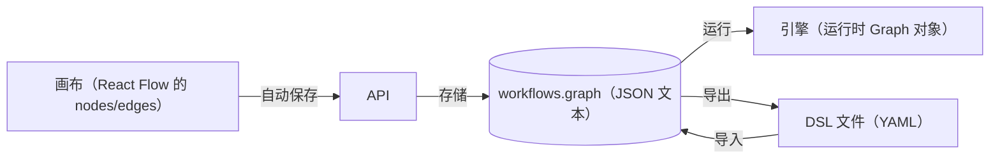

# 第 7 章 Workflow 的数据模型与 DSL

> 本章目标：设计“一张工作流图”在前端、后端、数据库、导出文件中的统一表示；实现草稿/发布两个版本、乐观锁和 DSL 导入导出。
> 前置：第 3 章。对应代码：mini-dify **v0.2** `backend/app/workflow/entities.py`、`app/models.py`、`app/services/workflow_service.py`、`app/services/dsl.py`。

## 7.1 问题：一张图要在哪些地方出现

同一张工作流图，会以不同的形态出现在 5 个地方：



最省事的做法是：**从画布到数据库，自始至终使用同一种 JSON 格式**。这也是 Dify 的做法：`workflows.graph` 存的就是 React Flow 的 `{nodes, edges}`，只是去掉了 UI 的临时状态。引擎在运行前再把它构建成运行时对象。这样就不需要维护一套“画布格式 ↔ 引擎格式”的转换代码，**画什么就跑什么**。

## 7.2 图的 JSON 长什么样

一个“开始 → LLM → 结束”的图（mini-dify 默认图，和 Dify 的结构一致）：

```json
{
  "nodes": [
    {
      "id": "start",
      "type": "custom",
      "position": {"x": 80, "y": 200},
      "data": {
        "type": "start",
        "title": "开始",
        "variables": [{"variable": "query", "label": "输入", "type": "paragraph", "required": true}]
      }
    },
    {
      "id": "llm",
      "type": "custom",
      "position": {"x": 400, "y": 200},
      "data": {
        "type": "llm",
        "title": "LLM",
        "model": {"provider": "mock", "name": "echo", "completion_params": {}},
        "prompt_template": [
          {"role": "system", "text": "You are a helpful assistant."},
          {"role": "user", "text": "{{#start.query#}}"}
        ]
      }
    },
    {
      "id": "end",
      "type": "custom",
      "position": {"x": 720, "y": 200},
      "data": {"type": "end", "title": "结束",
               "outputs": [{"variable": "result", "value_selector": ["llm", "text"]}]}
    }
  ],
  "edges": [
    {"id": "start-source-llm", "source": "start", "sourceHandle": "source", "target": "llm", "targetHandle": "target"},
    {"id": "llm-source-end", "source": "llm", "sourceHandle": "source", "target": "end", "targetHandle": "target"}
  ]
}
```

要读懂这份 JSON，需要先认识几个字段：

| 字段 | 含义 |
|---|---|
| `node.type` | **React Flow 的组件类型**（`custom`、`iteration`、`custom-note`），决定画布上用哪个组件来渲染 |
| `node.data.type` | **业务上的节点类型**（`start`、`llm`、`if-else`……），决定引擎用哪个节点类来执行 |
| `node.data.*` | 这个节点的全部配置，不同类型的字段各不相同 |
| `node.parentId` | 所在容器节点的 ID（迭代或循环的子节点才有，第 11 章） |
| `edge.sourceHandle` | 从源节点的**哪个出口**连出。普通节点是 `source`；IF/ELSE 是 `true`/`false`/分支 ID；配置了异常分支的节点还有 `fail-branch` |
| `edge.targetHandle` | 连到目标节点的哪个入口，通常是 `target` |
| `value_selector` / `{{#a.b#}}` | 变量引用（第 8 章） |

`sourceHandle` 是**条件分支能工作的关键**：IF/ELSE 节点运行完会告诉引擎“选中的是 `true` 这个出口”，引擎就只沿着 `sourceHandle == "true"` 的边往下走（第 9 章）。

Dify 存储的边上还有一个 `data` 字段（`sourceType`、`targetType`、`isInIteration`……），主要供前端渲染使用，引擎并不关心。graphon 构建运行时边的时候，只读取 `source`、`target`、`sourceHandle` 三个字段：

```python
# graphon/graph/graph.py:103  Graph._build_edges（节选）
for edge_config in edge_configs:
    source = edge_config.get("source")
    target = edge_config.get("target")
    edge_id = f"edge_{edge_counter}"                       # 运行时重新编号
    source_handle = edge_config.get("sourceHandle", "source")
    edge = Edge(id=edge_id, tail=source, head=target, source_handle=source_handle)
```

## 7.3 Dify 是怎么存储的

### 7.3.1 workflows 表

```python
# api/models/workflow.py:178
class Workflow(Base):
    ...
    version: Mapped[str] = mapped_column(String(255), nullable=False)          # 231  "draft" 或发布时间戳
    graph: Mapped[str] = mapped_column(LongText)                               # 237  JSON 文本
    _features: Mapped[str] = mapped_column("features", LongText)               # 238  文件上传、开场白等应用级特性
    _environment_variables: Mapped[str] = mapped_column("environment_variables", ...)   # 249
    _conversation_variables: Mapped[str] = mapped_column(...)                  # 250
    VERSION_DRAFT = "draft"                                                    # 257
```

**一个应用有多行 workflow 记录**：`version = "draft"` 的那一行是可以编辑的草稿；每次发布，都会把草稿复制一份，新行的 `version` 是发布时间的字符串。线上流量（API、WebApp）永远运行**最新发布**的那个版本，所以编辑草稿不会影响正在服务的应用。发布历史还支持回滚（`api/services/workflow_restore.py`）。

### 7.3.2 草稿同步与乐观锁

编辑器会频繁地自动保存（第 15 章）。如果同一个应用在两个浏览器标签页里同时打开，后保存的一方就会悄悄覆盖先保存的一方。Dify 用**乐观锁**来防止这种情况：

```python
# api/models/workflow.py:553
@property
def unique_hash(self) -> str:
    entity = {"graph": self.graph_dict}
    return helper.generate_text_hash(json.dumps(entity, sort_keys=True))

# api/services/workflow_service.py:402
def sync_draft_workflow(self, *, app_model, graph, features, unique_hash, account, ...):
    workflow = self.get_draft_workflow(app_model=app_model)
    if workflow and workflow.unique_hash != unique_hash:      # 439
        raise WorkflowHashNotEqualError()                       # 440
    ...
```

流程是这样的：前端加载草稿时拿到 `hash`，每次保存都带上它；服务端检查“你基于的版本是不是当前版本”，不是就拒绝（前端提示“草稿已被修改，请刷新”）；保存成功后，服务端返回新的 `hash`。


*图 7-1：乐观锁。B 带着过期的 hash h1 保存，服务端已是 h2，返回 409。*

为什么叫“乐观”锁？因为它假设冲突很少发生，平时不加锁，只在提交时检查一下。和它相对的是“悲观锁”，打开编辑就锁住、不让别人编辑，但那样用户体验很差。

### 7.3.3 发布前的校验

```python
# api/services/workflow_service.py:680
def publish_workflow(self, *, session, app_model, account, ...):
    draft_workflow = session.scalar(select(Workflow).where(..., Workflow.version == Workflow.VERSION_DRAFT))
    validate_llm_environment_model_references(...)      # 环境变量里引用的模型是否有效
    self._validate_workflow_credentials(...)            # 用到的模型/工具凭证是否可用
    self.validate_graph_structure(graph=draft_workflow.graph_dict)   # 1802 图结构
    ...                                                  # 计费检查，然后复制出一个新版本
```

草稿可以是半成品（随便改、随便存），**发布才是一道关卡**。graphon 自己也带了一套图校验器（`graphon/graph/validation.py`：边的端点是否存在、根节点是否合法……）。

### 7.3.4 DSL：可导出的应用

```python
# api/services/app_dsl_service.py
CURRENT_DSL_VERSION = CURRENT_APP_DSL_VERSION      # 91
def import_app(...):                                # 134  检查版本兼容性（241 check_version_compatibility）
def export_dsl(app_model, include_secret=False):    # 799
```

导出的 YAML 大致是这样的结构：

```yaml
app: {name: ..., mode: workflow, icon: ..., description: ...}
kind: app
version: 0.x.y            # DSL 版本，导入时做兼容检查
workflow:
  graph: {nodes: [...], edges: [...]}
  features: {...}
  environment_variables: [...]
  conversation_variables: [...]
dependencies: [...]       # 用到了哪些插件，导入时提示安装
```

导出时有两个细节：**密钥类的环境变量默认不导出**（`include_secret=False`）；**依赖**（用到的插件）会写进文件，导入时检查当前环境是否已经安装。

## 7.4 从零实现

### 7.4.1 用 Pydantic 描述图（v0.2）

```python
# backend/app/workflow/entities.py
class EdgeConfig(BaseModel):
    model_config = ConfigDict(extra="allow", populate_by_name=True)
    id: str
    source: str
    target: str
    source_handle: str = Field(default="source", alias="sourceHandle")

class NodeConfig(BaseModel):
    model_config = ConfigDict(extra="allow", populate_by_name=True)
    id: str
    data: dict[str, Any]                         # 节点配置先保持原样，由各节点类自己校验
    parent_id: str | None = Field(default=None, alias="parentId")

    @property
    def type(self) -> str:
        return self.data["type"]

class GraphConfig(BaseModel):
    nodes: list[NodeConfig] = Field(default_factory=list)
    edges: list[EdgeConfig] = Field(default_factory=list)
```

两个设计选择：

- `extra="allow"`：`position`、`style`、`targetHandle` 这些 UI 字段，引擎不关心，但也不报错、不丢弃；
- `data` 保持为 dict：每种节点有自己的 `data_class`（如 `LLMNodeData`），创建节点实例时再做校验（第 10 章）。这样新增一种节点，不需要修改图的模型定义。

每个节点都有的公共配置（v0.2 起）：

```python
class BaseNodeData(BaseModel):
    model_config = ConfigDict(extra="allow")
    type: str
    title: str = ""
    desc: str = ""
    error_strategy: ErrorStrategy | None = None       # 第 12 章
    default_value: dict[str, Any] = Field(default_factory=dict)
    retry_config: RetryConfig = Field(default_factory=RetryConfig)
```

### 7.4.2 表结构

```python
# backend/app/models.py（v0.2）
class App(Base):
    __tablename__ = "apps"
    id, name, mode ("workflow" | "advanced-chat"), description, icon, created_at, updated_at

class Workflow(Base):
    __tablename__ = "workflows"
    id
    app_id   = ForeignKey("apps.id", ondelete="CASCADE")
    version  = "draft" 或 发布时间
    graph    = JSON
    environment_variables = JSON
    hash
    ...
```

和 Dify 的区别：graph 用 SQLAlchemy 的 `JSON` 类型，读写时自动序列化；hash 存成一个字段，而不是每次读取时现算。

### 7.4.3 草稿、乐观锁、发布

```python
# backend/app/services/workflow_service.py
def graph_hash(graph: dict) -> str:
    return hashlib.sha256(json.dumps(graph, sort_keys=True, ensure_ascii=False).encode()).hexdigest()

def get_draft(session, app) -> Workflow:
    wf = session.scalar(select(Workflow).where(Workflow.app_id == app.id, Workflow.version == "draft"))
    if wf is None:                                  # 第一次打开编辑器：按应用类型生成默认图
        graph = default_graph(app.mode)
        wf = Workflow(app_id=app.id, version="draft", graph=graph, hash=graph_hash({"graph": graph, "env": {}}))
        session.add(wf)
        session.flush()
    return wf

def sync_draft(session, app, graph, hash_, env=None) -> Workflow:
    GraphConfig.model_validate(graph)               # 只检查结构；语义检查留到发布时
    wf = get_draft(session, app)
    if hash_ and hash_ != wf.hash:
        raise HashConflict("草稿已在别处被修改，请刷新后再编辑")   # → HTTP 409
    wf.graph = graph
    if env is not None:
        wf.environment_variables = env
    wf.hash = graph_hash({"graph": graph, "env": wf.environment_variables})
    return wf

def publish(session, app) -> Workflow:
    draft = get_draft(session, app)
    problems = validate_graph(GraphConfig.model_validate(draft.graph), mode=app.mode)
    if problems:
        raise GraphInvalid(problems)                # → HTTP 400，返回问题列表
    published = Workflow(app_id=app.id, version=datetime.now().strftime("%Y-%m-%d %H:%M:%S.%f"),
                         graph=draft.graph, environment_variables=draft.environment_variables, hash=draft.hash)
    session.add(published)
    return published
```

`sort_keys=True` 很重要：同一个 dict，键的顺序不同就会序列化出不同的字符串。不排序的话，内容完全相同的图也可能算出不同的 hash。

### 7.4.4 图校验：validate_graph

`backend/app/workflow/graph.py` 的 `validate_graph` 会返回一个“问题列表”。它同时服务于两个场景：编辑器的检查清单（第 16 章）和发布前的关卡。检查项包括：

1. 节点类型是否存在；
2. 节点配置能否通过 `data_class` 校验，引用的变量是否已设置、是否指向存在的节点（v0.3 加入）；
3. 根节点：顶层有且只有一个 `start`，每个迭代内部有且只有一个 `iteration-start`；
4. 终点：Workflow 要有 `end`，Chatflow 要有 `answer`；
5. 可达性：从根节点做 BFS，遍历不到的节点就是“未连接”；
6. 无环：用 **Kahn 算法**反复删除入度为 0 的节点，删不完就说明有环。

```python
queue = deque(n for n, d in indeg.items() if d == 0)
removed = 0
while queue:
    cur = queue.popleft()
    removed += 1
    for nxt in out[cur]:
        indeg[nxt] -= 1
        if indeg[nxt] == 0:
            queue.append(nxt)
if removed != len(nodes):
    problems.append("图中存在环（循环请使用迭代节点）")
```

为什么不允许有环？因为图引擎“节点就绪”的规则（第 9 章）建立在 DAG 之上：有环的话，环上的节点永远在等待彼此的输入。需要循环时，用**容器节点**（迭代、循环）把循环体封装成一个子图（第 11 章）。

### 7.4.5 DSL 导入导出

```python
# backend/app/services/dsl.py
def export_app(session, app) -> str:
    wf = get_draft(session, app)
    env = {k: ("" if k.upper().endswith(("KEY", "SECRET", "TOKEN")) else v)     # 密钥置空
           for k, v in (wf.environment_variables or {}).items()}
    return yaml.safe_dump({
        "kind": "app", "version": DSL_VERSION,
        "app": {"name": app.name, "mode": app.mode, "icon": app.icon, "description": app.description},
        "workflow": {"graph": wf.graph, "environment_variables": env},
    }, allow_unicode=True, sort_keys=False)
```

`yaml.safe_load` 是导入时**必须**使用的。`yaml.load` 能实例化任意 Python 对象，等于把远程代码执行的入口交给了上传文件的人。

## 7.5 运行与验证

```bash
cd code/mini-dify && git checkout v0.2 && cd backend
uv run pytest -q tests/test_api.py -k "hash or publish or dsl"
```

三个测试分别验证：

- `test_draft_hash_conflict`：用旧 hash 保存返回 409；
- `test_publish_validates_graph`：删掉一条边后发布，返回 400，问题列表里包含“未连接”；
- `test_dsl_roundtrip`：导出再导入，应用类型和名称保持一致。

再导入示例 DSL 试试：

```bash
uv run uvicorn app.main:app --port 5001 &
python3 - <<'EOF'
import json, urllib.request
body = json.dumps({"content": open("../examples/batch-translate.yml").read()}).encode()
req = urllib.request.Request("http://localhost:5001/api/apps/import", body, {"Content-Type": "application/json"})
print(json.load(urllib.request.urlopen(req)))
EOF
```

> `examples/batch-translate.yml` 从 v0.3 起才有，`git checkout v0.3` 后再运行。

## 7.6 练习

1. **巩固**：为什么 hash 要基于“图 + 环境变量”一起计算？如果只算图，会出现什么问题？
2. **扩展**：实现“发布历史”和“回滚”：`GET /apps/{id}/workflows` 列出所有发布版本，`POST /apps/{id}/workflows/{wf_id}/restore` 把某个版本复制回草稿。
3. **读源码**：Dify 的 DSL 导入在版本不兼容时有哪几种处理结果？读 `check_version_compatibility` 回答。

## 7.7 延伸阅读

- `api/services/workflow_restore.py`：Dify 的版本恢复
- `graphon/dsl/`：graphon 自带的一套轻量 DSL 导入器
