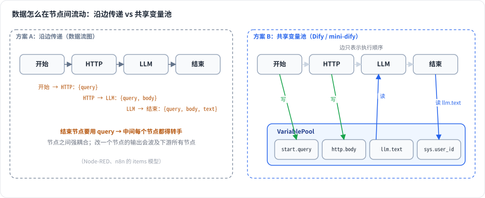

# 第 8 章 变量池（VariablePool）★

> 本章目标：理解工作流里“数据如何在节点之间流动”；掌握选择器（selector）、系统变量、环境变量、会话变量；实现一个带嵌套访问、模板渲染、子作用域的变量池。
> 前置：第 7 章。对应代码：mini-dify **v0.2** `backend/app/workflow/variables.py`。

## 8.1 问题：节点之间怎么传数据

在工作流里，LLM 节点要用“开始节点的 query”，结束节点要用“LLM 节点的 text”。数据的传递方式有两种设计：

**方案 A：沿着边传递**（数据流图，像 Node-RED）。每条边上流动的是数据，节点从入边接收输入。问题在于：一个节点想用“三步之前”某个节点的输出，就得让中间每个节点都把数据转手传下去。

**方案 B：共享黑板**（Dify 的做法）。每个节点运行完，把输出写进一块**共享的存储**；任何节点都可以按“节点 ID + 变量名”去读。**边只表示执行顺序，不负责搬运数据。**



*图 8-1：沿边传递 vs 共享变量池。变量池里边只表示执行顺序，节点按 selector 直接读上游输出。*

方案 B 的好处：

- 任意节点都可以引用任意**上游**节点的输出，不用层层转手；
- 节点实现非常简单：读变量、算、写输出；
- 调试也简单：变量池就是“这次运行的全部状态”，可以完整展示出来（第 17 章的变量检查器）。

代价是：引擎和编辑器必须保证“读的时候，被读的变量已经写好了”。规则是**只能引用祖先节点的输出**。编辑器只把祖先节点的变量放进选择列表（第 16 章），引擎保证祖先节点一定先执行完（第 9 章）。

## 8.2 选择器：变量的地址

变量的地址叫 **selector**，形式是一个字符串列表：

```
[node_id, variable_name, *path]
```

| selector | 含义 |
|---|---|
| `["sys", "query"]` | 系统变量：本轮用户的问题 |
| `["env", "API_BASE"]` | 环境变量 |
| `["conversation", "user_name"]` | 会话变量（Chatflow） |
| `["1711527768326", "text"]` | 节点 1711527768326 的输出 `text` |
| `["http", "body", "items"]` | 节点 http 的输出 `body` 里的 `items` 字段 |

`sys`、`env`、`conversation` 是三个**保留的“伪节点 ID”**：

```python
# api/core/workflow/variable_prefixes.py
SYSTEM_VARIABLE_NODE_ID = "sys"
ENVIRONMENT_VARIABLE_NODE_ID = "env"
CONVERSATION_VARIABLE_NODE_ID = "conversation"
```

在文本里（提示词、HTTP URL、回复模板），selector 写成 `{{#node_id.var.path#}}`，正则见第 5 章。在结构化配置里（结束节点的输出、条件分支的左值），直接存 selector 列表：`"value_selector": ["llm", "text"]`。

## 8.3 Dify 是怎么做的

### 8.3.1 VariablePool：两层字典

```python
# graphon/runtime/variable_pool.py:28
class VariablePool(BaseModel):
    variable_dictionary: defaultdict[str, dict[str, Variable]]    # node_id → {name → Variable}

    def add(self, selector, value, /) -> None:                     # 143
        if len(selector) != SELECTORS_LENGTH:                       # 写入只能用两段 selector
            raise ValueError(...)
        match value:
            case Segment():
                variable = segment_to_variable(segment=value, selector=selector)
            case _:
                segment = build_segment(value)                      # Python 值 → 带类型的 Segment
                variable = segment_to_variable(segment=segment, selector=selector)
        node_id, name = self._selector_to_keys(selector)
        self.variable_dictionary[node_id][name] = variable

    def get(self, selector, /) -> Segment | None:                  # 192
        node_id, name = selector[0], selector[1]
        segment = self.variable_dictionary.get(node_id, {}).get(name)
        if segment is None or len(selector) == 2:
            return segment
        match segment:                                              # 三段以上：取嵌套值
            case FileSegment():   return self._get_file_attribute_segment(segment=segment, attr=selector[2])
            case _:               return self._get_nested_segment(segment=segment, selector=selector[2:])
```

注意一个不对称：**写入只能用两段，读取可以用多段**。节点输出的是“整个变量”，下游可以按需深入其中某个字段。

### 8.3.2 Segment：带类型的值

Dify 不直接存 Python 值，而是包装成 **Segment**（`graphon/variables/segments.py`）：`StringSegment`、`IntegerSegment`、`ObjectSegment`、`ArrayStringSegment`、`FileSegment`……类型枚举在 `graphon/variables/types.py:66`：

```python
class SegmentType(StrEnum):
    NUMBER = "number"; INTEGER = "integer"; FLOAT = "float"; STRING = "string"
    OBJECT = "object"; SECRET = "secret"; FILE = "file"; BOOLEAN = "boolean"
    ARRAY_ANY = "array[any]"; ARRAY_STRING = "array[string]"; ARRAY_NUMBER = "array[number]"
    ARRAY_OBJECT = "array[object]"; ARRAY_FILE = "array[file]"; ARRAY_BOOLEAN = "array[boolean]"
    NONE = "none"; GROUP = "group"
```

类型有三个用途：

1. **编辑器做类型过滤**：迭代节点的输入只能选 `array[...]` 类型的变量；
2. **节点做类型校验**：代码节点声明的输出类型和实际返回值不一致时报错；
3. **特殊处理**：`SECRET` 类型的变量在日志和运行记录里会被打码；`FILE` 类型可以取 `.url`、`.name` 等属性。

### 8.3.3 运行前，变量池里预先放了什么

`api/core/app/apps/workflow/app_runner.py` 在构建图之前就准备好了变量池（参见 `core/workflow/system_variables.py` 的 `build_bootstrap_variables`，以及 `core/workflow/variable_pool_initializer.py`）：

**系统变量**（`api/core/workflow/system_variables.py:22`）：

```python
class SystemVariableKey(StrEnum):
    QUERY = "query"                       # Chatflow：本轮问题
    FILES = "files"                       # 用户上传的文件
    CONVERSATION_ID = "conversation_id"
    USER_ID = "user_id"
    DIALOGUE_COUNT = "dialogue_count"     # 第几轮对话
    APP_ID = "app_id"
    WORKFLOW_ID = "workflow_id"
    WORKFLOW_EXECUTION_ID = "workflow_run_id"
    TIMESTAMP = "timestamp"
    ...                                   # 还有 RAG Pipeline 专用的 document_id、dataset_id 等
```

**环境变量**：随工作流一起保存（`workflows.environment_variables`），适合存放 API 地址、开关这类配置。可以设为 secret 类型，导出 DSL 时默认不导出。运行时**只读**。

**会话变量**：Chatflow 专属，存在数据库里，**跨轮次保留**。比如“用户的名字”，第一轮问到之后，用**变量赋值**节点（`graphon/nodes/variable_assigner/`）写进会话变量，后面几轮的提示词都可以引用。它是工作流里**唯一可以被节点修改**的变量类型（引擎通过 `NodeRunVariableUpdatedEvent` 处理，`event_handlers.py:215`）。

**开始节点的输入**：用户填写的表单。开始节点运行时，会把它们作为自己的输出写进变量池。

### 8.3.4 节点输出由谁写入

不是节点自己写，而是**引擎在节点成功后统一写入**：

```python
# graphon/graph_engine/event_management/event_handlers.py:354
def _store_node_outputs(self, *, frame, node_id, outputs):
    for variable_name, variable_value in outputs.items():
        frame.graph_runtime_state.variable_pool.add((node_id, variable_name), variable_value)
```

这样做的原因：节点运行在 Worker 线程里，但写变量池发生在 Dispatcher 线程中，**所有写操作都集中在同一个线程里**，变量池本身就不需要加锁（第 9 章）。

### 8.3.5 调试场景：变量的延迟加载

“单步调试”某个节点时（第 17 章），上游节点并没有运行，它们的输出从哪里来？Dify 会把每次调试运行的节点输出保存成**草稿变量**（`api/services/workflow_draft_variable_service.py`），单步运行时通过 `VariableLoader`（`graphon/variable_loader.py:10`）按需从数据库加载，实现类是 `DraftVarLoader`（`workflow_draft_variable_service.py:80`）。所以你在 Dify 里单独运行一个节点时，它会自动用上“上次运行”的上游结果。

## 8.4 从零实现

```python
# backend/app/workflow/variables.py（v0.2）
SYSTEM_NODE_ID = "sys"
ENVIRONMENT_NODE_ID = "env"
CONVERSATION_NODE_ID = "conversation"

VARIABLE_TEMPLATE = re.compile(r"\{\{#([a-zA-Z0-9_]{1,50}(?:\.[a-zA-Z_][a-zA-Z0-9_]{0,29}){1,10})#\}\}")
_MISSING = object()


class VariablePool:
    def __init__(self, *, system=None, environment=None, conversation=None, parent=None):
        self._data: dict[str, dict[str, Any]] = {}
        self._parent = parent
        if system:       self._data[SYSTEM_NODE_ID] = dict(system)
        if environment:  self._data[ENVIRONMENT_NODE_ID] = dict(environment)
        if conversation: self._data[CONVERSATION_NODE_ID] = dict(conversation)

    def add(self, selector, value) -> None:
        if len(selector) != 2:
            raise ValueError(f"selector must be [node_id, name], got {list(selector)}")
        node_id, name = selector
        self._data.setdefault(node_id, {})[name] = value

    def get(self, selector, default=None):
        value = self._lookup(selector)
        return default if value is _MISSING else value

    def _lookup(self, selector):
        if len(selector) < 2:
            return _MISSING
        node_id, name, *path = selector
        node_vars = self._data.get(node_id)
        if node_vars is None or name not in node_vars:
            return self._parent._lookup(selector) if self._parent else _MISSING    # ← 子作用域回落到父级
        value = node_vars[name]
        for key in path:                                                            # ← 嵌套访问
            if isinstance(value, dict) and key in value:
                value = value[key]
            elif isinstance(value, list) and key.isdigit() and int(key) < len(value):
                value = value[int(key)]
            else:
                return _MISSING
        return value

    def child(self) -> "VariablePool":
        return VariablePool(parent=self)

    def render(self, template: str) -> str:
        return VARIABLE_TEMPLATE.sub(lambda m: value_to_text(self.get(m.group(1).split("."))), template)
```

几个设计要点：

**1. `_MISSING` 哨兵**。变量的值可以就是 `None`（比如一个可选输入没填），“值为 None”和“变量不存在”必须能区分开，所以用一个专门的哨兵对象表示“不存在”。

**2. 存 Python 原始值，按需推断类型。** 我们没有引入 Segment 层，而是在需要类型的地方（编辑器展示、代码节点校验）用 `infer_type()` 推断：

```python
def infer_type(value) -> str:
    match value:
        case bool():          return "boolean"     # 注意 bool 要放在 int 前面：True 也是 int
        case int() | float(): return "number"
        case str():           return "string"
        case dict():          return "object"
        case list():
            inner = {infer_type(v) for v in value}
            return f"array[{inner.pop()}]" if len(inner) == 1 else "array[any]"
        case None:            return "none"
```

省掉 Segment 层让代码短了很多，代价是没有 secret 打码，也没有文件属性这类类型相关的特殊行为。

**3. 嵌套访问还支持列表下标**：`{{#http.body.items.0#}}`。Dify 的 `_get_nested_attribute` 只能深入 dict，我们多支持了一种情况。注意，selector 正则要求属性段以字母或下划线开头（`[a-zA-Z_][a-zA-Z0-9_]{0,29}`），所以在**模板里**写不了 `.0`。只有在结构化的 `value_selector` 里才能用下标，这一点和 Dify 的模板规则保持一致。

**4. 子作用域**（`child()`）。迭代节点的每一轮都要有自己的 `item`、`index`，以及循环体内各节点的输出；多轮并行时互相不能覆盖，但又都要能读到外层变量。所以每一轮创建一个子池：**读取时先查自己、再查父级，写入只写自己**。这是经典的词法作用域链（第 11 章）。Dify 的 graphon 用“执行帧（ExecutionFrame）”实现同样的隔离效果。

**5. `value_to_text`：变量怎么印进提示词。** 字符串原样输出，dict 和 list 转成 JSON（`ensure_ascii=False`），None 输出为空字符串。

### 运行前准备变量池（v0.2 的 Generator）

```python
pool = VariablePool(
    system={
        "query": req.query, "files": [], "conversation_id": conversation_id,
        "dialogue_count": len(history) // 2 + 1, "user_id": req.user_id,
        "app_id": req.app.id, "workflow_id": req.workflow.id, "workflow_run_id": run_id,
    },
    environment=req.workflow.environment_variables or {},
)
```

### 引擎写入节点输出

```python
# backend/app/workflow/engine.py
def _complete(self, event, result):
    node = self.graph.nodes[event.node_id]
    self.ctx.pool.add_outputs(node.id, result.outputs)    # 只有 Dispatcher 线程会走到这里
    ...
```

### 我们省略了什么

| Dify | mini-dify |
|---|---|
| Segment 类型系统、secret 打码、文件属性 | Python 原始值 + `infer_type` |
| 会话变量 + 变量赋值节点 | 只预留了 `conversation` 命名空间，没有实现赋值节点（练习 2） |
| 草稿变量持久化 + 延迟加载 | 单步调试时由用户手动填写输入值（第 17 章） |

## 8.5 运行与验证

```bash
cd code/mini-dify && git checkout v0.2 && cd backend
uv run python - <<'EOF'
from app.workflow.variables import VariablePool, infer_type, template_selectors
pool = VariablePool(system={"query": "你好"}, environment={"API": "https://x.com"})
pool.add(("http", "body"), {"items": [{"name": "苹果"}, {"name": "香蕉"}], "total": 2})
print(pool.get(["http", "body", "total"]))                 # 2
print(pool.get(["http", "body", "items", "1", "name"]))   # 香蕉
print(pool.render("问题：{{#sys.query#}}，接口：{{#env.API#}}，数量：{{#http.body.total#}}"))
print(pool.render("不存在：[{{#nope.x#}}]"))               # 不存在：[]
print(infer_type([1, 2.5]), infer_type(["a", 1]))           # array[number] array[any]
child = pool.child(); child.add(("loop", "item"), "x")
print(child.get(["sys", "query"]), pool.get(["loop", "item"]))   # 你好 None（子池写入不会污染父池）
print(template_selectors("{{#a.b#}} and {{#c.d.e#}}"))     # [['a', 'b'], ['c', 'd', 'e']]
EOF
```

## 8.6 练习

1. **巩固**：为什么写入只允许两段 selector，读取却允许多段？如果允许写 `["http", "body", "total"]`，会带来什么问题？
2. **扩展**：实现会话变量。（a）`conversations` 表加一个 `variables` JSON 字段；（b）运行前加载到 `conversation` 命名空间；（c）写一个“变量赋值”节点，产出“更新会话变量”事件，引擎处理后写回变量池，运行结束时由一个 Layer 持久化到数据库。
3. **读源码**：读 graphon 的 `VariablePool._get_file_attribute_segment`，列出文件变量可以取哪些属性。

## 8.7 延伸阅读

- `graphon/variables/segments.py`、`variables.py`：Segment 与 Variable 的区别（Variable 是带 selector 和名字的 Segment）
- `graphon/nodes/variable_assigner/v2/node.py`：变量赋值节点，支持覆盖、追加、清空等操作
