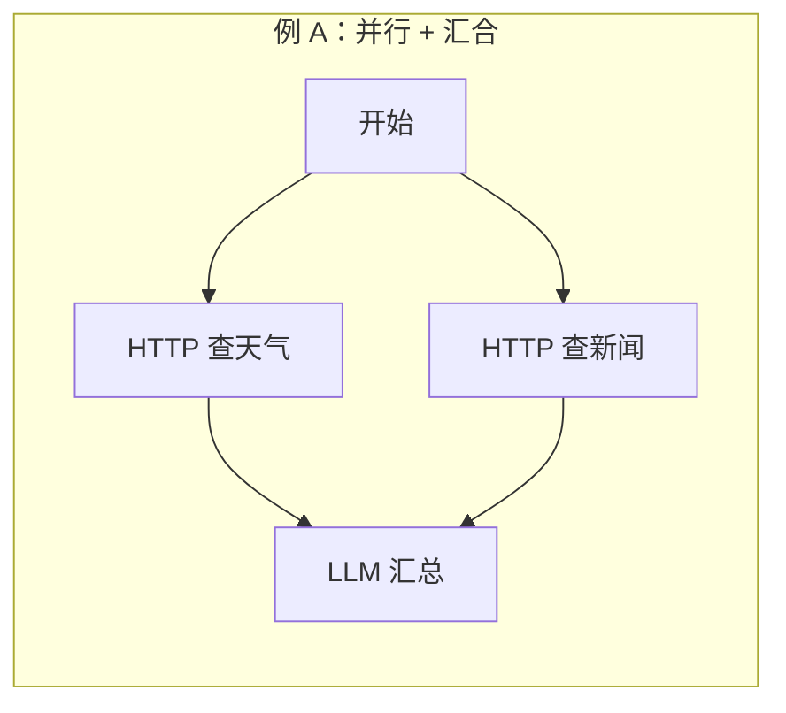
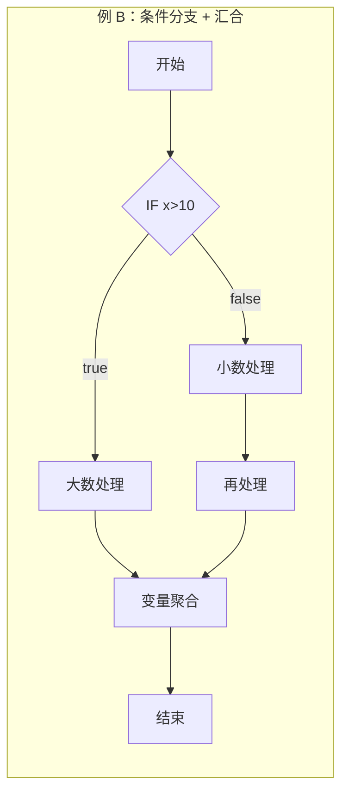
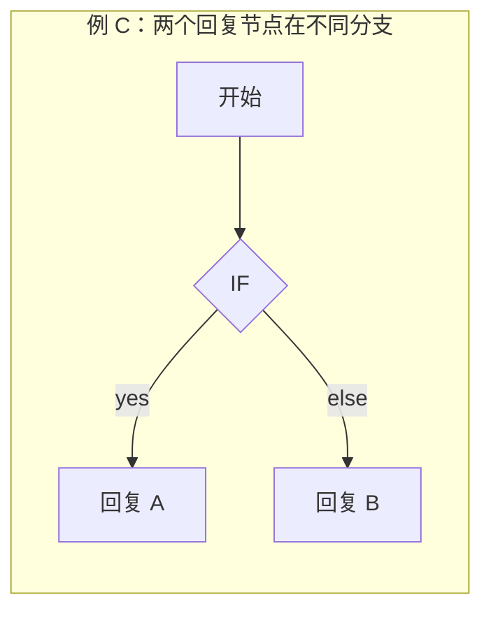
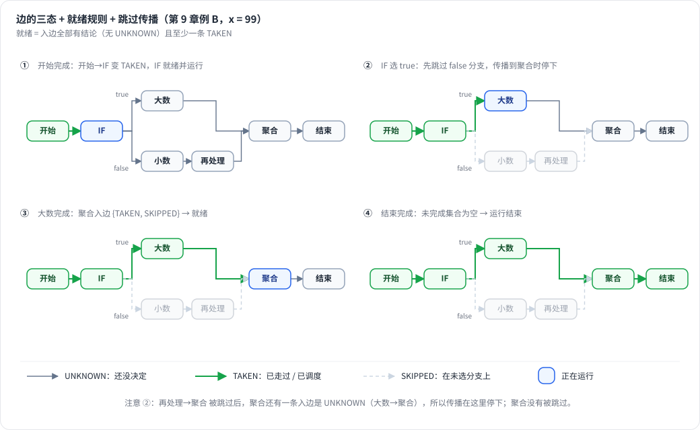
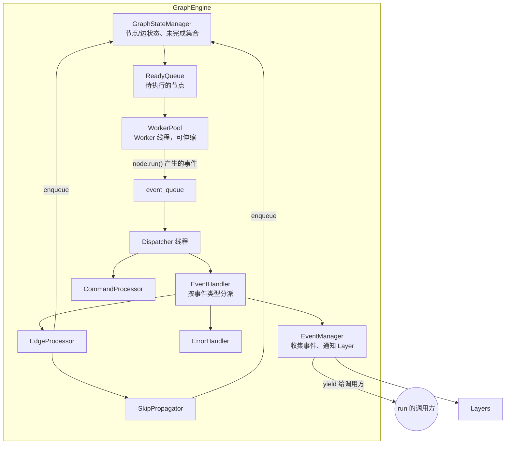

# 第 9 章 图执行引擎（Graph Engine）★★

> 本章目标：彻底搞懂一个工作流引擎怎样执行一张带**并行、条件分支、汇合**的 DAG；逐段读 graphon 的引擎实现；用约 300 行代码写出 mini-dify 的 `GraphEngine`，并用测试证明它正确。
> 前置：第 7、8 章。对应代码：mini-dify **v0.2** `backend/app/workflow/engine.py`、`graph.py`、`commands.py`、`layers.py`。
>
> 这是全书最重要的一章，建议边读边打开 `engine.py` 对照。

## 9.1 问题：给你一张图，怎么跑

先想清楚引擎要回答的三个问题：

1. **下一个跑谁？** 一个节点什么时候“可以开始”？
2. **能同时跑几个？** 互不依赖的分支要并行执行，否则两个各需 5 秒的 HTTP 请求要等 10 秒。
3. **条件分支没走到的那些节点怎么办？** 它们永远不会被执行。引擎怎么知道“已经不用等它们了”？

先看三个例子，后面会反复用到：







- 例 A 中，“LLM 汇总”必须等**两个** HTTP 都完成才能运行（AND 汇合）；
- 例 B 中，“变量聚合”只会收到**一个**分支的输入，另一个分支被跳过了。它必须在“走到的那个分支完成、另一个分支确定被跳过”之后运行；
- 例 C 中，“回复 A”和“回复 B”只会执行一个。整个运行要在执行完的那个回复节点之后正常结束，不能一直等另一个。

**一个朴素的想法**：先做拓扑排序，然后按顺序逐个执行。这个方案解决不了问题 2（无法并行），也解决不了问题 3（拓扑序里包含了那些不会执行的节点）。

**graphon 的方案**：给**每条边**一个运行时状态，用边的状态来推导节点能否开始。

## 9.2 核心思想：边的三态 + 就绪规则 + 跳过传播

### 9.2.1 边（和节点）的三种状态

```python
# graphon/enums.py —— NodeState 同时用于节点和边
UNKNOWN   # 还没决定
TAKEN     # 节点：已调度；边：已走过（上游成功了并且选择了这条边）
SKIPPED   # 节点/边：位于未被选择的分支上，永远不会执行
```

运行开始时，所有边都是 UNKNOWN。

### 9.2.2 就绪规则

```python
# graphon/graph_engine/graph_state_manager.py:75
def is_node_ready(self, node_id: str) -> bool:
    incoming_edges = self._graph.get_incoming_edges(node_id)
    if not incoming_edges:
        return True                                       # 没有入边（根节点）
    if any(edge.state == NodeState.UNKNOWN for edge in incoming_edges):
        return False                                      # 还有入边没决定 → 等
    return any(edge.state == NodeState.TAKEN for edge in incoming_edges)   # 至少有一条走过
```

**一句话总结：所有入边都有了结论，并且至少有一条是 TAKEN。**

拿三个例子验证：

- 例 A：“LLM 汇总”有两条入边。天气 HTTP 完成后，一条边变成 TAKEN、另一条还是 UNKNOWN，不就绪；新闻 HTTP 也完成后，两条都是 TAKEN，就绪。✓ 实现了 AND 汇合。
- 例 B：x=99 时，IF 选了 true。“大数处理”完成后，聚合节点的一条入边 TAKEN；另一条入边来自“再处理”，**它要变成 SKIPPED**，聚合节点才能就绪。这就需要下面的跳过传播。
- 例 C：IF 选了 yes，那么“回复 B”的入边变成 SKIPPED。“回复 B”的所有入边都已决定，但没有一条 TAKEN，所以它永远不就绪，而且它也会被标记为 SKIPPED。

### 9.2.3 节点完成后，怎么处理它的出边

```python
# graphon/graph_engine/graph_traversal/edge_processor.py:43
def process_node_success(self, node_id, selected_handle=None):
    node = self._graph.nodes[node_id]
    if node.execution_type == NodeExecutionType.BRANCH:
        return self.handle_branch_completion(node_id, selected_handle)   # 分支节点
    return self._process_non_branch_node_edges(node_id)                  # 普通节点：所有出边 TAKEN

# :119
def handle_branch_completion(self, node_id, selected_handle):
    selected_edges, unselected_edges = self._state_manager.categorize_branch_edges(node_id, selected_handle)
    skipped_events = self._skip_propagator.skip_branch_paths(unselected_edges)    # 先跳过没选中的
    ready_nodes, taken_events = self._process_taken_edges(selected_edges)        # 再走选中的
    return ready_nodes, [*skipped_events, *taken_events]

# :93
def _process_taken_edge(self, edge):
    self._state_manager.mark_edge_taken(edge.id)
    ready_nodes = [edge.head] if self._state_manager.is_node_ready(edge.head) else []
    return ready_nodes, [self._build_taken_event(edge)]
```

分支节点通过 `NodeRunResult.edge_source_handle` 告诉引擎选中了哪个出口（IF/ELSE 返回的是 case_id 或 `"false"`，第 10 章）。`categorize_branch_edges`（`graph_state_manager.py:146`）按 `edge.source_handle == selected_handle` 把出边分成两组。

### 9.2.4 跳过传播

```python
# graphon/graph_engine/graph_traversal/skip_propagator.py:36
def propagate_skip_from_edge(self, edge_id):
    downstream_node_id = self._graph.edges[edge_id].head
    edge_states = self._state_manager.analyze_edge_states(self._graph.get_incoming_edges(downstream_node_id))
    if edge_states["has_unknown"]:        # 下游还有别的入边没决定：先不管，以后再说
        return []
    if edge_states["has_taken"]:          # 下游有别的入边走过了：它可以运行！
        self._state_manager.enqueue_node(downstream_node_id)
        return []
    if edge_states["all_skipped"]:        # 下游的入边全部被跳过：下游也被跳过，继续往下传播
        return self._propagate_skip_to_node(downstream_node_id)
    return []

# :76
def _propagate_skip_to_node(self, node_id):
    self._state_manager.mark_node_skipped(node_id)
    events = []
    for edge in self._graph.get_outgoing_edges(node_id):
        events.extend(self._skip_edge_path(edge))       # 把它所有出边标为 SKIPPED，递归
    return events
```

`has_taken` 那个分支很关键，它正是例 B 需要的：“小数处理”分支被跳过时，一路传播到聚合节点，发现聚合节点的另一条入边已经 TAKEN 了，于是**由跳过传播负责把聚合节点放进就绪队列**。

### 9.2.5 手工推演例 B（x = 99）



*图 9-1：例 B 的四个时刻。IF 选 true 后先跳过 false 分支，传播到聚合时因还有 UNKNOWN 入边而停下；聚合在 {TAKEN, SKIPPED} 时就绪。*


| 步骤 | 事件 | 边状态变化 | 入队的节点 |
|---|---|---|---|
| 0 | 开始 | — | 开始 |
| 1 | 开始 完成 | 开始→IF: TAKEN | IF |
| 2 | IF 完成，选中 `true` | **先跳过**：IF→小数: SKIPPED → 小数的入边全部 SKIPPED → 小数 SKIPPED → 小数→再处理: SKIPPED → 再处理 SKIPPED → 再处理→聚合: SKIPPED → 聚合的入边 {大数→聚合: UNKNOWN, 再处理→聚合: SKIPPED} → has_unknown，停止传播。**再走选中的边**：IF→大数: TAKEN → 大数就绪 | 大数 |
| 3 | 大数 完成 | 大数→聚合: TAKEN → 聚合的入边 {TAKEN, SKIPPED} → 就绪 | 聚合 |
| 4 | 聚合 完成 | 聚合→结束: TAKEN | 结束 |
| 5 | 结束 完成 | — | （无，运行结束） |

`handle_branch_completion` 里**“先跳过、后走选中的边”的顺序**很重要。假设 IF 的两个出口都直接连到同一个汇合节点：如果先走选中的边，汇合节点检查就绪时，另一条边还是 UNKNOWN，结果就是不就绪；接着处理跳过的边时，传播到汇合节点发现 has_taken，于是入队。两种顺序最终都能正确运行，但先跳过可以让状态推进得更快，也更容易推理。mini-dify 采用同样的顺序。

### 9.2.6 什么时候算“跑完了”

不需要知道“总共有多少个节点要跑”，只需要一个集合：**已经调度、但还没有完成的节点**。

```python
# graphon/graph_engine/graph_state_manager.py
def enqueue_node(self, node_id):          # 48
    self._graph.nodes[node_id].state = NodeState.TAKEN
    self._unfinished_nodes.add(node_id)
    self._graph_runtime_state.enqueue_ready_task(StartTask(frame_id=..., node_id=node_id))

def finish_execution(self, node_id):      # 186
    self._unfinished_nodes.discard(node_id)

def is_execution_complete(self):          # 198
    return not self._unfinished_nodes     # 大意如此
```

这个集合为空时就结束。被跳过的节点从来没有进入过这个集合，所以不会“卡住”整个运行（例 C 就是这么结束的）。

## 9.3 graphon 的整体架构

`GraphEngine.__init__`（`graphon/graph_engine/graph_engine.py:71`）把职责拆成了一组小部件：



| 部件 | 文件 | 职责 |
|---|---|---|
| `GraphStateManager` | `graph_state_manager.py` | 唯一能修改节点和边状态的地方，内部有锁 |
| `ReadyQueue` | `ready_queue/in_memory.py:29` | 待执行任务队列；支持 `dumps/loads` 序列化（暂停后恢复时要用） |
| `WorkerPool` | `worker_management/worker_pool.py:27` | Worker 线程池，按队列长度在 `min_workers=1` 到 `max_workers=5`（`config.py`）之间自动伸缩 |
| `Worker` | `worker.py:51` | 线程：从 ReadyQueue 取任务 → `node.run()` → 把每个事件放进 event_queue |
| `Dispatcher` | `orchestration/dispatcher.py:31` | 独立线程：从 event_queue 取事件，交给 EventHandler，检查是否结束，处理命令 |
| `EventHandler` | `event_management/event_handlers.py:58` | 用 `singledispatchmethod` 按事件类型分派：成功→存输出、处理边；失败→交给 ErrorHandler…… |
| `EdgeProcessor` / `SkipPropagator` | `graph_traversal/` | 9.2 节讲的规则 |
| `ErrorHandler` | `error_handler.py:51` | 重试 → 异常分支 → 默认值 → 终止（第 12 章） |
| `CommandProcessor` | `command_processing/` | 处理外部命令：Abort、Pause、UpdateVariables |
| `EventManager` | `event_management/event_manager.py` | 收集事件，通知 Layer，yield 给调用方 |

### 9.3.1 run() 的主流程

```python
# graphon/graph_engine/graph_engine.py:222
def run(self):
    try:
        yield from self._run_graph()
    except Exception as error:
        yield GraphRunFailedEvent(error=str(error), ...)
        raise
    finally:
        self._stop_execution()

def _run_graph(self):                                   # 242
    self._initialize_layers()                           # layer.on_graph_start()
    yield GraphRunStartedEvent(...)
    self._start_execution(resume=resume)                # 324：启动 WorkerPool，根节点入队，启动 Dispatcher
    yield from self._event_manager.emit_events()        # 不断 yield 收集到的事件，直到 Dispatcher 标记完成
    yield from self._emit_terminal_events()             # 265：Paused / Aborted / 抛出 error / PartialSucceeded / Succeeded
```

`_start_execution` 里有一行注释值得一提：

```python
# ReadyQueue.put() may block, so consumers must exist before scheduling.
self._worker_pool.start()
...
self._state_manager.enqueue_node(root_node.id)
```

**先启动消费者，再生产任务**。队列有容量上限时，如果顺序反过来就可能死锁。

### 9.3.2 Dispatcher 循环

```python
# graphon/graph_engine/orchestration/dispatcher.py:110
def _run_until_exit(self) -> bool:
    self._process_commands()
    while not self._stop_event.is_set():
        if self._graph_execution.aborted or self._graph_execution.error is not None \
           or self._state_manager.is_execution_complete():
            return False
        if self._graph_execution.paused:
            self._state_manager.defer_ready_tasks(self._worker_pool.drain())   # 暂停：把没跑的任务存起来
            return True
        self._worker_pool.check_and_scale()           # 动态扩缩容 Worker
        self._dispatch_next_event()                   # 126：event_queue.get(timeout=0.1) → EventHandler

def _process_commands(self, event=None):              # 144
    if event is None or isinstance(event, self._COMMAND_TRIGGER_EVENTS):
        self._command_processor.process_commands()    # 只在“节点结束”这类时机检查命令
```

### 9.3.3 节点成功之后

```python
# graphon/graph_engine/event_management/event_handlers.py:318
def _complete_node(self, *, frame, event, follow_branch):
    frame.graph_runtime_state.add_llm_usage(event.node_run_result.llm_usage)
    self._store_node_outputs(frame=frame, node_id=event.node_id, outputs=event.node_run_result.outputs)  # 写变量池
    if follow_branch:
        ready_nodes, edge_events = frame.edge_processor.handle_branch_completion(
            event.node_id, event.node_run_result.edge_source_handle)
    else:
        ready_nodes, edge_events = frame.edge_processor.process_node_success(event.node_id)
    for edge_event in edge_events:
        self._event_collector.collect(edge_event)
    for node_id in ready_nodes:
        frame.state_manager.enqueue_node(node_id)
    if node.execution_type == NodeExecutionType.RESPONSE:
        frame.graph_runtime_state.merge_response_outputs(event.node_run_result.outputs)   # 回复节点的输出 → 运行输出
    frame.state_manager.finish_execution(event.node_id)
    self._collect(frame=frame, event=event)
```

### 9.3.4 节点的“执行类型”

```python
# graphon/enums.py:80
class NodeExecutionType(StrEnum):
    EXECUTABLE = "executable"   # 普通节点：跑完走所有出边
    RESPONSE = "response"       # 回复节点（Answer、End）：输出会合并成运行的输出
    BRANCH = "branch"           # 分支节点（IF/ELSE、问题分类）：只走选中的出边
    CONTAINER = "container"     # 容器（迭代、循环）：内部有子图
    ROOT = "root"               # 入口（开始、各种触发器）
```

引擎**不认识具体的节点类型**，只认识执行类型。这正是它能做成独立通用包的原因。

## 9.4 从零实现：mini-dify 的 GraphEngine

### 9.4.1 结构上的简化

graphon 用了 ReadyQueue + WorkerPool + Dispatcher 线程 + EventManager 四个部件，我们合并成两个：

```
┌──────────── dispatcher（就是调用 run() 的那个线程）────────────┐
│  events.get() → _handle(event) → yield 事件给调用方            │
│                    ├─ 把输出写进变量池                         │
│                    ├─ 标记出边 TAKEN / SKIPPED                 │
│                    └─ 把就绪的节点提交给线程池 ──┐             │
└──────────────────────────────────────────────────│─────────────┘
                                                   ▼
                    ThreadPoolExecutor：node.run() → events.put(...)
```

- **`ThreadPoolExecutor` 同时充当 ReadyQueue 和 WorkerPool**：`submit()` 就是入队，线程池就是 Worker；
- **`run()` 生成器本身就是 Dispatcher**：调用方迭代 `run()` 时，事件循环就在调用方的线程里推进，不需要额外开一个 Dispatcher 线程，也不需要 EventManager 再中转一次。

**最重要的不变量：所有图状态（节点/边状态、未完成集合、变量池写入）都只在 dispatcher 线程里修改，所以完全不需要加锁。** graphon 的 `GraphStateManager` 每个方法都带锁，是因为它允许跳过传播等逻辑从不同位置调用；我们把所有修改都收敛到 `_handle` 这一个入口。

### 9.4.2 运行时图

```python
# backend/app/workflow/graph.py
@dataclass
class Edge:
    id: str
    source: str
    target: str
    source_handle: str = "source"
    state: NodeState = NodeState.UNKNOWN      # 运行时状态

class Graph:
    def __init__(self, nodes: dict[str, Node], edges: dict[str, Edge], root_id: str):
        ...                                    # 建立 _out / _in 索引
    def outgoing(self, node_id) -> list[Edge]: ...
    def incoming(self, node_id) -> list[Edge]: ...

    @classmethod
    def build(cls, config: GraphConfig, ctx: RunContext, *, parent_id: str | None = None) -> "Graph":
        configs = _scope_nodes(config, parent_id)               # 顶层图，或某个迭代的子图
        nodes = {c.id: create_node(c, ctx) for c in configs}    # 节点工厂（第 10 章）
        edges = {e.id: Edge(e.id, e.source, e.target, e.source_handle or "source")
                 for e in config.edges if e.source in nodes and e.target in nodes}
        root_type = NodeType.START if parent_id is None else NodeType.ITERATION_START
        roots = [n.id for n in nodes.values() if n.node_type == root_type]
        if len(roots) != 1:
            raise ValueError(...)
        return cls(nodes, edges, roots[0])
```

每次运行都要**重新 build** 一张图。节点和边的状态属于“这一次运行”，不能在多次运行之间共享。

### 9.4.3 引擎主循环

```python
# backend/app/workflow/engine.py
class GraphEngine:
    def __init__(self, graph, ctx, *, max_workers=8, layers=(), command_channel=None, stream_response=True):
        self._events: queue.Queue[NodeEvent] = queue.Queue()
        self._unfinished: set[str] = set()    # 已调度、未完成
        self._running: set[str] = set()       # 已经发出 NodeRunStarted、未完成
        ...

    def run(self) -> Iterator[GraphEvent]:
        for layer in self.layers:
            layer.on_graph_start()
        yield from self._emit(GraphRunStarted())

        self._executor = ThreadPoolExecutor(max_workers=self._max_workers, thread_name_prefix="node")
        try:
            self._enqueue(self.graph.root_id)
            while self._unfinished:                       # 未完成集合为空 = 跑完了
                self._process_commands()                  # 停止命令？
                try:
                    event = self._events.get(timeout=0.1) # 超时是为了能定期检查命令
                except queue.Empty:
                    continue
                yield from self._handle(event)
        except Exception as e:
            self._error = self._error or f"engine error: {e}"
        finally:
            self._executor.shutdown(wait=False, cancel_futures=True)

        terminal = self._terminal_event()                 # Aborted / Failed / PartialSucceeded / Succeeded
        yield from self._emit(terminal)
        for layer in self.layers:
            layer.on_graph_end(terminal)
```

### 9.4.4 调度与 Worker

```python
def _enqueue(self, node_id, delay=0, *, retry=False):
    if self._stopping:
        return                                # 停止之后不再启动新节点
    node = self.graph.nodes[node_id]
    if node.state != NodeState.UNKNOWN and not retry:
        return                                # 幂等：两条路径可能同时让一个汇合节点就绪
    node.state = NodeState.TAKEN
    self._unfinished.add(node_id)
    self._executor.submit(self._execute, node, delay)

def _execute(self, node, delay):              # 在 Worker 线程里运行
    if delay:
        time.sleep(delay)                     # 重试间隔
    if self.ctx.should_stop():
        return                                # 排队期间运行已被停止
    try:
        for event in node.run():
            self._events.put(event)
    except BaseException as e:                # node.run() 已经捕获了异常，这里是最后一道防线
        self._events.put(node.event(NodeRunFailed, ...))
```

`_enqueue` 的幂等检查是写代码时自查补上的（在第一次运行测试之前）：同一次遍历中，跳过传播和走边可能**都**判定同一个汇合节点就绪，并且都返回了它。没有这个检查，汇合节点就会被执行两次。graphon 靠 `enqueue_node` 前的 `is_node_ready` 状态检查和锁来避免这种情况。

### 9.4.5 事件处理

```python
def _handle(self, event):
    if not self._is_own(event):                 # 迭代子图里的事件：原样透传（第 11 章）
        yield from self._emit(event)
        return
    match event:
        case NodeRunStarted():
            self.steps += 1
            self._running.add(event.node_id)
            yield from self._emit(event)
        case NodeRunStreamChunk():
            yield from self._emit(event)        # LLM 的流式片段
        case NodeRunSucceeded():
            yield from self._complete(event, event.result)
        case NodeRunFailed():
            yield from self._on_failed(event)   # 重试 / 错误策略 / 终止（第 12 章）
        case _:
            yield from self._emit(event)

def _complete(self, event, result):
    node = self.graph.nodes[event.node_id]
    self.ctx.pool.add_outputs(node.id, result.outputs)          # ① 写变量池
    self.total_tokens += result.total_tokens
    if node.execution_type == ExecutionType.RESPONSE:
        self._merge_outputs(result.outputs)                     # ② 回复节点 → 运行输出
    yield from self._emit(event)

    # ③ 决定走哪些出边
    if node.effective_execution_type == ExecutionType.BRANCH and isinstance(event, NodeRunSucceeded):
        traversal = self._take_branch(node.id, result.edge_source_handle or "source")
    elif isinstance(event, NodeRunException) and node.data.error_strategy == ErrorStrategy.FAIL_BRANCH:
        traversal = self._take_branch(node.id, "fail-branch")
    else:
        traversal = self._take_all(node.id)

    self._finish(node.id)                                       # ④ 移出未完成集合
    for item in traversal:                                      # ⑤ 提交就绪的节点，发出边事件
        if isinstance(item, str):
            self._enqueue(item)
        else:
            yield from self._emit(item)
```

### 9.4.6 走边与跳过传播

和 graphon 的规则完全一致，只是写成了几个递归的小函数：

```python
def _take_branch(self, node_id, handle):
    out, edges = [], self.graph.outgoing(node_id)
    for edge in edges:                         # 先跳过没选中的
        if edge.source_handle != handle:
            out += self._skip_edge(edge)
    for edge in edges:                         # 再走选中的
        if edge.source_handle == handle:
            out += self._take_edge(edge)
    return out

def _take_edge(self, edge):
    edge.state = NodeState.TAKEN
    out = [EdgeTaken(edge_id=edge.id, source=edge.source, target=edge.target)]
    if self._is_ready(edge.target):
        out.append(edge.target)
    return out

def _skip_edge(self, edge):
    edge.state = NodeState.SKIPPED
    out = [EdgeSkipped(edge_id=edge.id, source=edge.source, target=edge.target)]
    states = {e.state for e in self.graph.incoming(edge.target)}
    if NodeState.UNKNOWN in states:
        return out                             # 别的入边还没决定
    if NodeState.TAKEN in states:
        if self.graph.nodes[edge.target].state == NodeState.UNKNOWN:
            out.append(edge.target)            # 汇合节点：另一侧已经走过，可以运行了
        return out
    self.graph.nodes[edge.target].state = NodeState.SKIPPED      # 入边全部被跳过
    for nxt in self.graph.outgoing(edge.target):
        out += self._skip_edge(nxt)            # 继续向下传播
    return out

def _is_ready(self, node_id):
    if self.graph.nodes[node_id].state != NodeState.UNKNOWN:
        return False
    states = [e.state for e in self.graph.incoming(node_id)]
    return NodeState.UNKNOWN not in states and NodeState.TAKEN in states
```

### 9.4.7 停止：命令通道

```python
# backend/app/workflow/commands.py
@dataclass
class AbortCommand:
    reason: str = "用户停止"

class InMemoryChannel:
    def send(self, command): self._q.put(command)
    def fetch(self) -> list[AbortCommand]: ...     # 非阻塞，一次取出所有命令
```

```python
# engine.py
def _process_commands(self):
    for command in self.commands.fetch():
        if isinstance(command, AbortCommand) and not self._abort_reason:
            self._abort_reason = command.reason
    if not self._abort_reason and self.ctx.parent and self.ctx.parent.should_stop():
        self._abort_reason = "上级运行已停止"            # 迭代子引擎跟随父级停止
    if (self._abort_reason or self._error) and not self._stopping:
        self._stopping = True
        self.ctx.stop_event.set()                       # 协作式：LLM/迭代节点会检查这个标志
        self._unfinished &= self._running               # 排队中但没开始的节点不用再等
```

Python 线程无法被强制终止，所以停止是**协作式**的：

- 正在运行的节点：LLM 节点每收到一个流式片段就检查一次 `ctx.should_stop()`，发现停止就跳出；迭代节点在每轮之间检查；
- 已提交但还没开始的节点：`_execute` 开头检查 `should_stop()`，直接返回；
- 引擎只需等待**正在运行**的节点结束（`_unfinished &= _running`）。

graphon 的处理方式类似：Dispatcher 检测到 aborted 后退出循环，把剩下的事件处理完；节点内部也是协作式地检查。

### 9.4.8 Layer：引擎的插件点

```python
# backend/app/workflow/layers.py
class Layer:
    def attach(self, engine): self.engine = engine
    def on_graph_start(self): ...
    def on_event(self, event): ...
    def on_graph_end(self, terminal): ...

class ExecutionLimitsLayer(Layer):        # Dify 默认：500 步、3600 秒（api/configs/feature/__init__.py:921、931）
    def on_event(self, event):
        if isinstance(event, NodeRunStarted) and self.engine.steps > self.max_steps:
            self.engine.request_abort(f"超过最大执行步数 {self.max_steps}")
```

引擎的每个事件都会经过 `_emit`，在这里通知所有 Layer：

```python
def _emit(self, event):
    extra = self._response.on_event(event) if self._response else []    # 回复流协调器（第 10 章）
    for ev in (event, *extra):
        for layer in self.layers:
            layer.on_event(ev)
        yield ev
```

持久化（第 13 章）、执行限制、调试日志都以 Layer 的形式实现，**引擎本身一行都不用改**。graphon 里对应的是 `GraphEngineLayer`（`graph_engine/layers/base.py`），Dify 挂载的 Layer 有 `WorkflowPersistenceLayer`、`ExecutionLimitsLayer`（`layers/execution_limits.py`）、`ObservabilityLayer`、`PauseStatePersistenceLayer` 等。

## 9.5 运行与验证：用测试证明引擎正确

```bash
cd code/mini-dify && git checkout v0.2 && cd backend
uv run pytest -q tests/test_engine.py -v
```

| 测试 | 证明了什么 |
|---|---|
| `test_linear` | 最基本的串行执行、变量传递 |
| `test_if_else_skips_untaken_branch_and_joins` | 例 B：没选中的分支不执行；跳过传播一路到达汇合节点；x=99 和 x=1 两种情况都正确 |
| `test_parallel_branches_run_concurrently_and_join_waits_for_both` | 例 A：两个各 sleep 0.5 秒的节点**总耗时小于 1.5 秒**（说明是并行的），汇合节点拿到了两边的结果 |
| `test_answer_on_untaken_branch_streams_nothing` | 例 C：只输出走到的那个回复节点的内容，运行正常结束 |
| `test_abort_stops_run` | 运行中发 Abort，下游节点不再执行，终止事件是 `GraphRunAborted` |
| `test_failure_aborts_without_error_strategy` 等 | 错误处理（第 12 章） |

看一个测试的写法，它同时也是“怎么用代码构造一张图”的示例：

```python
def test_if_else_skips_untaken_branch_and_joins():
    ifelse = node("if", "if-else", cases=[{"case_id": "big", "conditions": [
        {"variable_selector": ["start", "x"], "comparison_operator": ">", "value": 10}]}])
    nodes = [START, ifelse, code("a", "return {'y': 'big'}"), code("b", "return {'y': 'small'}"),
             code("b2", "return {'y': 'small2'}"),
             node("agg", "variable-aggregator", variables=[["a", "y"], ["b2", "y"]]), end(["agg", "output"])]
    edges = [edge("start", "if"), edge("if", "a", "big"), edge("if", "b", "false"), edge("b", "b2"),
             edge("a", "agg"), edge("b2", "agg"), edge("agg", "end")]

    events, _, _ = run_graph(nodes, edges, {"x": 99})
    assert events[-1].outputs == {"result": "big"}
    assert "b" not in started(events) and "b2" not in started(events)
    assert {e.target for e in events if isinstance(e, EdgeSkipped)} == {"b", "b2", "agg"}
```

注意最后一行：被跳过的边的目标是 b、b2、agg。agg 的一条入边（b2→agg）被跳过了，但 agg 本身并没有被跳过，因为它的另一条入边是 TAKEN。

写作时把整个测试文件连续跑了多遍，结果都是全部通过，说明没有并发导致的偶发失败。

## 9.6 我们省略了什么

| graphon | mini-dify | 影响 |
|---|---|---|
| WorkerPool 动态伸缩 | 固定大小的线程池 | 无 |
| 暂停 / 恢复（Human Input）+ ReadyQueue 序列化 | 不支持暂停 | 第 12 章讨论原理 |
| 容器用执行帧（frame）在同一个引擎里运行子图 | 每轮迭代新建一个子引擎 | 更简单，代价是每轮多一点开销 |
| `UpdateVariablesCommand` | 只支持 Abort | — |
| 状态管理器加锁 | 单线程修改状态，不需要锁 | 是一种更简单的等价实现 |

## 9.7 练习

1. **巩固**：手工推演例 B 在 x=1 时的完整过程，写出每一步的边状态和入队节点。
2. **扩展**：实现 graphon 风格的 **Pause**：节点可以产出 `PauseRequested` 事件，引擎记录未完成的节点，并把它们序列化保存（节点 ID 列表 + 变量池快照 + 边状态）；提供 `resume(state)`，从保存的状态继续运行。
3. **读源码**：graphon 的 `Dispatcher._process_commands` 只在 `NodeRunSucceeded/Failed/Exception` 等事件之后检查命令（`_COMMAND_TRIGGER_EVENTS`），而 mini-dify 每 0.1 秒检查一次。两种做法各有什么优缺点？

## 9.8 延伸阅读

- `graphon/graph_engine/` 整个目录（约 4000 行），推荐的阅读顺序：`graph_engine.py` → `graph_state_manager.py` → `graph_traversal/` → `orchestration/dispatcher.py` → `worker.py` → `event_management/event_handlers.py` → `error_handler.py`
- `graphon/graph/graph.py` 的 `mark_inactive_root_branches`：多个触发器作为根节点时，如何只激活其中一个
