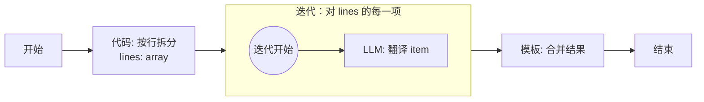
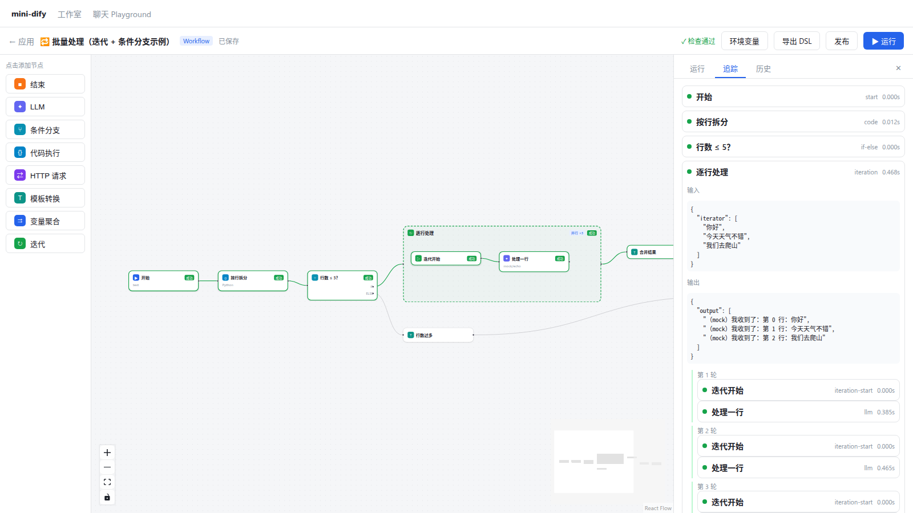

# 第 11 章 容器节点：Iteration 与 Loop

> 本章目标：理解 DAG 怎样表达“对每一项做同样的事”；实现带子作用域、可并行、有错误策略的迭代节点；对比 graphon 的“执行帧”方案。
> 前置：第 8、9、10 章。对应代码：mini-dify **v0.2** `backend/app/workflow/nodes/iteration.py`；前端容器节点见 v0.3。

## 11.1 问题：DAG 里没有循环，那批处理怎么办

第 7 章讲过，图里不允许有环。可是“对一个列表里的每一项都调用一次 LLM”这种需求非常常见：批量翻译、逐段总结、对检索结果逐条打分……

解决办法是**容器节点**：把循环体画成一个**子图**，放在容器里面；对外层的图来说，整个容器只是**一个节点**。



- 外层图依然是 DAG：`开始 → 拆分 → [迭代] → 合并 → 结束`；
- 子图也是 DAG：`迭代开始 → LLM`；
- 迭代节点依次（或并行）对每一项运行一次子图，然后把每轮的输出收集成一个数组。

Dify 有两种容器：

- **迭代（Iteration）**：遍历一个数组，每项运行一次，输出一个数组；可以并行；
- **循环（Loop）**：重复执行，直到满足退出条件或达到最大次数；每轮可以修改“循环变量”；只能串行（`graphon/nodes/loop/loop_node.py`）。

## 11.2 子图在 JSON 里怎么表示

子节点**和外层节点放在同一个 `nodes` 列表里**，用 `parentId` 指明自己属于哪个容器。这正是 React Flow 实现“子流程（sub flow）”的方式，所以画布能直接渲染：

```yaml
- id: loop                      # 迭代节点本身
  type: iteration               # React Flow 的容器组件
  style: {width: 620, height: 240}
  data:
    type: iteration
    iterator_selector: [split, lines]
    output_selector: [line_llm, text]    # 每一轮取哪个变量作为这一轮的输出
    start_node_id: loopstart
    is_parallel: true
    parallel_nums: 3
    error_handle_mode: terminated
- id: loopstart
  parentId: loop                # ← 属于 loop
  data: {type: iteration-start}
- id: line_llm
  parentId: loop
  data:
    type: llm
    prompt_template:
    - {role: user, text: "第 {{#loop.index#}} 行：{{#loop.item#}}"}   # ← 引用当前项
```

子图内的节点通过 `{{#迭代节点ID.item#}}` 和 `{{#迭代节点ID.index#}}` 引用当前项和当前序号。

## 11.3 Dify 是怎么做的：执行帧

graphon 的迭代节点**并不自己运行子图**，而是向引擎“申请”运行：

```python
# graphon/nodes/iteration/iteration_node.py:63  IterationNode._run（节选）
iterator_value = self._resolve_iterator_value(variable)
parallel_nums = self.node_data.parallel_nums if self.node_data.is_parallel else 1
yield IterationStartedEvent(start_at=started_at, inputs=inputs, metadata={"iteration_length": len(iterator_value)})
indexes = tuple(range(min(parallel_nums, len(iterator_value))))
for index in indexes:
    yield IterationNextEvent(index=index)
yield IterationFrameRequest(                 # ← “请帮我在这些项上跑子图”
    items=tuple(build_container_value(item) for item in iterator_value),
    root_node_id=root_node_id,
    indexes=indexes,
    output_selector=tuple(self.node_data.output_selector),
    error_handle_mode=self.node_data.error_handle_mode,
    flatten_output=self.node_data.flatten_output,
    parallel_nums=parallel_nums,
)
```

引擎收到这个请求后，交给 `IterationContainerHandler`（`graphon/graph_engine/iteration_container_handler.py:35`）处理。它为每一轮创建一个**执行帧（ExecutionFrame）**：每个帧有自己的子图状态、变量池和边处理器，但所有帧都**由同一个引擎、同一个 Worker 池**来执行。某一轮跑完了，就启动下一轮（`_continue_or_complete_iteration`，第 265 行）；全部跑完后，按序号整理输出（`_ordered_iteration_outputs`，第 463 行），把结果交还给迭代节点。

这样设计换来了三个好处：

1. **共用 Worker 池**：嵌套很深的迭代也不会线程数爆炸；
2. **暂停可以发生在迭代内部**：子图里的“人工输入”节点暂停时，帧的状态可以被序列化保存（`restore_frame`，第 44 行），恢复后从那一轮继续；
3. 子图事件天然带着 `in_iteration_id`，可以直接透传给外层。

错误处理模式（`graphon/enums.py:98`）：

```python
class ErrorHandleMode(StrEnum):
    TERMINATED = "terminated"                          # 任意一轮失败，整个迭代失败
    CONTINUE_ON_ERROR = "continue-on-error"            # 失败的那一轮输出 None，继续执行
    REMOVE_ABNORMAL_OUTPUT = "remove-abnormal-output"  # 失败的那一轮从输出中移除
```

另外，`flatten_output` 选项可以把“每轮输出一个数组”的结果展平成一个大数组。

## 11.4 从零实现：每轮一个子引擎

我们选择更直观的方案：**迭代节点自己为每一轮启动一个子 GraphEngine**。

```python
# backend/app/workflow/nodes/iteration.py
@register_node
class IterationNode(Node):
    node_type = NodeType.ITERATION
    data_class = IterationNodeData
    execution_type = ExecutionType.CONTAINER

    def _run(self):
        from app.workflow.engine import GraphEngine     # 在函数内 import：engine 模块本身 import 了 nodes
        from app.workflow.graph import Graph

        items = self.pool.get(self.data.iterator_selector) or []
        if not isinstance(items, list):
            raise NodeError(f"迭代输入必须是数组，实际是 {type(items).__name__}")

        yield self.event(IterationStarted, inputs={"iterator": items})
        results, errors, tokens = [None] * len(items), [None] * len(items), [0] * len(items)
        events: queue.Queue = queue.Queue()

        def run_round(index, item):                      # 在单独的线程里运行
            pool = self.pool.child()                     # ① 子作用域：读取回落到外层，写入只留在本轮
            pool.add((self.id, "item"), item)
            pool.add((self.id, "index"), index)
            ctx = replace(self.ctx, pool=pool, iteration_id=self.id, iteration_index=index,
                          stop_event=threading.Event(), parent=self.ctx)    # ② 本轮自己的停止标志
            try:
                engine = GraphEngine(Graph.build(self.ctx.graph_config, ctx, parent_id=self.id), ctx,
                                     stream_response=False)
                events.put(self.event(IterationNext, index=index))
                for ev in engine.run():
                    if isinstance(ev, (GraphRunFailed, GraphRunAborted)):
                        errors[index] = getattr(ev, "error", "") or getattr(ev, "reason", "")
                    elif not isinstance(ev, (GraphRunStarted, GraphRunSucceeded, GraphRunPartialSucceeded,
                                             ResponseChunk, EdgeTaken, EdgeSkipped)):
                        events.put(ev)                   # ③ 子图的节点事件转发出去
                results[index] = pool.get(self.data.output_selector)
                tokens[index] = engine.total_tokens
            except Exception as e:
                errors[index] = str(e)
            finally:
                events.put(_DONE)

        workers = max(1, self.data.parallel_nums) if self.data.is_parallel else 1
        pending, running, finished = list(enumerate(items)), 0, 0
        while finished < len(items):
            while pending and running < workers and not self.ctx.should_stop():   # ④ 控制并发数
                idx, item = pending.pop(0)
                threading.Thread(target=run_round, args=(idx, item), daemon=True).start()
                running += 1
            if running == 0:
                break
            ev = events.get()
            if ev is _DONE:
                running -= 1
                finished += 1
                if self.data.error_handle_mode == "terminated" and any(errors):
                    pending.clear()                      # 有一轮失败了：不再启动新的轮次
                continue
            yield ev                                     # 转发给外层引擎

        first_error = next((e for e in errors if e), None)
        if first_error and self.data.error_handle_mode == "terminated":
            yield self.event(IterationFailed, error=first_error)
            raise NodeError(f"迭代第 {errors.index(first_error)} 轮失败：{first_error}")
        if self.data.error_handle_mode == "remove-abnormal-output":
            results = [r for r, e in zip(results, errors) if not e]

        yield self.event(IterationSucceeded, outputs={"output": results}, steps=len(items))
        yield NodeRunResult(inputs={"iterator": items}, outputs={"output": results}, total_tokens=sum(tokens))
```

逐个解释编号处的设计：

**① 子作用域。** 每轮一个 `pool.child()`。并行的三轮各自写入自己的 `line_llm.text`，互不覆盖；子图里也能照常读到外层的 `split.lines`、`sys.query`。

**② 独立的停止标志 + 父级链接。** 最初的草稿里，所有轮次直接共用外层的 `stop_event`。写完后自查时发现了问题：某一轮的子引擎因为节点失败而设置停止标志时，会把**整个外层工作流**都停掉，即使配置的是 `continue-on-error`。（这个问题是在运行测试之前就改掉的，并没有实际触发。）修正方法是：每轮有自己的 `stop_event`，同时通过 `parent` 链接到外层。`should_stop()` 会沿着父级链往上检查，所以外层停止时每一轮都会跟着停，但某一轮失败不会影响外层。

**③ 事件透传。** 子图节点产生的 `NodeRunStarted / Succeeded` 等事件，带着 `in_iteration_id=迭代节点ID` 和 `iteration_index`，经由迭代节点的生成器交给外层引擎。外层引擎的 `_is_own()` 判断“这不是我图里的节点”，就原样转发出去（第 9 章 9.4.5）。前端据此把子节点的追踪信息按轮次归组显示。

写作时还遇到过另一个 bug：子图的 `EdgeTaken` 事件也被转发出去了，而外层引擎的 `_is_own()` 假设所有事件都是节点事件，访问 `event.node_id` 时直接报错。修复方法有两处：迭代节点丢弃子图的边事件；`_is_own()` 先判断事件是不是 `NodeEvent`。这类 bug 只有在写测试时才会暴露，这也是第 9 章强调测试的原因。

**④ 并发控制。** 用“正在运行的轮次数 < 并发上限”来控制同时启动的线程数，每轮跑完（收到 `_DONE`）再启动下一轮。串行执行就是并发数为 1 的特例，两种模式共用同一套代码。

**输出顺序**：`results[index] = ...` 按序号写入，所以即使第 3 轮先跑完，输出数组的顺序依然和输入一致。测试 `test_iteration_parallel_preserves_order` 让每轮随机 sleep 一段时间，以此验证这一点。

**token 统计**：每轮子引擎的 `total_tokens` 加总后，作为迭代节点的 `total_tokens` 上报。这同样是写作时发现的遗漏：最初版本里，迭代内部 LLM 消耗的 token 没有计入运行总数。

### 子图的构建

`Graph.build(config, ctx, parent_id=self.id)` 只挑出 `parentId == 迭代节点ID` 的节点，以 `iteration-start` 作为根节点（第 9 章 9.4.2）。`iteration-start` 节点本身什么也不做，存在的意义只是给子图提供一个入口：

```python
@register_node
class IterationStartNode(Node):
    node_type = NodeType.ITERATION_START
    execution_type = ExecutionType.ROOT
    def _run(self):
        return NodeRunResult()
```

### 两种方案对比

| | graphon：执行帧 | mini-dify：子引擎 |
|---|---|---|
| 线程 | 共用引擎的 Worker 池 | 每轮一个线程 + 子引擎自己的线程池 |
| 嵌套迭代 | 线程数可控 | 线程数随嵌套层数相乘 |
| 迭代内暂停/恢复 | 支持（帧可以序列化） | 不支持 |
| 代码复杂度 | 容器处理器约 500 行 | 迭代节点约 100 行 |

教学项目选子引擎方案没有问题。如果要上生产，帧方案更稳妥。

## 11.5 运行与验证

```bash
cd code/mini-dify && git checkout v0.3      # 示例 DSL 从 v0.3 开始提供
cd backend && uv run pytest -q tests/test_engine.py -k iteration
```

导入 `examples/batch-translate.yml`，然后用三行文本运行（写作时的实际输出）：

```json
{"status": "succeeded", "outputs": {"result":
  "1. （mock）我收到了：第 0 行：你好\n2. （mock）我收到了：第 1 行：今天天气不错\n3. （mock）我收到了：第 2 行：我们去爬山\n"},
 "total_steps": 7}
```

在 UI 的追踪面板里，迭代节点下面会按“第 1 轮 / 第 2 轮 / 第 3 轮”展开显示子节点：



## 11.6 练习

1. **巩固**：子作用域为什么必须“写入只写自己”？如果写入也直接写到父池里，并行迭代会出现什么问题？
2. **扩展**：实现 **Loop 节点**：配置 `loop_count`（最大次数）和 `break_conditions`（复用 IF/ELSE 的条件结构），以及若干“循环变量”。每轮开始前把循环变量放进子池，每轮结束后从子池读回新值。
3. **读源码**：读 graphon `iteration_container_handler.py` 的 `_continue_or_complete_iteration`，画出一轮结束之后，“启动下一轮”或“结束整个迭代”的判断流程。

## 11.7 延伸阅读

- `graphon/nodes/loop/loop_node.py` 与 `graph_engine/loop_container_handler.py`
- React Flow 文档的 Sub Flows 章节：`parentId` 和 `extent: 'parent'`
