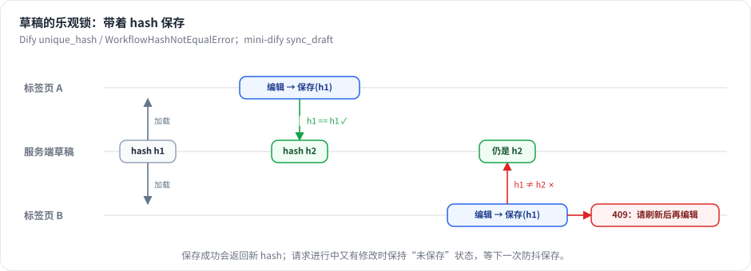

# 第 15 章 编辑器状态管理

> 本章目标：设计编辑器的状态（图数据、选中项、运行状态、保存状态、撤销历史）；实现带乐观锁的防抖自动保存和撤销/重做。
> 前置：第 7 章（hash 乐观锁）、第 14 章。对应代码：mini-dify **v0.3** `frontend/src/workflow/store.ts`、`hooks/useSyncDraft.ts`。

## 15.1 问题：编辑器里有哪些状态

| 状态 | 例子 | 是否需要保存到服务端 |
|---|---|---|
| 图数据 | nodes、edges、环境变量 | 是 |
| 图数据里的 UI 临时字段 | 节点的运行状态 `_status`、是否被选中、是否正在拖拽 | **否** |
| 编辑器 UI 状态 | 当前选中的节点、打开了哪个面板 | 否 |
| 运行状态 | 运行状态、task_id、追踪列表、流式输出的文字 | 否（运行记录在服务端另有一份） |
| 保存状态 | 已保存 / 保存中 / 有未保存的修改 / 保存失败、当前 hash | 否 |
| 撤销历史 | 之前的若干个快照 | 否 |

难点有三个：

1. **自动保存**：用户不应该需要手动点“保存”，但也不能每拖动一个像素就发一次请求；
2. **并发冲突**：同一个应用在两个标签页里打开时，不能悄无声息地互相覆盖；
3. **区分“需要保存的字段”和“UI 临时字段”**：运行状态绝不能被保存进草稿里。

## 15.2 Dify 是怎么做的

### 15.2.1 Zustand + 分片（slices）

Dify 的编辑器状态是一个 Zustand store（`web/app/components/workflow/store/workflow/index.ts:71` `createWorkflowStore`），按职责拆成多个分片：

```
store/workflow/
├── workflow-slice.ts        运行数据（workflowRunningData：状态、追踪、结果）
├── node-slice.ts            节点相关的 UI 状态
├── panel-slice.ts           面板的打开与关闭
├── workflow-draft-slice.ts  草稿同步：hash、防抖、是否正在同步
├── history-slice.ts         历史
├── env-variable-slice.ts / chat-variable-slice.ts
├── version-slice.ts / comment-slice.ts / layout-slice.ts / ...
```

**nodes 和 edges 本身并不在这个 store 里**，而是放在 React Flow 自己的内部 store 中（通过 `useStoreApi()` 的 `getNodes/setNodes` 访问）。Dify 的画布是“半受控”的。

### 15.2.2 防抖自动保存

```ts
// web/app/components/workflow/store/workflow/workflow-draft-slice.ts:35
const debouncedFn = debounce((syncWorkflowDraft) => {
  syncWorkflowDraft()
}, 5000)                       // 最后一次修改后 5 秒才保存
```

每个修改图的操作（连线、拖拽结束、删除、修改面板配置……）都会调用 `handleSyncWorkflowDraft()`，它在内部调用 `debouncedSyncWorkflowDraft(doSyncWorkflowDraft)`。

真正发送的请求（`web/app/components/workflow-app/hooks/use-nodes-sync-draft.ts`）：

```ts
// getPostParams（节选）
nodes.forEach((node) => {
  Object.keys(node.data).forEach((key) => {
    if (key.startsWith('_')) delete node.data[key]       // ← 去掉所有 _ 开头的 UI 临时字段
  })
})
edges.filter((edge) => !edge.data?._isTemp)               // ← 临时边（比如正在拖拽的连线）不保存
...
return { url: `/apps/${appId}/workflows/draft`,
         params: { graph: { nodes, edges, viewport }, features: featuresPayload,
                   environment_variables, conversation_variables, hash: syncWorkflowDraftHash } }
```

保存成功后，用返回的新 hash 更新 store（`setSyncWorkflowDraftHash(res.hash)`）。

**约定：所有以 `_` 开头的 data 字段都是 UI 状态**，例如 `_runningStatus`、`_isSingleRun`、`_waitingRun`。这是一个简单又有效的约定，序列化时用一个循环就能把它们全部过滤掉。

### 15.2.3 关闭页面时保存

用户在防抖的 5 秒窗口内关掉页面，修改就丢了。`syncWorkflowDraftWhenPageClose` 在页面卸载时调用 `postWithKeepalive(...)`，也就是带 `keepalive: true` 的 fetch。普通请求会在页面卸载时被浏览器取消，而 keepalive 请求能在页面关闭后继续完成。

### 15.2.4 撤销与重做

`web/app/components/workflow/workflow-history-store.ts` 使用了 **zundo**（Zustand 的时间旅行中间件），历史记录里存的是 `{nodes, edges, workflowHistoryEvent}` 快照。每次有意义的操作都调用 `saveStateToHistory(WorkflowHistoryEvent.NodeConnect, ...)`，事件类型会在历史面板里显示为“连接节点”“删除节点”等。

**并不是每一个变化都会记入历史**：拖拽过程中每一帧的位置变化不会记录，只有拖拽**结束**时（`handleNodeDragStop`，`use-nodes-interactions.ts:329`）才记录一步。

## 15.3 从零实现

### 15.3.1 一个 store 管全部

mini-dify 把所有状态放进**一个** Zustand store，nodes 和 edges 也在里面，React Flow 完全受控：

```ts
// frontend/src/workflow/store.ts
type State = {
  app: AppInfo | null
  nodes: WFNode[]
  edges: WFEdge[]
  env: Record<string, unknown>
  hash: string | null
  selectedId: string | null
  saveState: 'saved' | 'saving' | 'dirty' | 'error'
  problems: string[]                 // 检查清单（第 16 章）
  run: RunState                      // 运行状态（第 17 章）
  past: Snapshot[]                   // 撤销栈
  future: Snapshot[]                 // 重做栈
  // actions…
}
export const useWorkflowStore = create<State>((set, get) => ({ ... }))
```

在组件里**按字段订阅**，只订阅自己用到的那部分状态：

```tsx
const nodes = useWorkflowStore((s) => s.nodes)               // nodes 变化时才重新渲染
const saveState = useWorkflowStore((s) => s.saveState)
```

在事件处理函数这类非渲染代码里，用 `useWorkflowStore.getState()` 直接读取最新值，不会产生订阅。

### 15.3.2 “脏”标记：谁会触发保存

所有修改图数据的 action 都会把 `saveState` 设成 `'dirty'`；纯 UI 的变化（选中、尺寸测量）则不会：

```ts
onNodesChange: (changes) => {
  ...
  set({
    nodes, edges: ...,
    saveState: filtered.some((c) => c.type !== 'select' && c.type !== 'dimensions') ? 'dirty' : get().saveState,
  })
},
updateNodeData: (id, patch) =>
  set({ nodes: get().nodes.map((n) => (n.id === id ? { ...n, data: { ...n.data, ...patch } } : n)), saveState: 'dirty' }),
```

**运行状态的更新（`setNodeStatus`）不会把状态标记为 dirty**，所以运行时节点颜色的变化不会触发保存，并且序列化时 `_status` 也会被过滤掉，两道保险。

### 15.3.3 防抖自动保存 + 乐观锁



*图 15-1：每次保存都带上最后一次拿到的 hash；冲突时返回 409（同图 7-1）。*


```ts
// frontend/src/workflow/hooks/useSyncDraft.ts
export function useSyncDraft(appId: string) {
  const timer = useRef<number>()

  const saveNow = async () => {
    const { nodes, edges, env, hash } = useWorkflowStore.getState()
    useWorkflowStore.setState({ saveState: 'saving' })
    try {
      const res = await api.post(`/api/apps/${appId}/workflows/draft`,
                                 { graph: serializeGraph(nodes, edges), hash, environment_variables: env })
      const problems = (await api.get(`/api/apps/${appId}/workflows/draft/checklist`)).problems
      // 请求进行期间用户又改了内容？那就保持 dirty，等待下一次保存
      const stillDirty = useWorkflowStore.getState().saveState === 'dirty'
      useWorkflowStore.setState({ hash: res.hash, problems, saveState: stillDirty ? 'dirty' : 'saved' })
    } catch (e) {
      useWorkflowStore.setState({ saveState: 'error' })
      if (e instanceof ApiError && e.status === 409) alert(e.message)    // 草稿已在别处被修改
    }
  }

  useEffect(() => {
    // 在 React 渲染之外订阅 store：一旦变脏就（重新）开始倒计时
    const unsub = useWorkflowStore.subscribe((s, prev) => {
      if (s.saveState === 'dirty' && (s.nodes !== prev.nodes || s.edges !== prev.edges || s.env !== prev.env)) {
        window.clearTimeout(timer.current)
        timer.current = window.setTimeout(saveNow, 800)
      }
    })
    return () => { unsub(); window.clearTimeout(timer.current) }
  }, [appId])

  return { saveNow }
}
```

设计要点：

- **`store.subscribe` 而不是 `useEffect([nodes])`**：订阅不会让组件重新渲染，也不受 React 依赖数组的心智负担影响；
- **防抖间隔 800ms**：教学项目里希望变化尽快保存，Dify 用的是 5 秒；
- **“保存期间又发生了修改”**：这是一个经典的竞态。请求发出后用户继续编辑，请求返回时如果直接设为 `saved`，就会丢掉“还有未保存的修改”这个信息。所以要先检查当前是否仍然是 dirty；
- **`saveNow` 暴露出来**：点击“运行”“发布”或“单步调试”之前，都会先 `await saveNow()`，**保证运行的就是屏幕上看到的那张图**。

### 15.3.4 序列化：只保存该保存的字段

```ts
export function serializeGraph(nodes: WFNode[], edges: WFEdge[]) {
  return {
    nodes: nodes.map((n) => ({
      id: n.id, type: n.type, position: n.position,
      data: Object.fromEntries(Object.entries(n.data).filter(([k]) => !k.startsWith('_'))),   // 和 Dify 同样的约定
      ...(n.parentId ? { parentId: n.parentId } : {}),
      ...(n.style ? { style: n.style } : {}),          // 迭代容器的尺寸
    })),
    edges: edges.map((e) => ({ id: e.id, source: e.source, sourceHandle: e.sourceHandle ?? 'source',
                               target: e.target, targetHandle: 'target' })),
  }
}
```

React Flow 会往节点对象上附加很多运行时属性（`selected`、`dragging`、`measured`……），序列化时**白名单式地只取需要的字段**，比黑名单式地删除不需要的字段更安全。

### 15.3.5 撤销与重做

```ts
pushHistory: () => {
  const { nodes, edges, past } = get()
  set({ past: [...past.slice(-49), { nodes, edges }], future: [] })   // 最多保留 50 步；新操作会清空重做栈
},
undo: () => {
  const { past, future, nodes, edges } = get()
  const prev = past[past.length - 1]
  if (!prev) return
  set({ ...prev, past: past.slice(0, -1), future: [{ nodes, edges }, ...future], saveState: 'dirty' })
},
redo: () => { /* 对称 */ },
```

什么时候 `pushHistory`？在**修改发生之前**调用，把修改前的状态压栈：连线、删除、添加节点、拖拽结束（`c.type === 'position' && c.dragging === false`）。

由于 nodes 和 edges 都是**不可变**更新的（每次修改都生成新数组），快照只需要保存引用，不需要深拷贝，成本很低。这就是坚持不可变更新的回报。

快捷键 Ctrl/Cmd+Z 和 Ctrl/Cmd+Shift+Z 在 `Canvas.tsx` 里注册。焦点在输入框里时要忽略这两个快捷键，否则在面板里编辑文字时按撤销，会把整张图撤销掉。

## 15.4 运行与验证

1. 打开编辑器，修改一个节点的标题，顶栏状态依次变为“未保存 → 保存中… → 已保存”；
2. 同一个应用在两个标签页中打开，在 A 标签页修改并保存，再去 B 标签页修改：B 会弹出“草稿已在别处被修改，请刷新后再编辑”（后端返回了 409）；
3. 删除一个节点后按 Ctrl+Z，节点和它的连线都会恢复；
4. 运行一次工作流，节点变色，**但保存状态没有变成“未保存”**。

## 15.5 练习

1. **巩固**：如果把运行状态写在 `data.status`（没有下划线前缀）里，会发生什么？
2. **扩展**：实现“关闭页面时保存”：监听 `pagehide` 事件，用 `fetch(url, { method: 'POST', keepalive: true, headers, body })` 发出最后一次保存。注意 keepalive 请求的 body 有 64KB 的大小限制。
3. **读源码**：Dify 支持多人协同编辑（`web/app/components/workflow/collaboration/`），它是怎样绕开 hash 乐观锁的？（提示：搜索 `_is_collaborative`。）

## 15.6 延伸阅读

- zundo：Zustand 的撤销中间件
- `web/app/components/workflow/hooks/use-workflow-history.ts`：Dify 历史事件的类型定义和面板显示
