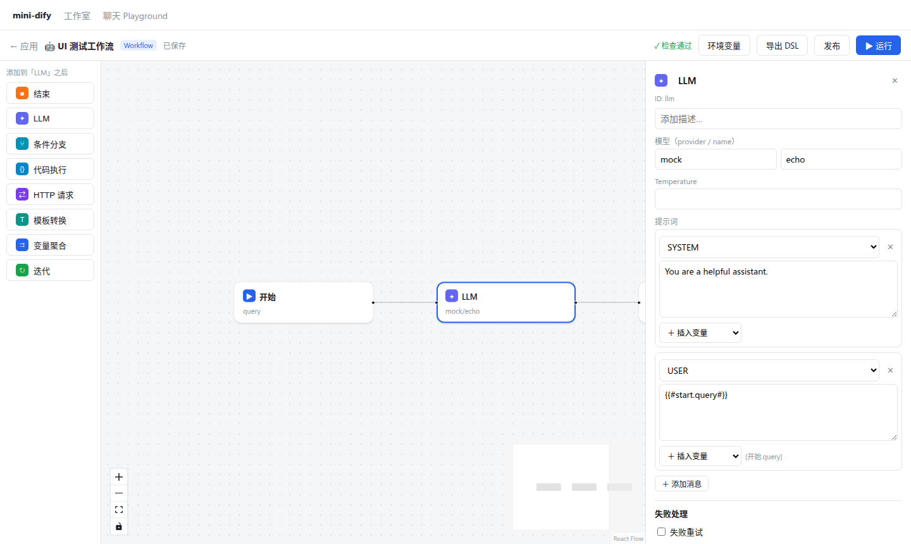

# 第 16 章 节点配置面板与变量选择器 ★

> 本章目标：实现“选中节点 → 右侧面板配置它”；实现变量选择器（只能选上游变量）和带变量插入的提示词编辑器；实现检查清单。理解前端怎样在不跑工作流的情况下，知道“上游有哪些变量”。
> 前置：第 8 章（selector）、第 14、15 章。对应代码：mini-dify **v0.3** `frontend/src/workflow/availableVars.ts`、`components/fields.tsx`、`components/panels.tsx`、`components/NodePanel.tsx`。

## 16.1 问题：用户怎么写出 `{{#1711527768326.text#}}`

没有人记得住节点 ID。用户需要的是一个下拉框，按节点分组列出“我**现在可以**用的变量”：

```
开始
  └─ query (string)
HTTP 请求
  ├─ status_code (number)
  ├─ body (string)
  └─ headers (object)
系统变量
  ├─ sys.user_id (string)
  └─ ...
```

选中一项后，存进去的是 selector（`["1711527768326", "text"]`）或模板写法（`{{#1711527768326.text#}}`），显示出来的却是可读的“HTTP 请求.body”。

要做到这一点，前端需要回答两个问题：

1. **哪些节点是“上游”**？——只有上游节点的输出，在当前节点运行时一定已经存在（第 8 章）。
2. **每个节点会输出哪些变量、各是什么类型**？——工作流还没运行过，前端也必须知道。

## 16.2 Dify 是怎么做的

### 16.2.1 上游节点：沿着入边反向遍历

```ts
// web/app/components/workflow/hooks/use-workflow.ts:104
const getBeforeNodesInSameBranch = useCallback((nodeId, newNodes?, newEdges?) => {
  const currentNode = nodes.find((node) => node.id === nodeId)
  const list: Node[] = []
  if (currentNode.parentId) {                                // 在容器里：先把容器的上游也加进来
    const parentNode = nodes.find((node) => node.id === currentNode.parentId)
    list.push(...getBeforeNodesInSameBranch(parentNode.id))
  }
  const traverse = (root, callback) => {                     // DFS：沿入边一路往回走
    getIncomers(root, nodes, edges).forEach((node) => {
      if (!list.find((n) => node.id === n.id)) { callback(node); traverse(node, callback) }
    })
  }
  traverse(currentNode, (node) => list.push(node))
  return uniqBy(list, 'id').reverse().filter((item) => SUPPORT_OUTPUT_VARS_NODE.includes(item.data.type))
}, [...])

// :155 —— 再加上容器节点本身（提供 item/index）
const getBeforeNodesInSameBranchIncludeParent = (nodeId) => {
  const nodes = getBeforeNodesInSameBranch(nodeId)
  if (parentNode) nodes.push(parentNode)
  return nodes
}
```

`web/app/components/workflow/hooks/use-nodes-available-var-list.ts` 用这些上游节点，加上每种节点的输出定义，算出可用变量的列表（`toNodeAvailableVars`，位于 `nodes/_base/components/variable/utils.ts:1089`）。

### 16.2.2 每种节点的输出：前端静态定义

每个节点的 `default.ts` 里都声明了它会输出什么（或者由 `utils.ts` 里的 `formatItem`，第 301 行，按节点类型统一生成）。例如 LLM 节点输出 `text`（string）、`usage`（object）；代码节点的输出则读取用户在面板里声明的 `outputs`。**这些信息完全在前端计算，不需要后端参与。**

### 16.2.3 变量选择器组件

`web/app/components/workflow/nodes/_base/components/variable/var-reference-picker.tsx` 是一个弹出式选择器：按节点分组、支持搜索、支持类型过滤（例如迭代节点只能选数组类型的变量），还能展开对象类型的变量去选择它的子字段（`object-child-tree-panel/`）。

文本类字段（提示词、HTTP URL、回复内容）使用的是基于 Lexical 的富文本**提示词编辑器**，变量以“块”的形式显示（一个带图标的标签），键入 `{` 或 `/` 就会弹出变量菜单。

### 16.2.4 检查清单

`web/app/components/workflow/hooks/use-checklist.ts:165` 的 `useChecklist(nodes, edges)` 会遍历所有节点：

- 调用每个节点 `default.ts` 里的 `checkValid(data, t)`：模型是否已配置、必填项是否已填写、引用的变量是否存在……；
- 用 `getValidTreeNodes` 找出没有连接到开始节点的“孤立节点”；
- 插件是否已经安装。

右上角会显示问题数量，点开能看到每个问题，点击某个问题就会定位到对应的节点。**发布按钮在有问题时不可用。**

## 16.3 从零实现

### 16.3.1 每种节点的输出

```ts
// frontend/src/workflow/blocks.ts
export function outputVars(node: WFNode): VarInfo[] {
  const d = node.data
  let vars: VarInfo[] = []
  switch (d.type) {
    case 'start':   vars = (d.variables ?? []).map((v) => ({ variable: v.variable, type: v.type === 'number' ? 'number' : 'string' })); break
    case 'llm':     vars = [{ variable: 'text', type: 'string' }, { variable: 'usage', type: 'object' }]; break
    case 'code':    vars = Object.entries(d.outputs ?? {}).map(([k, v]) => ({ variable: k, type: v.type })); break   // 用户声明的输出
    case 'http-request': vars = [{ variable: 'status_code', type: 'number' }, { variable: 'body', type: 'string' }, { variable: 'headers', type: 'object' }]; break
    case 'iteration': vars = [{ variable: 'output', type: 'array[any]' }]; break
    ...
  }
  if (d.error_strategy) vars = [...vars, { variable: 'error_message', type: 'string' }, { variable: 'error_type', type: 'string' }]
  return vars
}
```

**这份定义必须和后端节点的实际输出保持一致**，这是前后端之间的一个隐式契约。Dify 也存在同样的问题，它通过两侧都写测试来保证一致性。

### 16.3.2 可用变量

```ts
// frontend/src/workflow/availableVars.ts
export function ancestors(nodeId: string, edges: WFEdge[]): Set<string> {
  const incoming = new Map<string, string[]>()
  for (const e of edges) incoming.set(e.target, [...(incoming.get(e.target) ?? []), e.source])
  const seen = new Set<string>()
  const stack = [...(incoming.get(nodeId) ?? [])]
  while (stack.length) {                                  // 迭代式 DFS，不会爆栈
    const cur = stack.pop()!
    if (seen.has(cur)) continue
    seen.add(cur)
    stack.push(...(incoming.get(cur) ?? []))
  }
  return seen
}

export function availableVars(nodeId, nodes, edges, mode, env = {}): NodeVars[] {
  const byId = new Map(nodes.map((n) => [n.id, n]))
  const self = byId.get(nodeId)
  const result: NodeVars[] = []
  const addAncestorsOf = (id: string) => {
    for (const aid of ancestors(id, edges)) {
      const n = byId.get(aid)
      const vars = n ? outputVars(n) : []
      if (n && vars.length) result.push({ nodeId: n.id, title: n.data.title, vars })
    }
  }
  addAncestorsOf(nodeId)
  if (self?.parentId) {                                   // 在迭代里：当前项 + 容器外部的上游
    const parent = byId.get(self.parentId)!
    result.push({ nodeId: parent.id, title: `${parent.data.title}（当前项）`,
                  vars: [{ variable: 'item', type: 'any' }, { variable: 'index', type: 'number' }] })
    addAncestorsOf(parent.id)
  }
  result.push({ nodeId: 'sys', title: '系统变量', vars: systemVars(mode) })   // Chatflow 多出 query / conversation_id / dialogue_count
  if (Object.keys(env).length) result.push({ nodeId: 'env', title: '环境变量', vars: Object.keys(env).map((v) => ({ variable: v, type: 'string' })) })
  return result
}
```

和 Dify 的规则一致：**祖先节点 + （在容器里时）容器的当前项和容器外部的祖先 + 系统变量 + 环境变量**。

还有一个 `childVars(iterationId)`：迭代节点的“每轮输出”只能从**迭代内部**的节点中选择，所以要单独计算。

### 16.3.3 两个核心输入组件

**VarPicker**：用原生 `<select>` + `<optgroup>` 实现分组。value 是 `"nodeId.var"`，选中后再拆成 selector：

```tsx
// frontend/src/workflow/components/fields.tsx
export function VarPicker({ value, onChange, vars, filter }) {
  const key = value?.length ? value.join('.') : ''
  return (
    <select value={key} onChange={(e) => onChange(e.target.value ? e.target.value.split('.') : [])}>
      <option value="">— 选择变量 —</option>
      {vars.map((g) => (
        <optgroup key={g.nodeId} label={g.title}>
          {g.vars.filter((v) => !filter || filter(v.type)).map((v) => (
            <option key={v.variable} value={`${g.nodeId}.${v.variable}`}>{g.title}.{v.variable} ({v.type})</option>
          ))}
        </optgroup>
      ))}
      {/* 已选中的变量不在可用列表里（上游节点被删了、连线断了）：显示警告，而不是悄悄清空 */}
      {key && !vars.some((g) => g.vars.some((v) => `${g.nodeId}.${v.variable}` === key)) && (
        <option value={key}>⚠ {key}（不可用）</option>
      )}
    </select>
  )
}
```

最后那个“⚠ 不可用”选项很重要：用户删掉一个上游节点后，下游引用它的地方**不能静默失效**，必须让用户看见。

**PromptEditor**：在 textarea 下方加一个“＋ 插入变量”菜单，在光标位置插入 `{{#id.var#}}`，并在旁边显示一行**可读预览**（把 ID 替换成节点标题）：

```tsx
const insert = (token: string) => {
  const el = ref.current
  const start = el?.selectionStart ?? value.length, end = el?.selectionEnd ?? value.length
  onChange(value.slice(0, start) + token + value.slice(end))
}
const titles = new Map(vars.map((g) => [g.nodeId, g.title]))
const preview = value.replace(/\{\{#([a-zA-Z0-9_]+)\.([a-zA-Z0-9_.]+)#\}\}/g, (_, id, v) => `[${titles.get(id) ?? id}.${v}]`)
```

Dify 用 Lexical 把变量渲染成“块”，体验更好，但背后的机制一模一样：存储的是 `{{#id.var#}}`，显示的是节点标题。

### 16.3.4 面板：通用外壳 + 每种节点一个内容组件

```tsx
// frontend/src/workflow/components/NodePanel.tsx
export default function NodePanel({ appId, saveNow }) {
  const node = useWorkflowStore((s) => s.nodes.find((n) => n.id === s.selectedId))
  ...
  const update = (patch) => updateNodeData(node.id, patch)
  const vars = availableVars(node.id, nodes, edges, mode, env)      // 每次渲染都重新计算：图变了，可用变量也跟着变
  const Panel = PANELS[data.type]
  return (
    <aside className="node-panel" key={node.id}>                    {/* key：切换节点时重置面板内部状态 */}
      {/* 标题、ID、描述 */}
      {Panel && <Panel data={data} update={update} vars={vars} childVars={childVars(node.id, nodes)} mode={mode} />}
      {!NO_ERROR_HANDLING.has(data.type) && <ErrorHandling data={data} update={update} />}   {/* 第 12 章 */}
      {...} <SingleRun appId={appId} nodeId={node.id} saveNow={saveNow} />                  {/* 第 17 章 */}
    </aside>
  )
}
```

每种节点的面板只关心自己的字段（`panels.tsx`），统一的 props 是 `{data, update, vars, childVars, mode}`。以 IF/ELSE 面板为例，它是一个嵌套的列表编辑器：case 列表 → 条件列表 → 每个条件由 `VarPicker` + 运算符 + 值组成。新建 case 时 ID 用 `case${Date.now()}`。**case 的 ID 就是这个分支出口的 sourceHandle**，`sourceHandles()` 会据此在画布上多画出一个出口（第 14 章）。

### 16.3.5 检查清单：复用后端校验

mini-dify 没有在前端重复实现一遍校验逻辑，而是**每次自动保存后调用后端的 `/checklist` 接口**（第 15 章 `saveNow` 里的第二个请求）。后端的 `validate_graph` 既服务于检查清单，也服务于发布前的关卡（第 7 章 7.4.4）：

- 结构：根节点、终点、可达性、无环；
- 每个节点：能否通过 `data_class` 校验；`variable_selectors()` 返回的每个变量引用是否已设置、是否指向存在的节点。

```python
# backend/app/workflow/graph.py（v0.3）
def _check_node_config(n, all_ids) -> list[str]:
    cls = NODE_CLASSES[n.type]
    try:
        data = cls.data_class.model_validate(n.data)
    except ValidationError as e:
        return [f"节点「{title}」配置不合法：{e.errors()[0]['msg']}"]
    known = all_ids | {"sys", "env", "conversation"}
    out = []
    for sel in cls.variable_selectors(data):              # 每个节点类自己声明它读取哪些变量
        if len(sel) < 2:
            out.append(f"节点「{title}」有未设置的变量")
        elif sel[0] not in known:
            out.append(f"节点「{title}」引用了不存在的节点 {sel[0]}")
    return out
```

**这条检查是写作过程中补上的**：在浏览器里测试时，新加的代码节点的输入变量没有设置，检查清单却显示“✓ 检查通过”，结果一运行就失败了。补上之后，同样的操作会显示“⚠ 节点「代码执行」有未设置的变量”。

和 Dify 的取舍对比：Dify 在前端做校验，零延迟，但需要维护前后端两份校验逻辑；mini-dify 在后端做校验，只有一份逻辑，每次保存后多一个请求。

## 16.4 运行与验证

1. 选中默认图中的 LLM 节点，打开用户提示词下方的“＋ 插入变量”，只能看到“开始.query”和系统变量，**看不到**“结束”节点的任何东西；
2. 在 LLM 后面加一个代码节点，打开它的输入变量下拉框，现在可以看到“LLM.text”了；
3. 先不选择变量，等待自动保存，顶栏显示“⚠ 1 个问题”，底部显示具体的问题描述；选好变量后问题消失；
4. 把代码节点和 LLM 之间的连线删掉，代码节点的变量下拉框里会出现“⚠ llm.text（不可用）”。



## 16.5 练习

1. **巩固**：为什么下游节点的输出不能出现在可用变量里？请举一个“如果允许，会导致运行时出错”的例子。
2. **扩展**：让 VarPicker 支持对象类型变量的子字段：选择 `http.headers` 时，可以继续展开选择 `http.headers.content-type`（注意 selector 的属性段需要满足正则的要求）。
3. **读源码**：读 Dify 的 `var-reference-vars.helpers.ts`，看搜索过滤和类型过滤是怎么实现的。

## 16.6 延伸阅读

- `web/app/components/base/prompt-editor/`：Dify 基于 Lexical 的提示词编辑器（变量块、上下文块、历史块）
- `web/app/components/workflow/nodes/_base/components/variable/utils.ts`：变量类型推断的完整规则（约 1500 行）
