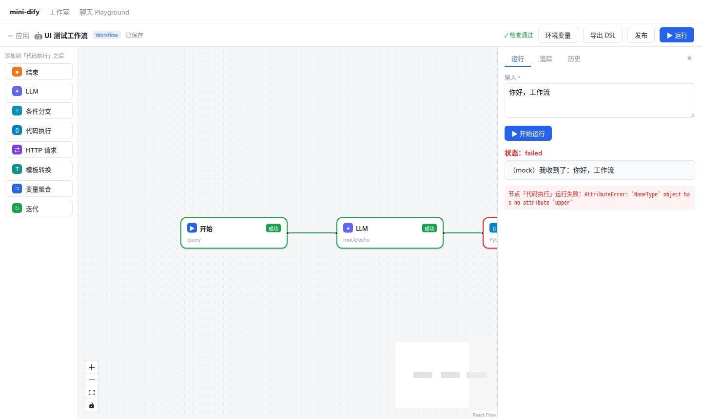
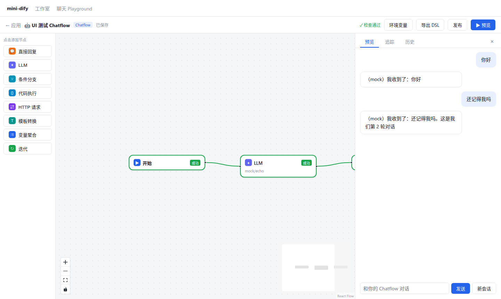

# 第 17 章 运行与调试体验

> 本章目标：把 SSE 事件变成“节点逐个亮起、文字逐字出现、点开任何节点都能看到输入输出”的调试体验；实现运行面板、追踪、历史、单步调试和 Chatflow 预览。
> 前置：第 3、6、13、15 章。对应代码：mini-dify **v0.3** `frontend/src/workflow/hooks/useWorkflowRun.ts`、`components/RunPanel.tsx`、`NodePanel.tsx`（SingleRun）；后端 `services/single_node.py`。

## 17.1 问题：工作流跑错了，怎么查

工作流是一段“程序”，而且出错的方式五花八门：提示词变量没有渲染进去、HTTP 返回的格式和预想的不一样、条件分支走错了、迭代中的某一轮失败了……调试体验直接决定了用户能不能把工作流做出来。一个好的调试器应该提供：

| 能力 | 作用 |
|---|---|
| 实时状态 | 哪个节点正在跑、哪个成功了、哪个失败了，一眼就能看出来 |
| 流式结果 | 不用等全部跑完，就能看到输出 |
| 追踪（Tracing） | 每个节点的输入、处理过程、输出、错误、耗时 |
| 迭代展开 | 按轮次查看容器内部的执行情况 |
| 历史 | 回看过去的运行记录 |
| 单步调试 | 只运行一个节点，自己提供输入，快速迭代提示词 |
| 变量检查 | 查看这次运行中变量池里的所有值 |

## 17.2 Dify 是怎么做的

### 17.2.1 每个事件一个 hook

第 3 章（3.8）介绍过 `web/app/components/workflow/hooks/use-workflow-run-event/` 目录：`use-workflow-started.ts`、`use-workflow-node-started.ts`、`use-workflow-node-finished.ts`、`use-workflow-text-chunk.ts`、`use-workflow-node-iteration-next.ts`、`use-workflow-finished.ts`……一个事件对应一个 hook，由 `use-workflow-run-event.ts` 汇总，交给 `ssePost` 作为回调。

它们修改两类状态：

- **画布节点的 `data._runningStatus`**（以及边上的运行状态），决定节点和边的颜色；
- **`workflowRunningData`**（workflow-slice），包括 `result`（状态、输出、耗时、token）、`tracing`（每个节点的执行记录列表）和 `resultText`（流式文字）。

### 17.2.2 运行面板

`web/app/components/workflow/run/` 目录：

- `result-panel.tsx` / `result-text.tsx`：结果与流式文字；
- `tracing-panel.tsx` + `node.tsx`：追踪列表，每个节点可以展开查看输入、处理过程和输出（JSON 视图）；
- `iteration-log/`、`loop-log/`、`retry-log/`、`agent-log/`：容器的每一轮、重试历史、Agent 的推理步骤，都有专门的视图。

### 17.2.3 单步调试与变量检查

在节点面板上点击“运行此步骤”，后端对应的接口是 `POST /apps/{id}/workflows/draft/nodes/{node_id}/run`（`api/controllers/console/app/workflow.py:1223`），由 `WorkflowEntry.single_step_run`（`api/core/workflow/workflow_entry.py:202`）实现：只为这一个节点构建一张单节点的图，再把它需要的变量放进变量池。

它怎么知道节点需要哪些变量？每个节点类都实现了 `extract_variable_selector_to_variable_mapping`（`graphon/nodes/base/node.py:741`），返回“这个节点会读取哪些 selector”。缺的值从**草稿变量**里加载（上一次运行时保存下来的，第 8 章 8.3.5），还缺的就让用户在表单里填写（`nodes/_base/components/before-run-form/`）。

**变量检查器**（`web/app/components/workflow/variable-inspect/`）是画布底部的一个面板，按节点列出最近一次运行中每个变量的值，可以手动修改，修改后再单步调试，就会使用修改后的值。

## 17.3 从零实现

### 17.3.1 事件 → 状态：一个 switch

```ts
// frontend/src/workflow/hooks/useWorkflowRun.ts
const handleEvent = (e: SSEEvent, chat?: ChatHandlers) => {
  const s = useWorkflowStore.getState()
  switch (e.event) {
    case 'workflow_started':
      s.patchRun({ status: 'running', taskId: e.task_id, runId: e.workflow_run_id }); break
    case 'node_started': {
      s.setNodeStatus(e.data.node_id, 'running')                                     // 画布：节点变蓝
      s.patchRun((r) => ({ tracing: [...r.tracing, { ...e.data, status: 'running' }] }))   // 追踪：追加一条
      break
    }
    case 'node_finished':
      s.setNodeStatus(e.data.node_id, e.data.status)                                 // 变绿 / 变红 / 变橙
      s.patchRun((r) => ({ tracing: r.tracing.map((t) => (t.id === e.data.id ? { ...t, ...e.data } : t)) }))
      break
    case 'node_retry':  ...                     // 在追踪条目上标注重试信息
    case 'agent_log':   ...                     // v0.4：把 Agent 的每一步追加到该节点的 process_data.steps
    case 'text_chunk':  s.patchRun((r) => ({ text: r.text + e.data.text })); break    // Workflow 的流式文字
    case 'message':     s.patchRun((r) => ({ text: r.text + e.answer })); chat?.onMessage?.(e.answer, e); break   // Chatflow
    case 'workflow_finished':
      s.patchRun({ status: e.data.status, outputs: e.data.outputs, error: e.data.error }); break
    case 'error':
      s.patchRun({ status: 'failed', error: e.message }); break
  }
}
```

追踪条目用**执行 ID**（`e.data.id`）来匹配，而不是节点 ID。迭代中同一个节点会执行很多次，每次的执行 ID 都不同。

**运行前的准备**：

```ts
const run = async (body, chat?) => {
  await saveNow()                                     // 一定要先保存：运行的是服务端的草稿
  useWorkflowStore.getState().resetRun()              // 清掉上次的状态（节点颜色、追踪、文字）
  useWorkflowStore.getState().patchRun({ status: 'running' })
  abortRef.current = new AbortController()
  await ssePost(`/api/apps/${appId}/workflows/draft/run`, body, (e) => handleEvent(e, chat), abortRef.current.signal)
}
const stop = async () => {
  const { taskId } = useWorkflowStore.getState().run
  if (taskId) await api.post(`/api/apps/${appId}/workflow-runs/tasks/${taskId}/stop`)   // 真正停止服务端的运行
}
```

### 17.3.2 运行面板的三个标签页

```
┌─ 运行 ─┬─ 追踪 ─┬─ 历史 ─┐
```

- **运行**：Workflow 模式下，根据开始节点的 `variables` 动态生成输入表单（单行文本 / 段落 / 数字 / 下拉），下方显示状态、流式文字和最终输出 JSON。Chatflow 模式下换成聊天界面（`ChatPreview`），自己维护 `conversation_id`；
- **追踪**：`Tracing` 组件。顶层只显示 `iteration_id` 为空的条目；迭代节点展开后，把 `iteration_id === 该迭代节点ID` 的条目按 `iteration_index` 分组，渲染成“第 N 轮”；
- **历史**：调用第 13 章的运行记录接口，点击某一条后，把它的 `node-executions` 渲染成同样的追踪视图。实时追踪和历史回放**复用同一个组件**，因为实时事件里的 `node_finished.data` 和数据库里的执行记录字段是一致的。这也是第 6 章让事件结构对齐数据库字段带来的好处。

```tsx
function TraceRow({ item, children }) {
  const rounds = new Map<number, TraceItem[]>()
  for (const c of children) rounds.set(c.iteration_index ?? 0, [...(rounds.get(c.iteration_index ?? 0) ?? []), c])
  return (
    <div className={`trace-row ${item.status}`}>
      <div className="trace-head" onClick={() => setOpen(!open)}>
        <span className={`dot ${item.status}`} /> {item.title} <span>{item.node_type}</span> <span>{item.elapsed_time?.toFixed(3)}s</span>
      </div>
      {open && (<>
        {item.error && <pre className="result-box failed">{item.error}</pre>}
        <pre>{JSON.stringify(item.inputs, null, 2)}</pre>
        <pre>{JSON.stringify(item.process_data, null, 2)}</pre>     {/* LLM 的 prompts、IF 的条件计算过程…… */}
        <pre>{JSON.stringify(item.outputs, null, 2)}</pre>
        {[...rounds.entries()].map(([idx, list]) => <div key={idx}>第 {idx + 1} 轮 {list.map(...)}</div>)}
      </>)}
    </div>
  )
}
```

### 17.3.3 单步调试

**后端**：

```python
# backend/app/services/single_node.py
def required_selectors(graph, node_id) -> list[list[str]]:
    node_cfg = ...
    cls = NODE_CLASSES[node_cfg.type]
    selectors = cls.variable_selectors(cls.data_class.model_validate(node_cfg.data))   # 第 10 章的静态分析接口
    return 去重后的 [node_id, var] 列表

def run_single_node(graph, node_id, values: dict, env=None, tenant_id="") -> dict:
    pool = VariablePool(environment=env or {})
    for key, value in values.items():               # "llm.text" → pool.add(("llm", "text"), value)
        nid, _, name = key.partition(".")
        pool.add((nid, name), value)
    ctx = RunContext(pool=pool, graph_config=config, inputs=values if node_cfg.type == "start" else {}, tenant_id=tenant_id)
    node = create_node(node_cfg, ctx)
    for ev in node.run():                            # 不需要引擎：直接调用 node.run()
        if isinstance(ev, (NodeRunSucceeded, NodeRunFailed)):
            final = ev
    return {"status": ..., "inputs": ..., "process_data": ..., "outputs": ..., "error": ..., "elapsed_time": ...}
```

注意：单步调试**完全不需要引擎**。节点是自包含的，只要有配置和变量池就能运行。这说明第 10 章节点契约的设计是成功的。

**前端**（`NodePanel.tsx` 的 `SingleRun`）：点击“▶ 单步运行此节点” → 先 `saveNow()` → 请求 `/variables` 拿到需要的 selector 列表 → 每个 selector 生成一个输入框（值可以写成 JSON）→ 点击“运行” → 显示输出或错误。

和 Dify 相比，我们省掉了“草稿变量自动填充”：每次都需要用户手动填写输入值。练习 2 会把它补上。

## 17.4 运行与验证



1. **实时运行**：运行默认工作流，三个节点依次变蓝、变绿，右侧的文字逐字出现；
2. **失败定位**：截图里最后一个代码节点变成红色，错误信息 `AttributeError: 'NoneType' object has no attribute 'upper'` 直接显示出来，原因是它的输入变量没有设置。打开追踪，可以看到它的 inputs 是 `{"arg1": null}`；
3. **单步调试**：选中 LLM 节点 → 单步运行 → 填入 `start.query = 单步` → 得到输出 `（mock）我收到了：单步`；
4. **Chatflow 预览**：



## 17.5 练习

1. **巩固**：追踪条目为什么用执行 ID 而不是节点 ID 来匹配？
2. **扩展**：实现“上次运行的值自动填充”：单步调试表单打开时，从最近一次运行的 `node-executions` 中，找到对应上游节点的 outputs 作为默认值。
3. **读源码**：读 Dify 的 `web/app/components/workflow/run/iteration-log/`，看它怎么显示“第 N 轮失败”，以及怎么区分并行迭代中各轮的耗时。

## 17.6 延伸阅读

- `web/app/components/workflow/variable-inspect/`：变量检查器
- `api/services/workflow_draft_variable_service.py`：草稿变量的存储与更新
