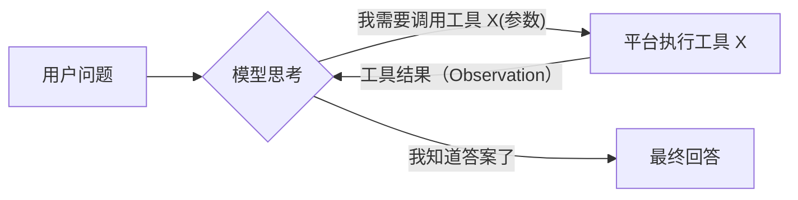

# 第 18 章 Agent 原理：ReAct 与 Function Calling

> 本章目标：理解 Agent 的本质（模型决定控制流的循环）；吃透两种主流实现策略；读懂 Dify 的两个 Agent Runner；实现 mini-dify 的 `FunctionCallingRunner` 和 `ReActRunner`，并用 mock 模型和真实模型各验证一次。
> 前置：第 4 章（模型抽象、工具调用的数据结构）。对应代码：mini-dify **v0.4** `backend/app/agent/`、`app/llm/mock.py`。

## 18.1 问题：什么是 Agent

对比一下工作流和 Agent：

| | 工作流 | Agent |
|---|---|---|
| 下一步做什么 | 人画好的边决定 | **模型**根据当前情况决定 |
| 步数 | 固定（有分支，但都是预先画好的） | 不固定，直到模型认为完成为止 |
| 可预测性 | 高 | 低 |
| 适合的场景 | 流程明确、要求稳定的任务 | 开放式任务、需要随机应变的场景 |

Agent 的核心是一个**循环**：



平台在这个循环里负责四件事：

1. 把**可用工具的描述**告诉模型；
2. **解析**模型“要调用哪个工具、传什么参数”的意图；
3. **执行**工具，把结果追加到对话里；
4. **兜底**：最大轮数、工具报错、模型输出格式不对……

第 2 步，“怎么让模型表达调用意图”，有两种主流做法。

## 18.2 策略一：Function Calling（工具调用）

模型 API 原生支持：请求里带上 `tools`（JSON Schema），模型在需要时返回结构化的 `tool_calls`，而不是文本：

```
→ messages: [system, user: "1234*5678 等于多少"]
  tools: [{name: "calculator", parameters: {expression: string}}]
← assistant: tool_calls=[{id: "call_1", name: "calculator", arguments: '{"expression": "1234*5678"}'}]

→ messages: [..., assistant(tool_calls), tool(call_1): "1234*5678 = 7006652"]
← assistant: "1234 × 5678 = 7,006,652"
```

**优点**：可靠，参数一定是合法的 JSON，模型厂商专门训练过这种能力；可以并行调用多个工具。
**缺点**：需要模型支持；不同厂商的格式有差异（已经由第 4 章的 Provider 层抹平）。

## 18.3 策略二：ReAct（Reason + Act）

ReAct 不依赖模型的工具调用能力，只用纯文本，通过提示词**教模型按固定格式输出**：

~~~~text
Question: 1234*5678 等于多少
Thought: 我应该用计算器
Action:
```
{"action": "calculator", "action_input": {"expression": "1234*5678"}}
```
Observation: 1234*5678 = 7006652          ← 这一行由平台填进去
Thought: 我知道答案了
Action:
```
{"action": "Final Answer", "action_input": "7006652"}
```
~~~~

平台的工作：

1. 让模型生成到 `Observation:` **之前就停下**（`stop=["Observation"]`），否则模型会自己编造工具结果；
2. 从文本中**解析**出 JSON 代码块；
3. 执行工具，把 `Observation: 结果` 追加到“草稿本（scratchpad）”里，再让模型继续生成；
4. 遇到 `"action": "Final Answer"` 就结束。

**优点**：任何模型都能用，包括不支持工具调用的开源小模型；思考过程以文本形式展示出来，可解释性好。
**缺点**：模型可能不遵守格式（解析失败），需要兜底处理；提示词更长，消耗的 token 更多。

## 18.4 Dify 是怎么做的

### 18.4.1 Function Calling Runner

```python
# api/core/agent/fc_agent_runner.py:103  FunctionCallAgentRunner.run（骨架）
iteration_step = 1
max_iteration_steps = min(app_config.agent.max_iteration, 99) + 1          # 122
function_call_state = True
while function_call_state and iteration_step <= max_iteration_steps:       # 147
    function_call_state = False
    if iteration_step == max_iteration_steps:
        prompt_messages_tools = []                                         # 150：最后一轮把工具拿掉，逼模型直接回答
    agent_thought_id = self.create_agent_thought(...)                       # 记录这一轮的“思考”
    chunks = model_instance.invoke_llm(prompt_messages=..., tools=prompt_messages_tools, stream=...)
    for chunk in chunks:
        if self.check_tool_calls(chunk):                                    # 428
            function_call_state = True
            tool_calls.extend(self.extract_tool_calls(chunk))
        ...                                                                  # 流式输出文本
    if iteration_step == max_iteration_steps and tool_calls:
        raise AgentMaxIterationError(app_config.agent.max_iteration)       # 311
    for tool_call_id, tool_call_name, tool_call_args in tool_calls:
        tool_invoke_response, message_files, tool_invoke_meta = ToolEngine.agent_invoke(...)   # 第 19 章
        tool_responses.append(...)
        # 把工具结果以 ToolPromptMessage 的形式追加到消息里
    self.save_agent_thought(...)                                            # 落库：思考、工具、输入、观察、耗时、token
    iteration_step += 1
```

**“最后一轮把工具拿掉”** 是一个非常实用的技巧：避免模型一直调用工具、迟迟不给出回答。拿掉工具之后，模型只能用已有的信息作答。

每一轮的思考记录保存在 `message_agent_thoughts` 表中（`base_agent_runner.py:226` 的 `create_agent_thought` 和 `:268` 的 `save_agent_thought`），前端据此显示可以展开的“思考过程”。对应的 SSE 事件是 `agent_thought`（第 6 章）。

### 18.4.2 ReAct（CoT）Runner

```
api/core/agent/
├── cot_agent_runner.py              # 基类：循环、执行 Action、维护 scratchpad
├── cot_chat_agent_runner.py         # 面向 chat 模型（scratchpad 放在 assistant 消息里）
├── cot_completion_agent_runner.py   # 面向 completion 模型（全部拼成一段文本）
├── prompt/template.py               # ReAct 提示词模板
└── output_parser/cot_output_parser.py   # 从流式文本中解析 Action
```

提示词模板（`api/core/agent/prompt/template.py`）的核心部分：

~~~~text
You have access to the following tools:
{{tools}}
Use a json blob to specify a tool by providing an action key (tool name) and an action_input key (tool input).
Valid "action" values: "Final Answer" or {{tool_names}}
...
Question: input question to answer
Thought: consider previous and subsequent steps
Action:
```
$JSON_BLOB
```
Observation: action result
... (repeat Thought/Action/Observation N times)
...
Begin! Reminder to ALWAYS respond with a valid json blob of a single action. ...
~~~~

`CotAgentOutputParser.handle_react_stream_output`（`output_parser/cot_output_parser.py:12`）是一个**流式解析器**：它在模型逐字输出时就开始识别代码块，遇到代码块之前的文字作为“思考”实时推送给前端，遇到 JSON 代码块就解析成 `AgentScratchpadUnit.Action`。

### 18.4.3 Agent 策略插件

在新版 Dify 中，工作流里的 Agent 节点的策略是**插件**提供的（`api/core/agent/strategy/plugin.py:12` `PluginAgentStrategy`）。官方提供 Function Calling 和 ReAct 两种策略，第三方可以发布自己的策略（比如 Plan-and-Execute）。第 21 章会讲。

## 18.5 从零实现

### 18.5.1 统一的事件流

两种策略产出同样的三种事件：

```python
# backend/app/agent/runner.py
@dataclass
class AgentChunk:            # 回答的文字片段（流式）
    text: str

@dataclass
class AgentStep:             # 一轮工具调用 = Dify 的 agent_thought
    iteration: int
    thought: str = ""
    tool: str | None = None
    tool_input: dict | None = None
    observation: str | None = None
    is_error: bool = False
    elapsed: float = 0.0

@dataclass
class AgentFinal:            # 结束
    answer: str
    usage: Usage
    steps: list[AgentStep]
```

调用方（聊天接口、工作流的 Agent 节点）只需要处理这三种事件，不需要关心底层用的是哪种策略。

### 18.5.2 Function Calling Runner

```python
class FunctionCallingRunner(AgentRunner):
    def run(self, query, *, instruction="", history=None):
        messages = ([Message("system", instruction)] if instruction else []) + list(history or []) + [Message("user", query)]
        specs = [t.spec(name) for name, t in self.tools.items()]
        usage, steps = Usage(), []
        for iteration in range(1, self.max_iterations + 1):
            offer = specs if iteration < self.max_iterations else None          # 和 Dify 一样：最后一轮不给工具
            text, calls = [], []
            for chunk in self.model.invoke(messages, tools=offer, params=self.params):
                if chunk.delta:
                    text.append(chunk.delta)
                    yield AgentChunk(chunk.delta)
                if chunk.tool_calls:
                    calls = chunk.tool_calls
                if chunk.usage:
                    usage = usage + chunk.usage
            if not calls:                                                       # 没有工具调用 = 最终回答
                yield AgentFinal("".join(text), usage, steps)
                return
            messages.append(Message("assistant", "".join(text), tool_calls=calls))
            for call in calls:                                                  # 支持一次返回多个工具调用
                try:
                    args = json.loads(call.arguments or "{}")
                except json.JSONDecodeError:
                    args = {}
                result, elapsed = self._call_tool(call.name, args)
                observation = result.to_observation()
                messages.append(Message("tool", observation, tool_call_id=call.id))   # tool_call_id 必须对应上
                step = AgentStep(iteration, "".join(text), call.name, args, observation, result.is_error, elapsed)
                steps.append(step)
                yield step
```

注意 `tool_call_id`：OpenAI 协议要求每条 `tool` 消息都通过 `tool_call_id` 对应到 assistant 消息中的某一个 tool_call，对应不上会直接返回 400 错误。

### 18.5.3 ReAct Runner

```python
class ReActRunner(AgentRunner):
    def run(self, query, *, instruction="", history=None):
        tool_lines = "\n".join(json.dumps({"name": n, "description": t.description, "parameters": t.parameters},
                                          ensure_ascii=False) for n, t in self.tools.items())
        system = (REACT_PROMPT.replace("{{instruction}}", instruction or "")
                  .replace("{{tools}}", tool_lines)
                  .replace("{{tool_names}}", json.dumps(list(self.tools), ensure_ascii=False)))
        scratchpad = ""
        params = {**(self.params or {}), "stop": ["Observation:"]}              # 在模型自己编造 Observation 之前停下
        for iteration in range(1, self.max_iterations + 1):
            messages = [Message("system", system), *(history or []), Message("user", f"Question: {query}\n{scratchpad}")]
            text = "".join(c.delta for c in self.model.invoke(messages, params=params))
            action = parse_react_action(text)
            thought = text.split("Action:")[0].replace("Thought:", "").strip()
            if action is None or action[0] == "Final Answer" or iteration == self.max_iterations:
                answer = ...                                                     # 解析失败时，把整段文本当作回答
                for i in range(0, len(answer), 8):
                    yield AgentChunk(answer[i:i + 8])
                yield AgentFinal(answer, usage, steps)
                return
            name, args = action
            result, elapsed = self._call_tool(name, args if isinstance(args, dict) else {"input": args})
            observation = result.to_observation()
            yield AgentStep(iteration, thought, name, args, observation, result.is_error, elapsed)
            scratchpad += (f"Thought: {thought}\nAction:\n```\n"
                           f"{json.dumps({'action': name, 'action_input': args}, ensure_ascii=False)}\n```\n"
                           f"Observation: {observation}\n")
```

解析器有两层兜底：先找 ```json 代码块，找不到就取第一个 `{` 到最后一个 `}` 之间的内容，最后要求解析出来的 dict 里包含 `action` 字段：

```python
def parse_react_action(text: str):
    candidates = _JSON_BLOCK.findall(text) or [text[text.find("{"): text.rfind("}") + 1]]
    for raw in candidates:
        try:
            data = json.loads(raw)
        except json.JSONDecodeError:
            continue
        if isinstance(data, dict) and "action" in data:
            return str(data["action"]), data.get("action_input")
    return None
```

和 Dify 的区别是：我们在**整段输出生成完之后**才解析，所以 ReAct 模式下回答不能真正地流式输出，最后会被切成 8 个字一片来模拟流式效果。Dify 用流式解析器实现了真正的流式输出（练习 2）。

### 18.5.4 工具名清洗

```python
for t in tools:
    name = re.sub(r"[^a-zA-Z0-9_-]", "_", t.name)[:64]     # OpenAI 要求工具名满足 ^[a-zA-Z0-9_-]{1,64}$
    while name in self.tools:
        name += "_"                                         # 去重
    self.tools[name] = t
```

### 18.5.5 让 mock 模型学会“调用工具”

为了离线也能测试 Agent，v0.4 的 mock 模型用关键词规则来模拟模型的判断（`backend/app/llm/mock.py` 的 `_pick_tool`）：

- 用户消息中有算术表达式，并且有名字里包含 calc 或 math 的工具 → 调用它，参数是 `{"expression": 表达式}`；
- 消息中出现“时间”“几点”“date”之类的词，并且有名字里包含 time 的工具 → 调用它；
- 消息中直接提到了某个工具名 → 调用这个工具，按它的 JSON Schema 从文本中填充必填参数；
- 上一条是工具结果 → 回答“根据工具返回的结果：……”；
- 提示词里出现了 ReAct 格式 → 按 ReAct 格式输出 Thought 和 Action；遇到 Observation 就输出 Final Answer。

这个 mock 让 Agent 的所有代码路径都能写成自动化测试。

## 18.6 运行与验证

```bash
cd code/mini-dify && git checkout v0.4 && cd backend
uv run pytest -q tests/test_agent.py::test_agent_chat_function_calling_and_react
```

mock 模型下两种策略的实际运行结果：

```
function_calling AgentStep {'tool': 'calculator', 'tool_input': {'expression': '(3+4)*12/7'}, 'observation': '(3+4)*12/7 = 12'}
function_calling AgentFinal 根据工具返回的结果：(3+4)*12/7 = 12
react AgentStep {'thought': 'I should use the calculator tool.', 'tool': 'calculator', ...}
react AgentFinal 根据工具返回的结果：(3+4)*12/7 = 12
```

**用真实模型验证**（Ollama 上的 qwen2.5:0.5b，只有 0.5B 参数的小模型也支持工具调用）：

```bash
OPENAI_BASE_URL=http://localhost:11434/v1 OPENAI_API_KEY=ollama uv run python -c "
from app.agent.runner import create_runner, AgentStep, AgentFinal
from app.llm import get_model
from app.tools.builtin import CalculatorTool, CurrentTimeTool
r = create_runner('function_calling', get_model('openai/qwen2.5:0.5b'), [CalculatorTool(), CurrentTimeTool()])
for ev in r.run('What is 1234 * 5678? Use the calculator tool.'):
    if isinstance(ev, AgentStep): print('STEP', ev.to_dict())
    if isinstance(ev, AgentFinal): print('FINAL', ev.answer)
"
```

写作时第一次运行的结果暴露了一个 bug：

```
STEP {'tool': 'calculator', 'tool_input': {'expression': '1234 * 5678'}, 'observation': '1234 * 5678 = 7.00665e+06'}
FINAL The result of 1234 * 5678 is 7.00665 × 10^6 or 7,006,650.
```

计算器用 `f"{value:g}"` 来格式化结果，`:g` 默认只保留 6 位有效数字，于是 7006652 变成了 `7.00665e+06`。**模型拿到这个不精确的数，又“好心”地还原成了 7,006,650，答案错了**。修复方法是：结果为整数时原样输出，小数最多保留 12 位有效数字。修复后的观察结果是 `1234 * 5678 = 7006652`。

这个 bug 很有代表性：**工具返回给模型的内容，精度和格式都会直接影响答案**。模型只会基于它看到的内容推理。

## 18.7 练习

1. **巩固**：Function Calling 的最后一轮为什么要把工具拿掉？如果不拿掉，会出现什么问题？
2. **扩展**：实现 ReAct 的**流式解析**：边接收模型输出边处理，遇到 ``` 之前的内容作为“思考”实时推送；如果 action 是 Final Answer，就把 action_input 字符串的内容逐字推送出去。
3. **读源码**：Dify 的 `cot_chat_agent_runner.py` 和 `cot_completion_agent_runner.py` 在组织提示词时有什么区别？为什么需要两个版本？

## 18.8 延伸阅读

- 论文：*ReAct: Synergizing Reasoning and Acting in Language Models*（Yao et al., 2022）
- OpenAI 和 Anthropic 的工具调用文档：并行工具调用、`tool_choice` 参数
