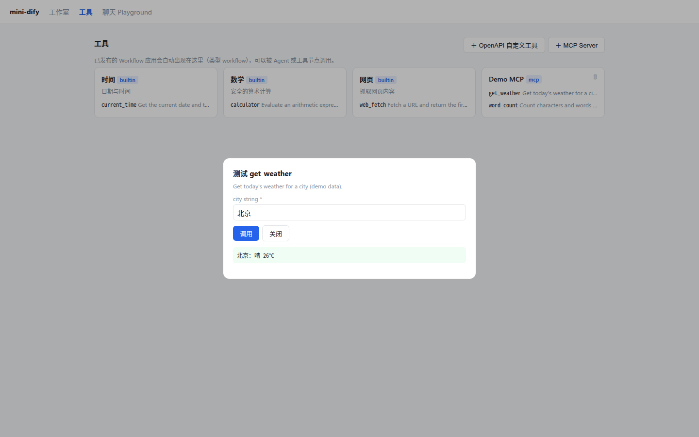

# 第 19 章 工具体系

> 本章目标：设计一个统一的工具抽象，接入四种来源：内置、OpenAPI 自定义、工作流即工具、MCP；理解工具对模型来说就是“名字 + 描述 + JSON Schema”。
> 前置：第 18 章。对应代码：mini-dify **v0.4** `backend/app/tools/`、`app/api/tools.py`、`frontend/src/pages/ToolsPage.tsx`。

## 19.1 问题：工具从哪里来

Agent 有多强，很大程度上取决于它能用哪些工具。一个平台的工具通常来自几个地方：

| 来源 | 例子 | 谁来提供 |
|---|---|---|
| 内置 | 当前时间、计算器、网页抓取 | 平台开发者写的代码 |
| 插件 | Google 搜索、GitHub、Slack、DALL·E…… | 插件市场 |
| OpenAPI 自定义 | 公司内部的订单查询接口 | 用户粘贴一份 OpenAPI 文档 |
| 工作流 | “生成周报”这个工作流本身 | 用户在平台上发布的工作流 |
| MCP | 任何一个 MCP Server 暴露的工具 | 外部服务 |

对模型来说，这些来源**没有任何区别**：每个工具都只是

```json
{
  "name": "get_order",
  "description": "Query an order by its ID. Use it when the user asks about order status.",
  "parameters": {"type": "object", "properties": {"order_id": {"type": "string"}}, "required": ["order_id"]}
}
```

工具描述的质量直接决定了模型能不能用对工具。**description 是写给模型看的**：要说清楚“什么时候应该用它”，而不只是“它是什么”。

## 19.2 Dify 是怎么做的

### 19.2.1 Tool 与 ToolProvider

```python
# api/core/tools/__base/tool.py:22
class Tool(ABC):
    def invoke(self, user_id, tool_parameters, ...) -> Generator[ToolInvokeMessage]:   # 49
        tool_parameters = self._transform_tool_parameters_type(tool_parameters)     # 按声明的类型转换参数
        result = self._invoke(user_id=user_id, tool_parameters=tool_parameters, ...)
        ...
    @abstractmethod
    def _invoke(self, ...) -> ToolInvokeMessage | list | Generator: ...            # 101 子类实现
    def get_llm_parameters_json_schema(self) -> dict: ...                          # 166 生成给模型看的 JSON Schema
    # 各种辅助方法：create_text_message / create_json_message / create_image_message / create_file_message ...
```

一个工具的返回值是一串 `ToolInvokeMessage`，类型很丰富（`api/core/tools/entities/tool_entities.py:230`）：

```python
class MessageType(StrEnum):
    TEXT, IMAGE, LINK, BLOB, JSON, IMAGE_LINK, BINARY_LINK, VARIABLE, FILE, LOG, BLOB_CHUNK, RETRIEVER_RESOURCES
```

工具可以返回图片、文件，甚至可以流式返回大文件（BLOB_CHUNK）。

工具按 **Provider（提供方）** 分组管理，一个 Provider 包含若干个工具，并共享同一套凭证。比如“GitHub”这个 Provider 下有搜索仓库、创建 Issue 等工具，用的是同一个 token。Provider 的类型（第 65 行）：

```python
class ToolProviderType(StrEnum):
    PLUGIN = auto(); BUILT_IN = "builtin"; WORKFLOW = auto(); API = auto()
    APP = auto(); DATASET_RETRIEVAL = "dataset-retrieval"; MCP = auto()
```

对应的实现目录：

```
api/core/tools/
├── builtin_tool/        内置（目前只剩 audio、code、time 这几个，其余都迁移成了插件）
├── plugin_tool/         插件工具 → 调用 plugin_daemon
├── custom_tool/         OpenAPI 自定义工具
├── workflow_as_tool/    工作流即工具
├── mcp_tool/            MCP 工具
├── tool_manager.py      统一入口：按 provider 类型和名字创建工具实例
└── tool_engine.py       统一调用：参数校验、调用、结果转换、错误处理
```

### 19.2.2 OpenAPI → 工具

```python
# api/core/tools/utils/parser.py:32
class ApiBasedToolSchemaParser:
    def parse_openapi_to_tool_bundle(...)            # 34  每个 operation 生成一个工具
    def parse_swagger_to_openapi(...)                # 287 Swagger 2.0 先转换成 OpenAPI 3
    def parse_openai_plugin_json_to_tool_bundle(...) # 353 兼容老的 ChatGPT 插件格式
    def auto_parse_to_tool_bundle(...)               # 394 自动识别格式
```

解析规则：`operationId` 作为工具名（没有就用 `method + path` 拼一个），`summary` 或 `description` 作为描述，path、query、header 参数和 JSON body 的属性合并成工具的参数。

### 19.2.3 ToolEngine：出错不能抛异常

```python
# api/core/tools/tool_engine.py:49  agent_invoke（节选）
try:
    ...
    return plain_text, message_files, meta
except ToolProviderCredentialValidationError as e:
    error_response = "Please check your tool provider credentials"
except (ToolNotFoundError, ToolNotSupportedError, ToolProviderNotFoundError) as e:
    error_response = f"there is not a tool named {tool.entity.identity.name}"
except ToolParameterValidationError as e:
    error_response = f"tool parameters validation error: {e}, please check your tool parameters"
except ToolInvokeError as e:
    error_response = f"tool invoke error: {e}"
...
return error_response, [], ToolInvokeMeta.error_instance(error_response)
```

**工具出错时，不抛异常，而是把错误信息作为 Observation 返回给模型。** 模型看到“参数校验错误：缺少 order_id”之后，往往能自己修正参数再调用一次。如果直接抛异常，Agent 就整个崩掉了。这是 Agent 系统里非常重要的一个设计原则。

### 19.2.4 工作流即工具

`api/core/tools/workflow_as_tool/tool.py:40` 的 `WorkflowTool`：参数来自工作流开始节点的输入字段，调用时以阻塞模式运行**已发布**的版本，并且记录调用深度：

```python
def __init__(self, ..., workflow_call_depth: int, ...):    # 54
...
call_depth=self.workflow_call_depth + 1,                    # 126
```

`WORKFLOW_CALL_MAX_DEPTH = 5`（第 12 章）用来防止工作流 A 调用 B、B 又调用 A 这样的无限递归。

## 19.3 从零实现

### 19.3.1 基础抽象

```python
# backend/app/tools/base.py
@dataclass
class ToolResult:
    text: str = ""
    json: Any = None
    is_error: bool = False
    def to_observation(self) -> str:                  # 喂给模型的内容
        if self.json is not None and not self.text:
            return json.dumps(self.json, ensure_ascii=False)
        return self.text

class Tool(ABC):
    name: str
    label: str = ""
    description: str = ""                             # 写给模型看
    parameters: dict = {"type": "object", "properties": {}}   # JSON Schema
    @abstractmethod
    def invoke(self, args: dict) -> ToolResult: ...
    def spec(self, exposed_name=None) -> ToolSpec:    # 转换成第 4 章的 ToolSpec
        return ToolSpec(name=exposed_name or self.name, description=self.description, parameters=self.parameters)

@dataclass
class ToolProvider:
    id: str            # "builtin:time" | "api:<uuid>" | "workflow:<app_id>" | "mcp:<uuid>" | "plugin:<name>/<id>"
    name: str
    type: str
    description: str = ""
    tools: list[Tool] = field(default_factory=list)
```

我们把 Dify 丰富的 `ToolInvokeMessage` 简化成了“文本 + JSON”。图片和文件类的工具结果，读者可以按需扩展。

### 19.3.2 内置工具：计算器为什么不能用 eval

```python
# backend/app/tools/builtin.py
def safe_eval(expr: str) -> float:
    """只允许算术运算，绝不对模型生成的字符串使用 eval()。"""
    def walk(node):
        if isinstance(node, ast.Expression): return walk(node.body)
        if isinstance(node, ast.Constant) and isinstance(node.value, (int, float)): return node.value
        if isinstance(node, ast.BinOp) and type(node.op) in _OPS: return _OPS[type(node.op)](walk(node.left), walk(node.right))
        if isinstance(node, ast.UnaryOp) and type(node.op) in _OPS: return _OPS[type(node.op)](walk(node.operand))
        raise ToolError(f"不支持的表达式：{ast.dump(node)[:60]}")
    return walk(ast.parse(expr, mode="eval"))
```

模型生成的参数**等同于用户输入**，而用户输入可以被提示词注入操纵。`eval("__import__('os').system('rm -rf /')")` 只需要一次成功的注入就够了。用 AST 白名单只允许数字和四则运算，从根本上杜绝了这种可能。

### 19.3.3 OpenAPI 自定义工具

```python
# backend/app/tools/api_tool.py
def parse_openapi(schema_text: str, headers=None) -> list[ApiTool]:
    doc = json.loads(schema_text) if 是 JSON else yaml.safe_load(schema_text)
    base = (doc.get("servers") or [{"url": ""}])[0]["url"].rstrip("/")
    for path, item in doc["paths"].items():
        for method in ("get", "post", "put", "patch", "delete"):
            op = item.get(method)
            if not op: continue
            name = op.get("operationId") or f"{method}_{path...}"
            body = op["requestBody"]["content"]["application/json"]["schema"]（如果有）
            tools.append(ApiTool(name=name, description=op.get("summary") or ..., method=method, url=base + path,
                                 params=[*item.get("parameters", []), *op.get("parameters", [])], body_schema=body, ...))
```

`ApiTool.invoke` 根据每个参数的 `in`（path / header / query）把值放到 URL、请求头或查询串里，body 的属性组装成 JSON 请求体，然后**通过 SSRF 安全客户端**发出请求（v1.0，第 27 章）。

工具页面里预置了一份 Open-Meteo 天气 API 的示例 schema，方便直接试用。

### 19.3.4 工作流即工具

```python
# backend/app/tools/workflow_tool.py
class WorkflowTool(Tool):
    def __init__(self, app_id, app_name, description, start_vars):
        self.name = f"workflow_{app_id.replace('-', '')[:12]}"
        self.parameters = {"type": "object",
                           "properties": {v["variable"]: {"type": ..., "description": v.get("label") or v["variable"]} for v in start_vars},
                           "required": [v["variable"] for v in start_vars if v.get("required", True)]}

    def invoke(self, args):
        depth = current_call_depth.get()
        if depth >= MAX_CALL_DEPTH:
            raise ToolError(f"工作流嵌套调用超过最大深度 {MAX_CALL_DEPTH}")
        result = blocking(generate(GenerateRequest(app=app, workflow=已发布版本, inputs=args,
                                                   triggered_from="tool", call_depth=depth + 1)))
        ...
        return ToolResult(json=data.get("outputs"))
```

**调用深度限制是写这一章时补上的。** 读 Dify 的 `WorkflowTool` 时注意到它会传递 `workflow_call_depth`，回头检查 mini-dify，发现没有做这个限制。一个“工具节点调用自己”的工作流会无限递归下去。修复方法：

- 引擎在每个 Worker 线程执行节点之前，把 `ctx.call_depth` 写进一个 `ContextVar`（`current_call_depth`）；
- `WorkflowTool` 从这个 ContextVar 读出当前深度，加一后传给新的运行；
- 深度达到 5 时拒绝调用。

回归测试 `test_workflow_calling_itself_as_tool_stops_at_max_depth` 构造了一个调用自己的工作流，验证它在第 5 层失败，错误信息里包含“最大深度”。

为什么用 ContextVar？因为 `Tool.invoke(args)` 的签名里没有运行上下文。ContextVar 能把“当前运行的属性”隐式地传给同一线程里调用的任何代码，又不会跨线程泄漏。

所有**已发布**的 Workflow 类型应用会自动出现在工具列表里（`workflow_providers()`）。Dify 则需要用户主动点击“发布为工具”，并为每个参数写好给模型看的描述。

### 19.3.5 ToolManager：统一入口、统一兜底

```python
# backend/app/tools/manager.py
def list_providers(tenant_id=None) -> list[ToolProvider]:
    providers = builtin_providers() + plugin_tool_providers()
    for rec in 数据库里本工作空间的 ToolProviderRecord:
        providers.append(api_provider(...) if rec.type == "api" else mcp_provider(...))
    return providers + workflow_providers(tenant_id)

def invoke_tool(tool, args) -> tuple[ToolResult, float]:
    """永不抛异常：错误也变成一个结果，让 Agent 能看到错误并做出反应（和 Dify 的 ToolEngine.agent_invoke 一样）。"""
    try:
        result = tool.invoke(args)
    except ToolError as e:
        result = ToolResult(text=f"工具调用失败：{e}", is_error=True)
    except Exception as e:
        result = ToolResult(text=f"工具内部错误：{type(e).__name__}: {e}", is_error=True)
    return result, elapsed
```

### 19.3.6 工具管理 API

| 接口 | 作用 |
|---|---|
| `GET /api/tools` | 所有 provider 及其工具（含参数 schema） |
| `POST /api/tool-providers` | 添加 OpenAPI provider（保存时立即解析校验）或 MCP provider（立即连接并拉取工具列表） |
| `DELETE /api/tool-providers/{id}` | 删除 |
| `POST /api/tools/invoke` | 直接调用一个工具（工具页面的“测试”按钮） |



## 19.4 运行与验证

```bash
cd code/mini-dify && git checkout v0.4 && cd backend
uv run pytest -q tests/test_agent.py -k "openapi or tool_node or workflow_as_tool"
```

- `test_openapi_provider_and_invoke`：解析出 `getPet` 工具，path 参数 `id` 是必填的；对一个没有服务监听的端口发起调用，**返回的是 is_error=true 的结果**，而不是 500 错误；
- `test_agent_node_and_tool_node_in_workflow`：工作流里的工具节点调用计算器得到 `6*7 = 42`；
- `test_published_workflow_as_tool_and_mcp_server`：发布一个工作流后，它出现在工具列表中，参数里的 `query` 是必填的。

## 19.5 练习

1. **巩固**：为什么工具出错时要“返回错误文本”而不是“抛异常”？在什么情况下又**应该**直接中止 Agent？
2. **扩展**：给 OpenAPI provider 加上鉴权配置（API Key 放在 header 或 query 里，Bearer Token），凭证要加密保存（参考第 27 章的 `encrypt`）。
3. **读源码**：读 Dify 的 `api/core/tools/tool_engine.py` 的 `_extract_tool_response_binary_and_text`，看工具返回的图片和文件是怎样变成消息附件的。

## 19.6 延伸阅读

- `api/core/tools/tool_manager.py`：Dify 如何按租户加载工具、处理凭证、缓存工具列表
- Dify 插件文档中的“工具插件”部分
