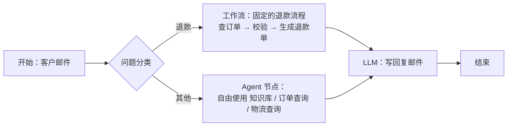
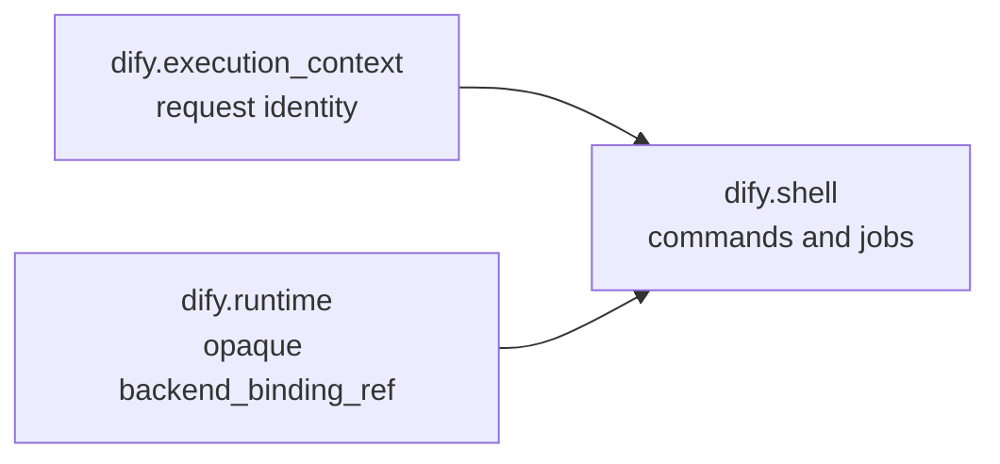
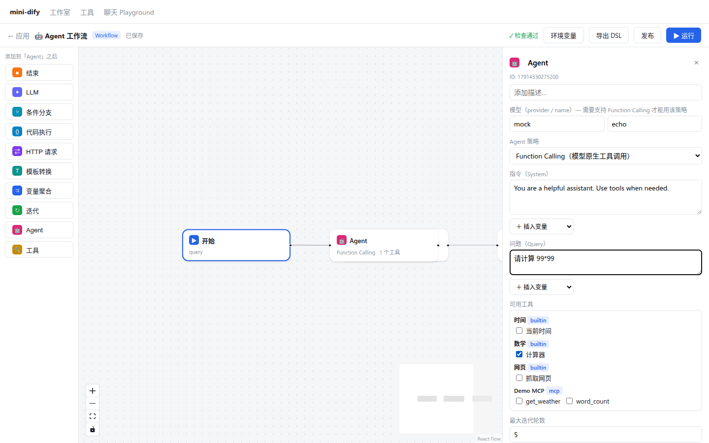

# 第 21 章 Agent 在 Workflow 中 & 新一代 Agent 运行时

> 本章目标：把 Agent 变成工作流里的一个节点，以及把一个固定的工具调用变成节点；理解 Dify 两代 Agent 节点的架构差异（策略插件 vs 独立的 dify-agent 运行时）以及 agenton 的“层组合”思想。
> 前置：第 18、19 章。对应代码：mini-dify **v0.4** `backend/app/workflow/nodes/agent.py`、前端 Agent/工具面板。

## 21.1 问题：工作流与 Agent 怎么结合

第 18 章对比过：工作流**可控**，Agent **灵活**。真实的业务往往两者都需要：



把 Agent **装进**工作流的一个节点里，就得到了“大流程可控，局部灵活”的效果：

- **Agent 节点**：给它一组工具和一个任务，它自己决定怎么完成；
- **工具节点**：在固定的位置、以固定的参数调用一个工具，这一步不需要模型来做决定。

## 21.2 Dify 是怎么做的

### 21.2.1 第一代：策略即插件

```python
# api/core/workflow/nodes/agent/agent_node.py:30
class AgentNode(Node[AgentNodeData]):
    def __init__(self, ..., strategy_resolver: AgentStrategyResolver, ...): ...
    def _run(self):                                                # 101
        strategy = self._strategy_resolver.resolve(
            agent_strategy_provider_name=self.node_data.agent_strategy_provider_name,
            agent_strategy_name=self.node_data.agent_strategy_name,    # 例如 function_calling / ReAct
        )
        ...  # 组装参数（模型、工具、指令、查询、最大轮数），调用策略，把策略吐出的消息转换成节点事件
```

**Agent 的推理循环不在 Dify 主程序里，而在插件里**（`api/core/agent/strategy/plugin.py` 的 `PluginAgentStrategy`）。主程序负责把节点配置、工具列表、模型凭证交给插件，再把插件流式返回的消息（文本、工具调用日志、文件……）转换成工作流事件（`message_transformer.py`）。工具调用的日志以 `agent_log` 事件推送给前端（第 6 章），在运行面板里显示为可以展开的树形结构（`web/app/components/workflow/run/agent-log/`）。

这样做的好处是：Agent 的推理算法可以独立演进和发布，第三方也可以发布自己的策略。

### 21.2.2 第二代：独立的 Agent 运行时

新版 Dify 有一个 `agent_v2` 节点（`api/core/workflow/nodes/agent_v2/agent_node.py:84` `DifyAgentNode`）。它**完全不在 API 进程里执行 Agent**，而是调用一个独立部署的服务 `agent_backend`（也就是仓库里的 `dify-agent/`，第 2 章表格里的那个服务）：

```python
def _run(self):                                                   # 151
    ...
    create_response = self._agent_backend_client.create_run(runtime_request.request)   # 340
    ...  # 订阅运行事件 → 转换成节点事件；保存 session_snapshot 以便下次继续
```

为什么要拆出去？因为新一代 Agent 的能力已经远远超出了“循环调用工具”：

- 它有**工作空间**（文件系统）和 **Shell**，可以执行命令、读写文件、运行代码（`dify-agent/src/shellctl/`）；
- 它的会话是**可恢复的**（session snapshot），同一个工作流运行中可以多次进入同一个 Agent 会话；
- 它需要隔离的运行环境（本地或 E2B 沙箱），资源由 `RuntimeLease` 管理。

`dify-agent/docs/dify-agent/concepts/run-lifecycle/index.md` 里有一段话特别值得注意：

> **Agent runs do not have a pause state.** With a human tool, the current `agent run` has ended; the outer `workflow run` is what should be paused.

也就是说，Agent 需要人来介入时，Agent 的这一次运行就结束了（同时保存好会话快照），**暂停发生在外层的工作流上**（第 12 章的暂停/恢复机制）。人回复之后，工作流恢复执行，Agent 从快照开始新的一次运行。**职责划分得很清楚：Agent 运行时只负责“跑完一段”，暂停、恢复、持久化都交给工作流引擎。**

### 21.2.3 agenton：用“层”组合出一个 Agent

dify-agent 内部用一个叫 **agenton** 的小框架来组装 Agent（`dify-agent/src/agenton/`）。它的核心思想（摘自 `dify-agent/docs/agenton/guide/index.md`）：

> Agenton composes reusable graph plans from `LayerNode`s and `LayerProvider`s. The core is state-only: a `Compositor` stores no live layer instances, clients, cleanup stacks, or run state. Each `Compositor.enter(...)` call creates a fresh `CompositorRun` ...

- 一个 Agent = 若干**层（Layer）**的组合：提示词层、工具层、运行时层、Shell 层、输出层……每一层声明自己依赖哪些层（例如 Shell 层依赖运行时层提供的命令执行能力）；
- **Compositor** 只保存“拓扑结构”（这张层图本身），不保存任何运行时状态；每次 `enter()` 都会创建全新的层实例；
- 每层的运行时状态（`runtime_state`）可以序列化，这就是 session snapshot 的来源；
- 文件句柄、网络客户端这类“活的”资源**不放进层里**，由外部管理，以参数形式传给层。

运行时层图的一个例子（`concepts/runtime-resources/index.md`）：



这和第 9 章 Layer 的思想一脉相承：**核心只做编排，能力以可组合、可替换的层的形式挂上去**。

## 21.3 从零实现

### 21.3.1 Agent 节点

```python
# backend/app/workflow/nodes/agent.py
class AgentNodeData(BaseNodeData):
    model: ModelConfig = Field(default_factory=ModelConfig)
    strategy: Literal["function_calling", "react"] = "function_calling"
    instruction: str = "You are a helpful assistant."
    query: str = "{{#sys.query#}}"
    tools: list[ToolRef] = Field(default_factory=list)     # [{provider_id, tool_name}]
    max_iterations: int = 5
    memory: MemoryConfig | None = None

@register_node
class AgentNode(Node):
    node_type = NodeType.AGENT
    data_class = AgentNodeData

    def _run(self):
        d = self.data
        tools = [get_tool(t.provider_id, t.tool_name, self.ctx.tenant_id) for t in d.tools]
        runner = create_runner(d.strategy, get_model(..., tenant_id=self.ctx.tenant_id), tools,
                               max_iterations=d.max_iterations, params=d.model.completion_params)
        history = self.ctx.history[-d.memory.window.size:] if d.memory and d.memory.window.enabled else []
        query, instruction = self.pool.render(d.query), self.pool.render(d.instruction)
        final = None
        for ev in runner.run(query, instruction=instruction, history=history):
            if self.ctx.should_stop():
                break
            if isinstance(ev, AgentChunk):
                yield self.event(NodeRunStreamChunk, selector=[self.id, "text"], chunk=ev.text)   # 和 LLM 节点一样流式输出
            elif isinstance(ev, AgentStep):
                yield self.event(NodeRunAgentLog, data=ev.to_dict())                              # 每一步 → agent_log 事件
            elif isinstance(ev, AgentFinal):
                final = ev
        yield NodeRunResult(inputs={"query": query},
                            process_data={"strategy": d.strategy, "steps": [s.to_dict() for s in final.steps]},
                            outputs={"text": final.answer, "usage": final.usage.to_dict()},
                            total_tokens=final.usage.total_tokens)
```

几个设计点：

- **复用第 18 章的 Runner**：聊天接口里的 Agent 和工作流里的 Agent 是同一份代码，区别只在于怎样把三种事件映射出去；
- **流式输出的 selector 是 `[node_id, "text"]`**：和 LLM 节点一致，所以 Answer 节点写 `{{#agent.text#}}` 时，回复流协调器（第 10 章）能把 Agent 的回答流式推送给用户，不需要任何特殊处理；
- **每一步都发一个 `agent_log` 事件**：引擎不认识这种事件，会直接透传；转换器把它变成 SSE 的 `agent_log`；前端把它追加到这个节点追踪条目的 `process_data.steps` 里；
- `process_data.steps` 同时写入节点执行记录，所以在历史回放里也能看到完整的推理过程。

### 21.3.2 工具节点

```python
class ToolParam(BaseModel):
    type: Literal["mixed", "variable", "constant"] = "mixed"   # 和 Dify 的工具参数类型一致
    value: Any = None

class ToolNode(Node):
    node_type = NodeType.TOOL
    def _run(self):
        tool = get_tool(d.provider_id, d.tool_name, self.ctx.tenant_id)
        props = tool.parameters.get("properties", {})
        args = {}
        for name, p in d.tool_parameters.items():
            value = (self.pool.get(p.value or []) if p.type == "variable"        # 直接引用一个变量（保留原始类型）
                     else self.pool.render(str(p.value or "")) if p.type == "mixed"   # 文本里嵌入变量
                     else p.value)                                           # 常量
            if props.get(name, {}).get("type") in ("number", "integer") and isinstance(value, str):
                value = float(value) if "." in value else int(value)         # 按 schema 转换类型
            args[name] = value
        result = tool.invoke(args)                                           # 工具节点出错时直接让节点失败（可以配置错误策略）
        return NodeRunResult(inputs=args, outputs={"text": result.to_observation(), "json": result.json})
```

注意和 Agent 的区别：Agent 遇到工具出错，会把错误告诉模型，让模型自己想办法（第 19 章）。**工具节点出错时直接让节点失败**，然后由第 12 章的错误策略（重试 / 默认值 / 异常分支）来处理。工作流是给人编排的，失败就应该让编排者看到，并按他配置的方式处理。

### 21.3.3 前端

- `blocks.ts` 新增 `agent`、`tool` 两种节点（输出：Agent 是 `text` 和 `usage`，工具是 `text` 和 `json`）；
- `AgentPanel`：模型、策略、指令、问题（都支持插入变量）、用 `ToolPicker` 多选工具（来自 `/api/tools`）、最大迭代轮数；
- `ToolPanel`：先选择工具，然后**根据工具参数的 JSON Schema 动态生成表单**，每个参数都是一个可以插入变量的输入框，类型为 mixed；
- `useWorkflowRun` 处理 `agent_log` 事件。



## 21.4 运行与验证

```bash
cd code/mini-dify && git checkout v0.4 && cd backend
uv run pytest -q tests/test_agent.py::test_agent_node_and_tool_node_in_workflow
```

这个测试构造了 `开始 → 工具节点(计算器 6*7) → Agent 节点(问“现在几点了？”，工具：当前时间) → 结束`，然后断言：

- 工具节点输出 `6*7 = 42`；
- Agent 的回答以“根据工具返回的结果”开头（说明它调用了时间工具）；
- 事件流中有 `NodeRunAgentLog` 事件。

写作时在 UI 中实际运行的结果：Agent 节点的追踪显示 `strategy: function_calling`，steps 中有一步 `calculator {"expression": "99*99"} → 99*99 = 9801`，输出 `根据工具返回的结果：99*99 = 9801`。

## 21.5 练习

1. **巩固**：Agent 节点和工具节点在“工具出错”时的处理方式为什么不同？
2. **扩展**：实现 Agent 的 **final_output 工具**：给 Agent 额外注入一个 `final_output(answer: object)` 工具，并要求它必须通过这个工具交付最终结果。这样 Agent 节点就能输出**结构化**的结果（JSON），下游节点可以直接引用其中的字段。（这正是 dify-agent 的做法。）
3. **读源码**：读 `dify-agent/src/agenton/compositor/core.py`，说说 `Compositor.enter()` 是怎样按依赖顺序创建各层、又在退出时按相反的顺序清理的。

## 21.6 延伸阅读

- `dify-agent/docs/agenton/`：agenton 的完整文档和示例
- `api/core/workflow/nodes/agent_v2/`：Dify 如何把一个 dify-agent 运行嵌入工作流（请求构建、输出类型检查、HITL 恢复）
