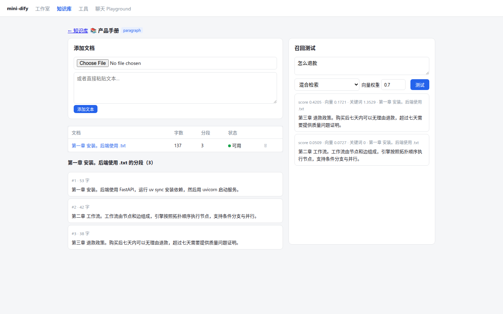

# 第 22 章 索引管线：提取 → 清洗 → 分段 → 向量化 → 存储

> 本章目标：理解知识库“上传文档之后发生了什么”；掌握分段的原理和参数（分隔符、长度、重叠、父子分段）；实现一条带状态流转、向量缓存、后台执行的索引管线。
> 前置：第 4 章（embedding 接口）。对应代码：mini-dify **v0.5** `backend/app/rag/processing.py`、`index.py`（`embed_texts`）、`indexing.py`。

## 22.1 问题：为什么不能直接把文档塞进提示词

模型有两个限制：

1. **上下文窗口有限**：几百页的手册塞不进去；
2. **知识不新、也不私有**：模型不知道你公司的退款政策。

RAG（Retrieval-Augmented Generation，检索增强生成）的思路是：**先把文档切成小段，存好；提问时只把最相关的几段找出来，放进提示词里**。这一章讲“存”的部分（索引），第 23 章讲“找”的部分（检索）。


## 22.2 Dify 是怎么做的

### 22.2.1 整体流程与状态

文档上传后，API 立即返回，索引工作交给 Celery（`api/tasks/document_indexing_task.py:35` `document_indexing_task`）。任务调用 `DocumentIndexingService.run`（`api/services/knowledge/indexing/execution.py:73`、`:92`），按阶段推进文档的状态：

```python
# api/models/enums.py:121
class IndexingStatus(StrEnum):
    WAITING = "waiting"; PARSING = "parsing"; CLEANING = "cleaning"; SPLITTING = "splitting"
    INDEXING = "indexing"; PAUSED = "paused"; COMPLETED = "completed"; ERROR = "error"
```

前端轮询文档列表，显示“解析中 / 分段中 / 索引中 / 可用”。

一个容易被忽略的细节：**租户隔离的任务队列**（`api/core/rag/pipeline/queue.py:25` `TenantIsolatedTaskQueue`）。如果所有租户共用一个 Celery 队列，一个大客户一次上传 1 万个文档，所有其他租户的索引任务都要排在后面。Dify 用 Redis list 为每个租户单独排队，保证公平。这是多租户 SaaS 特有的问题。

### 22.2.2 ① 提取

```
api/core/rag/extractor/
├── extract_processor.py     # 根据文件类型分派
├── pdf_extractor.py  word_extractor.py  markdown_extractor.py  html_extractor.py
├── csv_extractor.py  excel_extractor.py  text_extractor.py  notion_extractor.py
├── firecrawl/  jina_reader_extractor.py  watercrawl/     # 网页抓取
└── unstructured/                                          # 借助 Unstructured 服务处理更多格式
```

### 22.2.3 ② 清洗

`api/core/rag/cleaner/clean_processor.py` 按照知识库的**预处理规则**执行：

```python
if pre_processing_rule["id"] == "remove_extra_spaces" and pre_processing_rule["enabled"]:   # 20
    ...   # 连续多个换行压缩成两个，连续空格压缩成一个
elif pre_processing_rule["id"] == "remove_urls_emails" and pre_processing_rule["enabled"]:  # 26
    ...
```

### 22.2.4 ③ 分段

```python
# api/core/rag/splitter/fixed_text_splitter.py:34
class FixedRecursiveCharacterTextSplitter(EnhanceRecursiveCharacterTextSplitter):
    def __init__(self, fixed_separator: str = "\n\n", separators: list[str] | None = None, **kwargs):
        self._fixed_separator = fixed_separator
        self._separators = separators or ["\n\n", "\n", "。", ". ", " ", ""]     # 39
```

分两步：

1. 先按**用户指定的分隔符**（默认 `\n\n`，也就是段落）切开；
2. 某一块还是超过了 `chunk_size`，就**递归地**用更细的分隔符继续切：段落 → 行 → 句号 → 空格 → 单个字符，直到每块都不超过长度限制；然后把相邻的小块**合并**起来，尽量接近 chunk_size，相邻 chunk 之间保留 `chunk_overlap` 的**重叠**。

Dify 计算长度时用的是 token 数（`from_encoder`，第 18 行），不是字符数。

**为什么要重叠？** 一句关键的话正好被切在两个 chunk 的边界上，任何一个 chunk 单独拿出来都不完整。重叠让边界附近的内容在两个 chunk 里都出现一次。

### 22.2.5 三种索引结构

```
api/core/rag/index_processor/processor/
├── paragraph_index_processor.py     # 通用：chunk 就是检索单元，也是返回给模型的内容
├── parent_child_index_processor.py  # 父子分段
└── qa_index_processor.py            # 问答：用 LLM 把每个 chunk 改写成若干问答对，按“问题”去检索
```

**父子分段**（`parent_child_index_processor.py:44`）是解决“chunk 大小两难”的方法：

- chunk **小**，检索准确（语义集中），但返回给模型的上下文不够完整；
- chunk **大**，上下文完整，但语义被稀释，检索就不准了。

父子分段把两者分开：**用小的子块（child）去匹配，命中后返回它所属的大的父块（parent）**。父块有两种模式（第 68、117 行）：`paragraph`（按段落切出父块）和 `full_doc`（整篇文档作为一个父块）。

### 22.2.6 ④ 向量化与缓存

```python
# api/core/rag/embedding/cached_embedding.py:24
class CacheEmbedding(Embeddings):
    def embed_documents(self, texts):                # 48：按 hash 查 embeddings 表，只对没有缓存的文本调用模型
        ... Embedding.hash == hash ...
    def embed_query(self, text):                     # 214：查询的向量缓存在 Redis，带 TTL
```

缓存的 key 是“模型 + 文本内容”的 hash。重新索引同一篇文档、不同文档里有相同的段落、用户问同一个问题，都不需要再付一次 embedding 的费用。

### 22.2.7 ⑤ 存储

向量写进配置好的向量库（`api/core/rag/datasource/vdb/vector_factory.py`，可选 Weaviate、Qdrant、Milvus、pgvector、Elasticsearch……）。分段的文本和元数据写进 `document_segments` 表（`api/models/dataset.py:557` `DocumentSegment`）。全文检索则依赖向量库自带的全文能力，或者单独的关键词表。

## 22.3 从零实现

### 22.3.1 提取与清洗

```python
# backend/app/rag/processing.py
def extract_text(filename: str, data: bytes) -> str:
    name = filename.lower()
    if name.endswith(".pdf"):
        reader = PdfReader(io.BytesIO(data))
        return "\n\n".join((page.extract_text() or "") for page in reader.pages)
    if name.endswith((".html", ".htm")):
        html = re.sub(r"(?is)<(script|style).*?</\1>", "", data.decode("utf-8", errors="ignore"))
        return re.sub(r"<[^>]+>", "", re.sub(r"(?s)<br\s*/?>|</p>|</div>|</h\d>|</li>", "\n", html))
    if 文本类扩展名:
        for enc in ("utf-8", "gbk"):              # 中文环境常见 GBK 编码的 txt
            try: return data.decode(enc)
            except UnicodeDecodeError: continue
    raise ExtractError(f"不支持的文件类型：{filename}")

def clean_text(text, *, remove_extra_spaces=True, remove_urls_emails=False) -> str:
    text = text.replace("\r\n", "\n").replace("\r", "\n")         # ← 后面会讲这一行的来历
    text = re.sub(r"[\x00-\x08\x0b\x0c\x0e-\x1f\x7f]", "", text)  # 控制字符
    if remove_extra_spaces:
        text = re.sub(r"\n{3,}", "\n\n", text)
        text = re.sub(r"[ \t　]{2,}", " ", text)               # 　 是全角空格
    if remove_urls_emails:
        text = re.sub(r"https?://\S+", "", text)
        text = re.sub(r"[\w.+-]+@[\w-]+\.[\w.]+", "", text)
    return text.strip()
```

### 22.3.2 递归分段

```python
DEFAULT_SEPARATORS = ["\n\n", "\n", "。", ". ", "！", "？", "; ", " ", ""]

def recursive_split(text, chunk_size, overlap, separators=None) -> list[str]:
    separators = separators or DEFAULT_SEPARATORS
    if len(text) <= chunk_size:
        return [text] if text.strip() else []
    # 选第一个在文本中出现过的分隔符
    for i, s in enumerate(separators):
        if s == "" or s in text:
            sep, rest = s, separators[i + 1:]
            break
    pieces = list(text) if sep == "" else [p + sep for p in text.split(sep)]   # 分隔符保留在片段末尾
    atoms = []
    for p in pieces:
        if len(p) > chunk_size and rest:
            atoms += recursive_split(p, chunk_size, overlap, rest)    # 还是太长：换更细的分隔符递归
        elif p:
            atoms.append(p)
    return _merge(atoms, chunk_size, overlap)

def _merge(atoms, chunk_size, overlap) -> list[str]:
    chunks, current, length = [], [], 0
    for atom in atoms:
        if length + len(atom) > chunk_size and current:
            chunks.append("".join(current).strip())
            # 保留上一个 chunk 的尾部作为重叠
            while current and (length > overlap or length + len(atom) > chunk_size):
                length -= len(current[0])
                current.pop(0)
        current.append(atom)
        length += len(atom)
    if current:
        chunks.append("".join(current).strip())
    return [c for c in chunks if c]
```

`_merge` 是整个分段算法里最难写对的部分。它维护一个滑动窗口：窗口满了就输出一个 chunk，然后**从窗口头部丢弃元素，直到剩下的长度不超过 overlap**，剩下的这部分自然就成了下一个 chunk 的开头。

### 22.3.3 两种分段模式

```python
@dataclass
class Chunk:
    content: str               # 用来生成向量、用来匹配的内容
    parent: str | None = None  # 父子模式：命中后返回给模型的内容

def split_document(text, *, mode="paragraph", separator="\n\n", chunk_size=500, chunk_overlap=50, child_chunk_size=150):
    sep = separator.encode().decode("unicode_escape") if "\\" in separator else separator   # UI 里填的 "\n\n" 字面量
    blocks = [b for b in (text.split(sep) if sep else [text]) if b.strip()]
    if mode == "parent_child":
        return [Chunk(child, parent)
                for block in blocks
                for parent in recursive_split(block, chunk_size, 0)          # 父块
                for child in recursive_split(parent, child_chunk_size, 0)]   # 子块
    return [Chunk(c) for block in blocks for c in recursive_split(block, chunk_size, chunk_overlap)]
```

`unicode_escape` 那一行处理了一个界面细节：用户在输入框里键入的 `\n\n` 是 4 个字符（反斜杠、n、反斜杠、n），要先转换成两个真正的换行符。

### 22.3.4 向量化与缓存

```python
# backend/app/rag/index.py
def embed_texts(model_spec, texts, batch=32, tenant_id=None) -> list[list[float]]:
    keys = [hashlib.sha256(f"{model_spec}\n{t}".encode()).hexdigest() for t in texts]   # 模型也要参与 hash
    found = {row.hash: row.vector for row in 数据库 EmbeddingCache where hash in keys}
    missing = [i for i, k in enumerate(keys) if k not in found]
    model = get_model(model_spec, tenant_id=tenant_id)
    for start in range(0, len(missing), batch):                  # 分批调用：大多数 API 对单次请求的条数有限制
        idxs = missing[start:start + batch]
        vectors = model.embed([texts[i] for i in idxs])
        写回缓存
    return [found[k] for k in keys]
```

**mock 模型的 embedding**：把文本的字符二元组（bigram）哈希到 256 个桶里，再做 L2 归一化。共享相同词语的文本，向量也会相似。它当然没有真正的语义理解能力，但足够把 RAG 的整条链路跑通：

```python
def embed(self, model, texts):
    for text in texts:
        vec = [0.0] * 256
        for g in (text[i:i+2] for i in range(len(text) - 1)):
            vec[hash_bucket(g)] += 1.0          # 用稳定的 FNV-1a 哈希，不能用 Python 的 hash()（每个进程的盐不一样）
        归一化 ...
```

注释里那句话很关键：Python 内置的 `hash()` 对字符串加了**每个进程不同的随机盐**。如果用它，API 进程和 Worker 进程算出来的向量就不一样，检索会完全失效。

### 22.3.5 管线与状态

```python
# backend/app/rag/indexing.py
def index_document(document_id):
    try:
        读取 doc、dataset、处理规则
        _set_status(document_id, "parsing")
        text = clean_text(extract_text(filename, raw), **规则)
        _set_status(document_id, "splitting", word_count=len(text))
        chunks = split_document(text, mode=..., separator=..., chunk_size=..., ...)
        _set_status(document_id, "indexing", segment_count=len(chunks))
        vectors = embed_texts(model_spec, [c.content for c in chunks], tenant_id=tenant_id)
        删除旧的分段，写入新的分段（content、parent_content、vector）
        _set_status(document_id, "completed", completed_at=datetime.now(), error=None)
    except Exception as e:
        _set_status(document_id, "error", error=str(e))      # 出错也要更新状态，否则前端会一直显示“索引中”

def index_in_background(document_id):                       # v0.5 用线程；v1.0 交给 Celery
    submit(index_document, document_id, celery_task="mini_dify.index_document")
```

“先删除旧分段，再写入新分段”让重新索引成为**幂等**操作：同一个文档索引多少次，结果都一样。这对会重试的 Celery 任务很重要（`api/AGENTS.md`：“Celery tasks that may be retried or redelivered must keep side effects idempotent”）。

## 22.4 写作时踩到的坑：浏览器提交的换行是 CRLF

后端单元测试全部通过之后，到浏览器里测试“粘贴文本”，却发现三段文字只被切成了两段。调查过程是这样的：

1. 直接在 Python 里调用 `split_document`，得到 3 段，说明算法本身没问题；
2. 通过 API 查看保存下来的分段内容，发现文本里的换行是 `\r\n\r\n`；
3. 原因找到了：**HTML 规范要求浏览器在提交表单时，把 textarea 里的换行统一转换成 CRLF**。分隔符 `\n\n` 当然匹配不到 `\r\n\r\n`。

修复方法是：在清洗阶段的**第一步**把换行统一转换成 `\n`，并加上回归测试 `test_crlf_is_normalised_before_splitting`。Windows 系统上编辑的文件也是 CRLF 换行，同样会因此受益。

教训：**单元测试测的是你以为的输入，浏览器给的才是真实的输入。** 端到端测试不可替代。

## 22.5 运行与验证

```bash
cd code/mini-dify && git checkout v0.5 && cd backend
uv run pytest -q tests/test_rag.py
```

- `test_recursive_split_respects_size_and_overlap`：每块不超过 60 个字符，并且相邻块之间有重叠；
- `test_parent_child_split`：每个子块都包含在它的父块中，父块的数量少于子块的数量；
- `test_crlf_is_normalised_before_splitting`；
- `test_dataset_index_retrieve_and_rag_workflow`：上传 → 等待状态变为 completed → 检索 → 在 RAG 工作流中使用。

在 UI 中操作：知识库 → 创建（分段最大长度 120）→ 粘贴文本 → 状态依次显示“解析中 → 分段中 → 索引中 → 可用”→ 点击文档名查看分段：



## 22.6 练习

1. **巩固**：chunk_size 设成 50 和设成 2000，分别会出现什么问题？
2. **扩展**：实现 Dify 的**问答索引模式**：用 LLM 把每个 chunk 改写成 3 个问答对，用“问题”的向量去匹配，命中后返回“答案”。
3. **读源码**：读 Dify 的 `EnhanceRecursiveCharacterTextSplitter.from_encoder`，说说它是怎么让 `chunk_size` 按 token 而不是字符来计算的。

## 22.7 延伸阅读

- `api/core/rag/extractor/extract_processor.py`：Dify 支持的所有文件类型和数据源
- `api/core/rag/pipeline/`：RAG Pipeline，用可视化工作流来编排索引过程（第 1 章提到的 `rag-pipeline` 应用类型）
