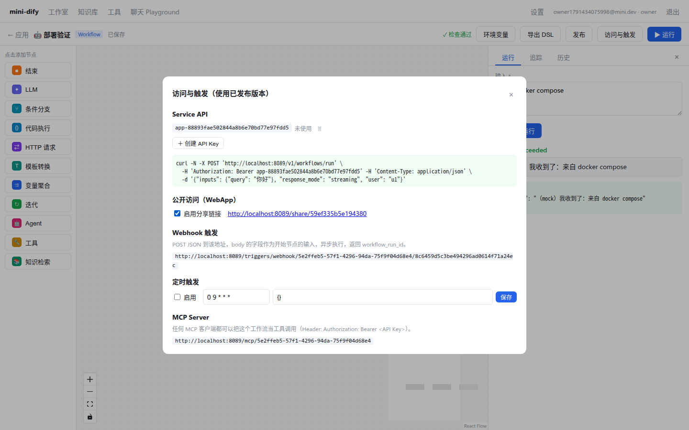

# 第 24 章 多租户、权限、发布与开放 API

> 本章目标：把“单人玩具”变成“多团队共用的平台”：账号、工作空间（租户）、角色权限、按租户隔离数据、应用 API Key、Service API、公开分享页、工作空间级的模型凭证。
> 前置：Part III–VI。对应代码：mini-dify **v1.0** `backend/app/auth.py`、`app/api/auth.py`、`app/api/service.py`、`app/security/crypto.py`；前端登录、设置、访问与触发面板、分享页。

## 24.1 问题：三类调用者

在平台上，有三种完全不同的“访问者”：

| 谁 | 例子 | 身份凭证 | 能做什么 |
|---|---|---|---|
| **控制台用户** | 公司里搭建应用的员工 | 登录后获得的 token | 按角色：编辑应用、管理知识库、查看日志…… |
| **API 调用方** | 公司的后端服务、App | 应用的 API Key（`app-xxx`） | 只能调用**这一个应用**的**已发布**版本 |
| **终端用户** | 访问分享链接的访客 | 无（或者匿名的 passport） | 使用这个应用 |

还有一条贯穿所有设计的红线：**租户隔离**。A 公司的人，无论用什么方式，都不能看到、改动、调用 B 公司的任何东西。

## 24.2 Dify 是怎么做的

### 24.2.1 账号、租户、成员关系

```python
# api/models/account.py
class Account(UserMixin, TypeBase): ...          # 29  登录账号
class Tenant(TypeBase): ...                       # 175 工作空间
class TenantAccountJoin(TypeBase): ...            # 212 成员关系（account × tenant × role）

# api/enums/account.py:7
class TenantAccountRole(StrEnum):
    OWNER = "owner"; ADMIN = "admin"; EDITOR = "editor"; NORMAL = "normal"
    DATASET_OPERATOR = "dataset_operator"         # 只能管理知识库
```

一个账号可以加入多个工作空间，在每个工作空间里的角色可以不同。所有业务表（`apps`、`datasets`、`tool_*_providers`……）都有 `tenant_id` 列。

企业版还提供更细粒度的 RBAC（`api/core/rbac/entities.py:25` `RBACPermission`）：`app_view_layout`、`app_test_and_run`、`app_edit`、`app_release_and_version`、`app_import_export_dsl`、`app_monitor`…… 每个权限点都可以单独授予。

### 24.2.2 密码与登录

```python
# api/libs/password.py
def hash_password(password_str, salt_byte):                       # 19
    dk = hashlib.pbkdf2_hmac("sha256", password_str.encode("utf-8"), salt_byte, 10000)
    return binascii.hexlify(dk)

# api/libs/passport.py
class PassportService:
    def issue(self, payload): return jwt.encode(payload, self.sk, algorithm="HS256")      # 11
    def verify(self, token): return jwt.decode(token, self.sk, algorithms=["HS256"])     # 14
```

- 密码：PBKDF2 加上每个用户各自的盐。**绝不存明文，也不用 MD5 / SHA1 这类快速哈希**。快速哈希每秒可以算几十亿次，PBKDF2 的多轮迭代让暴力破解的成本高出好几个数量级；
- 登录态：JWT（HS256，用 `SECRET_KEY` 签名），外加 refresh token 机制（`web/service/refresh-token.ts`）。

### 24.2.3 租户隔离写进开发规范

`api/AGENTS.md`：

> Scope tenant-owned reads and writes by the complete owner chain, and propagate `tenant_id` across every affected layer. Reconstruct trusted internal references from validated database state after payload or async boundaries.

后半句特别值得注意：**跨越异步边界（例如 Celery 任务的参数）之后，要从数据库重新查出可信的数据**，不能直接信任传过来的 tenant_id 等参数。

### 24.2.4 Service API 鉴权

```python
# api/controllers/service_api/wraps.py:396
def validate_and_get_api_token(scope: str | None = None):
    """
    1. First checks Redis cache for the token
    2. If not cached, queries database and caches the result
    The last_used_at field is updated asynchronously via Celery task
    """
    ...  # 要求 Authorization: Bearer <token>
```

每一次 API 调用都要校验 token。Dify 做了三层优化：先查 Redis 缓存；缓存未命中时用 **single flight** 避免大量并发请求同时去查数据库（`services/api_token_service.py:305` `fetch_token_with_single_flight`）；`last_used_at` 字段通过 Celery **异步**更新（第 266 行 `record_token_usage`），避免每个请求都写一次数据库。

Service API 的接口（`api/controllers/service_api/app/`）：`/v1/workflows/run`、`/v1/chat-messages`、`/v1/completion-messages`、`/v1/parameters`、`/v1/files/upload`、`/v1/conversations`…… Dify 的各语言 SDK（`sdks/`）封装的就是这些接口。

### 24.2.5 WebApp

分享链接对应 `api/controllers/web/`：每个应用有一个 `site`（站点配置：标题、图标、版权信息……），访客访问时会拿到一个 passport token（匿名身份），以 `EndUser`（`api/models/model.py:2078`）的身份使用应用。会话按 EndUser 隔离：访客 A 看不到访客 B 的对话。

## 24.3 从零实现

### 24.3.1 数据模型

```python
# backend/app/models.py（v1.0 新增）
class Tenant(Base):           id, name, created_at
class Account(Base):          id, email(unique), name, password_hash, password_salt
class TenantMember(Base):     tenant_id, account_id, role ∈ {owner, admin, editor, normal}
class ApiToken(Base):         app_id, token = "app-" + uuid4().hex, last_used_at
class ProviderCredential(Base): tenant_id, provider, encrypted_config   # 加密后的 {base_url, api_key}
# App / Dataset / ToolProviderRecord 增加 tenant_id
# App 增加 site_enabled / site_code / webhook_token / schedule
```

> 版本之间没有做数据库迁移：从 v0.5 切换到 v1.0 时，删除 `backend/storage/` 重新建库即可。生产环境请使用 Alembic（Dify 的迁移脚本在 `api/migrations/`）。

### 24.3.2 密码、token、加密

```python
# backend/app/security/crypto.py
PBKDF2_ROUNDS = 100_000           # Dify 用的是 10000；OWASP 当前建议 PBKDF2-SHA256 至少迭代 60 万次。按自己的威胁模型取值

def hash_password(password, salt=None):
    salt = salt or os.urandom(16)
    return b64(pbkdf2_hmac("sha256", password.encode(), salt, PBKDF2_ROUNDS)), b64(salt)

def verify_password(password, hashed, salt):
    candidate, _ = hash_password(password, b64decode(salt))
    return hmac.compare_digest(candidate, hashed)          # 常量时间比较，防止计时攻击

def sign_token(payload, ttl=None) -> str:                   # 一个最小化的“JWT”：base64(payload).base64(hmac)
    body = {**payload, "exp": int(time.time()) + (ttl or settings.token_ttl_seconds)}
    raw = b64url(json.dumps(body))
    return f"{raw}.{b64url(hmac_sha256(SECRET_KEY, raw))}"

def verify_token(token) -> dict | None:
    raw, sig = token.split(".")
    if not hmac.compare_digest(sig, expected_sig(raw)): return None    # 签名不对
    payload = json.loads(b64urldecode(raw))
    return None if payload["exp"] < time.time() else payload           # 已过期
```

自己实现签名 token 是为了让读者看清 JWT 的本质：**载荷本身是明文（只是 base64 编码），安全性完全来自 HMAC 签名**。所以载荷里不能放任何秘密信息，`SECRET_KEY` 一旦泄露，任何人都能伪造 token。生产环境建议直接使用 PyJWT。

### 24.3.3 鉴权依赖

```python
# backend/app/auth.py
ROLE_RANK = {"normal": 0, "editor": 1, "admin": 2, "owner": 3}

@dataclass
class ConsoleCtx:
    account_id: str
    tenant_id: str
    role: str
    def can(self, role) -> bool: return ROLE_RANK.get(self.role, -1) >= ROLE_RANK[role]

def console_ctx(authorization: str | None = Header(None)) -> ConsoleCtx:
    payload = verify_token(_bearer(authorization))                 # 401：没有登录或已过期
    member = 查询 TenantMember(account_id=payload["sub"], tenant_id=payload["tid"])
    if member is None:
        raise HTTPException(403, "不是该工作空间的成员")            # 每次请求都从数据库确认成员关系
    return ConsoleCtx(payload["sub"], member.tenant_id, member.role)

def require(role):
    def dep(ctx: ConsoleCtx = Depends(console_ctx)):
        if not ctx.can(role):
            raise HTTPException(403, f"需要 {role} 及以上角色")
        return ctx
    return dep
editor_ctx = require("editor")
admin_ctx = require("admin")

def get_tenant_app(session, app_id, tenant_id) -> App:
    app = session.get(App, app_id)
    if app is None or app.tenant_id != tenant_id:
        raise HTTPException(404, "应用不存在")       # ← 别的工作空间的应用返回 404，而不是 403
    return app
```

几个值得深入讲的细节：

**1. token 里只放 `sub`（账号 ID）和 `tid`（工作空间 ID），角色每次都从数据库读取。** 管理员把某人降级、或者移出工作空间之后**立即生效**，不需要等 token 过期。代价是每个请求多一次数据库查询，Dify 用缓存来缓解这个开销。

**2. 别的工作空间的资源返回 404，而不是 403。** 返回 403 等于告诉对方“这个 ID 的应用存在，只是你没有权限”，这会泄露资源是否存在的信息。

**3. 所有的控制台接口都换成了依赖注入：**

```python
@router.post("/apps/{app_id}/workflows/draft")
def sync_draft(app_id: str, body: SyncDraft, ctx: ConsoleCtx = Depends(editor_ctx)):   # 修改：要求 editor 角色
    with session_scope() as s:
        app = get_tenant_app(s, app_id, ctx.tenant_id)                                    # 隔离：只能操作本工作空间的应用
        ...

@router.get("/apps")
def list_apps(ctx: ConsoleCtx = Depends(console_ctx)):                                   # 读取：成员即可
    ... select(App).where(App.tenant_id == ctx.tenant_id) ...
```

**4. 租户 ID 一路传到最底层。** 不只是接口层，**每一个会访问租户数据的地方**都要带上 tenant_id：
- `RunContext.tenant_id` → LLM 和 Agent 节点用它获取这个工作空间的模型凭证；
- `retrieve(..., tenant_id=...)` → 知识检索只查本工作空间的知识库（即使工作流配置里写了别人的 dataset_id，也查不到）；
- `get_tool(..., tenant_id)` → 只能用本工作空间的自定义工具和工作流工具；
- `RunJob.tenant_id` → 跨越异步边界到 Celery 之后，依然知道属于哪个租户。

加入租户隔离时，第 23 章的 RAG 测试真的因此失败过一次：测试辅助函数构造的 RunContext 没有带 tenant_id，**检索结果为空**。我们选择让测试显式地传入 tenant_id，**而不是把过滤条件放宽成“tenant_id 为空就不过滤”**。安全相关的默认值应该收紧，而不是放宽。

### 24.3.4 模型凭证：工作空间级 + 加密存储

```python
# backend/app/api/auth.py
@router.put("/workspace/model-providers/{provider}")
def set_credentials(provider, body: CredentialBody, ctx = Depends(admin_ctx)):   # 只有 admin 及以上可以修改
    old = 解密已有配置
    api_key = old["api_key"] if "*" in body.api_key else body.api_key      # 前端回传的是掩码 → 表示没有修改
    row.encrypted_config = encrypt(json.dumps({"base_url": body.base_url, "api_key": api_key}))

@router.get("/workspace/model-providers")
def list_credentials(ctx = Depends(console_ctx)):
    return {provider: {"base_url": ..., "api_key": mask(api_key)}}          # 永远不把明文返回给前端
```

“掩码回传表示未修改”是一个常见技巧：前端拿到的是 `sk-********tkey`，用户只改了 base_url 就保存时，回传的还是掩码，后端识别出来后保留原来的密钥。

`get_model(spec, tenant_id)`（第 4 章）会先查这个工作空间的凭证，查到就用它构造一个 `OpenAICompatProvider`，查不到就退回到环境变量里的默认配置。

### 24.3.5 API Key 与 Service API

```python
# backend/app/auth.py
def app_from_api_key(authorization: str | None = Header(None)) -> App:
    row = 查询 ApiToken where token == bearer
    if row is None: raise HTTPException(401, "API Key 无效")
    row.last_used_at = datetime.now()
    return 对应的 App

# backend/app/api/service.py
@router.post("/v1/workflows/run")
def service_workflow_run(body: WorkflowRunBody, app: App = Depends(app_from_api_key)):
    if app.mode != "workflow":
        raise HTTPException(400, "该应用是 Chatflow，请使用 /v1/chat-messages")
    events = generate(GenerateRequest(app=app, workflow=_published(app),        # 永远运行已发布的版本
                                      inputs=body.inputs, user_id=body.user, triggered_from="api"))
    return blocking(events) if body.response_mode == "blocking" else sse_response(events)
```

路径和请求体都和 Dify 保持一致：`/v1/workflows/run`、`/v1/chat-messages`、`/v1/workflows/tasks/{id}/stop`、`/v1/parameters`、`/v1/workflows/run/{run_id}`。**这意味着 Dify 的部分 SDK 和调用代码，只要改一下 base_url 就能直接调用 mini-dify。**

`user` 字段由调用方传入，用来区分它自己的终端用户，会被记录在运行记录和会话里。

### 24.3.6 WebApp 分享页

```python
@router.get("/api/web/{code}")                 # 公开接口：应用的名称、图标、输入表单
@router.post("/api/web/{code}/run")            # 公开接口：运行已发布的版本

def _site_app(code):
    app = 查询 App where site_code == code
    if app is None or not app.site_enabled:
        raise HTTPException(404, "分享链接不存在或已关闭")     # 分享默认关闭，需要显式开启
```

前端的 `/share/:code` 路由**不需要登录**（`main.tsx` 的 `Root` 组件对这个路由放行），页面根据应用类型渲染表单或聊天界面，访客的 user id 是一个随机生成的 `visitor-xxxx`。

> 公开接口必须考虑滥用问题：任何人都可以无限次调用，消耗的是**你的**模型额度。生产环境至少要做到：按 IP 和访客限流、设置每日额度、加验证码，必要时要求登录。Dify 的 WebApp 支持访问控制（`api/controllers/web/` 中的 access mode、`web/service/access-control/`）。

### 24.3.7 前端

- `lib/auth.ts`：token 存在 localStorage 里（所有读写都包在 try/catch 中，因为隐私模式下访问 localStorage 可能抛异常）；
- `lib/api.ts`：每个请求自动带上 `Authorization` 头；收到 401 就清除 token 并跳转到登录页；
- `lib/sse.ts`：SSE 请求同样带上鉴权头（这就是第 6 章说过的、`EventSource` 做不到的事情）；
- DSL 导出：原来的 `<a href download>` 没法携带鉴权头，改为用 fetch 下载成 Blob，再触发浏览器保存；
- 登录 / 注册页、设置页（模型凭证、成员管理）、编辑器顶栏的“访问与触发”面板、分享页。



## 24.4 运行与验证

```bash
cd code/mini-dify && git checkout v1.0 && cd backend
uv run pytest -q tests/test_platform.py -k "login or rbac or crypto or credentials or service_api or web_app"
```

| 测试 | 验证了什么 |
|---|---|
| `test_login_and_tenant_isolation` | 未登录返回 401；B 工作空间读取 A 的应用返回 404，并且 B 的应用列表里看不到它；密码错误返回 401 |
| `test_rbac_normal_member_cannot_edit` | normal 角色可以查看应用列表，但创建应用返回 403 |
| `test_crypto_helpers` | 密码校验、篡改过的 token 校验失败、加密解密往返 |
| `test_model_credentials_are_encrypted_and_masked` | 接口返回的是掩码；**数据库里存的原始数据也查不到明文** |
| `test_service_api_runs_published_version` | 没有 Key 返回 401；应用没有发布时返回 400；发布后阻塞和流式两种模式都能正常调用；运行记录的 triggered_from 是 api |
| `test_web_app_share_link` | 分享默认关闭（返回 404），开启后匿名访客也能对话 |

用 curl 调用 Service API（把 Key 换成“访问与触发”面板里生成的那个）：

```bash
curl -N -X POST http://localhost:5001/v1/workflows/run \
  -H 'Authorization: Bearer app-xxxxxxxx' -H 'Content-Type: application/json' \
  -d '{"inputs": {"query": "你好"}, "response_mode": "blocking", "user": "u1"}'
```

## 24.5 练习

1. **巩固**：为什么 token 里不放角色？为什么跨租户访问返回 404 而不是 403？
2. **扩展**：实现“切换工作空间”：一个账号可以属于多个工作空间，登录后默认进入第一个；`POST /api/auth/switch {tenant_id}` 校验成员关系后，签发一个新的 token。
3. **读源码**：读 Dify 的 `services/api_token_service.py`，解释 `fetch_token_with_single_flight` 是怎么避免缓存击穿的。

## 24.6 延伸阅读

- OWASP Password Storage Cheat Sheet
- RFC 7519（JWT）
- `api/controllers/console/wraps.py`：Dify 控制台接口的各种装饰器（登录、租户、角色、功能开关、计费限制）
