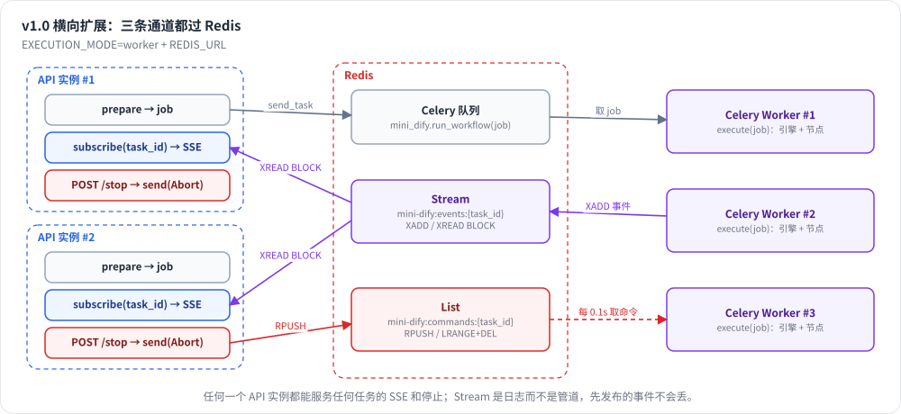

# 第 25 章 异步执行与横向扩展

> 本章目标：让 API 进程和执行进程分离，各自独立扩容；用 Redis Stream 跨进程传递事件，用 Redis 列表跨进程传递停止命令；用 Celery 执行工作流和索引任务；理解队列划分与公平调度。
> 前置：第 3 章（三类线程）、第 9 章（命令通道）。对应代码：mini-dify **v1.0** `backend/app/tasks/`（`bus.py`、`channels.py`、`celery_app.py`、`__init__.py`）、`app/apps/generator.py`。

## 25.1 问题：单进程撑不住了

v0.2 到 v0.5 的架构是这样的：

```
一个 API 进程：HTTP 线程 ⇄ queue.Queue ⇄ 工作线程（引擎 + 节点线程池）
```

这在单机上运行得很好，但是：

1. **扩容很尴尬**：API 进程既要处理大量短小的 HTTP 请求，又要执行长时间运行的工作流。想单独增加执行能力做不到，只能整体扩容；
2. **重启就丢任务**：发布新版本时重启 API 进程，所有正在运行的工作流都会中断；
3. **停止命令到不了**：部署多个 API 实例之后，用户的“停止”请求可能被**另一个**实例处理，而那个实例的内存里根本没有这个运行的命令通道；
4. **资源争抢**：一个超大的文档索引任务就能把 API 进程的 CPU 吃满。

解决方法是把“**接收请求、推送事件**”和“**执行任务**”拆到不同的进程甚至不同的机器上，中间用消息系统连接：



*图 25-1：job 走 Celery 队列、事件走 Redis Stream、命令走 Redis List；任何 API 实例都能服务任何任务。*

## 25.2 Dify 是怎么做的

### 25.2.1 Celery 与队列划分

Dify 的 `worker` 服务是 Celery。`api/docker/entrypoint.sh`（第 34 行起）为不同类型的任务分配了**不同的队列**：

```
自部署版：api_token, dataset, dataset_summary, priority_dataset, priority_pipeline, pipeline, mail, ops_trace,
          app_deletion, app_rbac, plugin, workflow_storage, conversation, workflow, schedule_poller,
          schedule_executor, triggered_workflow_dispatcher, trigger_refresh_publisher, ...
云版：     ... workflow_professional, workflow_team, workflow_sandbox ...   ← 按付费等级划分队列
```

为什么要分这么多队列？

- **隔离**：索引任务慢（可能要几分钟），发邮件快，混在一个队列里，邮件就要排在索引任务后面；
- **独立扩容**：dataset 队列积压了，就单独给它增加 worker（`CELERY_WORKER_QUEUES` 可以让某个 worker 只消费指定的队列）；
- **优先级与配额**：云版按付费等级把工作流放进不同的队列，付费用户不会被免费用户的流量拖慢。

在队列之上还有**公平调度**：`api/tasks/workflow_cfs_scheduler/`（CFS 是 Completely Fair Scheduler 的缩写，借用了 Linux 进程调度器的名字），以及第 22 章提到的知识库租户隔离队列。

### 25.2.2 异步工作流

`api/services/async_workflow_service.py:39` `AsyncWorkflowService.trigger_workflow_async`：Webhook、定时任务这类触发器启动的运行没有人在等待结果，直接投递到 Celery，结果写进触发日志，之后可以查询，失败了还可以重试（`get_failed_logs_for_retry`，第 308 行）。

### 25.2.3 跨进程停止

graphon 自带一个基于 Redis 的命令通道：

```python
# graphon/graph_engine/command_channels/redis_channel.py:61
class RedisChannel:
    def send_command(self, command): ...               # RPUSH 到 key，并设置过期时间
    def fetch_commands(self) -> list[GraphEngineCommand]:   # 87
        with self._redis.pipeline() as pipe:            # 99：用 pipeline 保证“读取 + 删除”是原子操作
            pipe.lrange(self._key, 0, -1)
            pipe.delete(self._key)
            ...
```

Dify 的 Runner 为每个任务创建一个 RedisChannel（`api/core/app/apps/workflow/command_channels.py`），所以任何一个 API 实例收到“停止”请求，都能把命令送到正在执行的引擎。

### 25.2.4 跨进程事件

流式运行默认是在 API 进程里开线程执行的（第 3 章）。为了支持断线后重新连接、在多个实例之间转发事件，Dify 有一套基于 Redis 的广播通道（`api/libs/broadcast_channel/`），以及运行事件的快照服务（`api/services/workflow_event_snapshot_service.py`）。

## 25.3 从零实现：把三个箭头换成可插拔的组件

v1.0 的关键重构是：**保持“准备 → 执行 → 订阅”这个结构不变，把中间的三条通道都换成可插拔的实现**。

### 25.3.1 Job：可以序列化的运行描述

```python
# backend/app/apps/generator.py
@dataclass
class RunJob:
    """执行一次运行所需的全部信息，都是可以 JSON 序列化的数据。"""
    task_id: str; run_id: str; app_id: str; tenant_id: str; mode: str; workflow_id: str
    inputs: dict; query: str; conversation_id: str | None; message_id: str | None
    user_id: str; triggered_from: str; call_depth: int = 0

def prepare(req) -> RunJob:          # 在 API 进程：创建会话、workflow_run 记录，生成 ID
def execute(job: RunJob) -> None:    # 在任意进程：从数据库重新加载工作流和历史，构建并运行引擎，把事件发布到总线
def generate(req):
    job = prepare(req)
    stream = get_bus().subscribe(job.task_id)    # 先订阅
    _dispatch(job)                               # 再派发
    return stream

def _dispatch(job):
    submit(_execute_from_dict, asdict(job), celery_task="mini_dify.run_workflow")
```

`execute` 只依赖 `job`、数据库和事件总线，**不依赖任何内存中的对象**，所以它能在 Celery worker 里运行。这正好符合 `api/AGENTS.md` 的要求：“Reconstruct trusted internal references from validated database state after payload or async boundaries.”

### 25.3.2 执行位置：线程还是 Celery

```python
# backend/app/tasks/__init__.py
def submit(fn, *args, celery_task=None):
    if settings.execution_mode == "worker" and settings.redis_url and celery_task:
        celery.send_task(celery_task, args=list(args))      # 按名字投递，API 进程不需要 import 任务函数
    else:
        threading.Thread(target=fn, args=args, daemon=True).start()

# backend/app/tasks/celery_app.py
celery = Celery("mini_dify", broker=settings.redis_url or "memory://")
celery.conf.update(task_acks_late=True, worker_prefetch_multiplier=1, task_serializer="json", accept_content=["json"])

@celery.task(name="mini_dify.run_workflow")
def run_workflow_task(job: dict): execute(RunJob(**job))

@celery.task(name="mini_dify.index_document")
def index_document_task(document_id: str): index_document(document_id)
```

两个配置值得解释：

- `task_acks_late=True`：任务**执行完**才确认，worker 中途崩溃的话，任务会被重新投递；
- `worker_prefetch_multiplier=1`：每个 worker 进程一次只预取一个任务。工作流的执行时间长短不一，预取太多的话，一个 worker 可能囤了一堆任务，而其他 worker 闲着。

`task_acks_late` 带来的副作用是：任务**可能被执行两次**，所以任务必须是幂等的（第 22 章“先删除旧分段再写入”）。不过工作流运行**本身并不幂等**：重新执行一次，就会再调用一次 LLM、再发一次 HTTP 请求。生产环境需要在 `execute` 开头检查运行记录的状态，已经开始执行的就跳过，或者标记为失败（练习 1）。

### 25.3.3 事件总线：Queue 或 Redis Stream

```python
# backend/app/tasks/bus.py
class EventBus(Protocol):
    def publish(self, task_id, payload): ...
    def close(self, task_id): ...
    def subscribe(self, task_id) -> Iterator[dict]: ...

class InProcessBus:                    # 单进程：每个任务一个 queue.Queue（就是 v0.2 的做法）
    ...

class RedisBus:
    def publish(self, task_id, payload):
        key = f"mini-dify:events:{task_id}"
        self.r.xadd(key, {"d": json.dumps(payload, ensure_ascii=False, default=str)}, maxlen=20000, approximate=True)
        self.r.expire(key, 3600)
    def close(self, task_id):
        self.r.xadd(self._key(task_id), {"end": "1"})          # 结束标记
    def subscribe(self, task_id):
        key, last = self._key(task_id), "0-0"                   # 从头开始读：先发布的事件也不会丢
        while True:
            batch = self.r.xread({key: last}, block=10_000, count=200)
            if not batch:
                yield {"event": "ping"}                         # 10 秒内没有新事件：发一个心跳
                continue
            for _key, entries in batch:
                for entry_id, fields in entries:
                    last = entry_id
                    if fields.get("end"):
                        return
                    yield json.loads(fields["d"])

@lru_cache
def get_bus() -> EventBus:
    return RedisBus(settings.redis_url) if settings.redis_url else InProcessBus()
```

**为什么选 Stream，而不是 Pub/Sub？**

| | Redis Pub/Sub | Redis Stream |
|---|---|---|
| 订阅之前发布的消息 | **丢失** | 保留，可以从任意位置开始读 |
| 断线重连 | 中间的消息丢失 | 从 last_id 继续读 |
| 消息上限 | — | `maxlen` 限制长度，`expire` 自动清理 |

`generate` 里是“先订阅、再派发”，但 Celery worker 可能抢在 HTTP 线程真正开始读取之前就发布了事件。Pub/Sub 会丢掉这些事件，Stream 不会。Stream 本质上是一份**日志**，不是一根管道。第 6 章练习 2 里的“断线续传”，用 Stream 实现起来也很自然：客户端带上最后收到的 ID 重新连接，从那个位置继续读就行。

### 25.3.4 命令通道：Redis 列表

```python
# backend/app/tasks/channels.py
class RedisCommandChannel:
    def __init__(self, task_id):
        self.key = f"mini-dify:commands:{task_id}"
    def send(self, command):
        self.r.rpush(self.key, json.dumps({"type": "abort", "reason": command.reason}))
        self.r.expire(self.key, 3600)
    def fetch(self):
        pipe = self.r.pipeline()                    # 和 graphon 的 RedisChannel 一样：原子地读取并删除
        pipe.lrange(self.key, 0, -1)
        pipe.delete(self.key)
        items, _ = pipe.execute()
        return [AbortCommand(json.loads(i).get("reason", "")) for i in items]

def command_channel(task_id):   # 引擎侧
    return RedisCommandChannel(task_id) if settings.redis_url else 进程内的 InMemoryChannel（按 task_id 登记）

def stop_task(task_id, reason="用户停止"):   # 任何一个 API 实例都可以调用
    command_channel(task_id).send(AbortCommand(reason))
```

引擎的代码（第 9 章）**一行都没改**，它只认 `CommandChannel` 这个协议。这就是当初把停止设计成“消息”而不是“方法调用”的回报。

### 25.3.5 Webhook 和定时任务：没有人在等的运行

```python
def run_async(req) -> RunJob:
    job = prepare(req)
    _dispatch(job)
    submit(lambda: [None for _ in get_bus().subscribe(job.task_id)])   # 在后台把事件读完，免得进程内的队列越积越多
    return job                                                          # 立即返回 run_id，调用方之后自己查结果
```

## 25.4 运行与验证

**单元测试**（需要 Redis）：

```bash
docker run -d --rm -p 6399:6379 redis:7-alpine
cd code/mini-dify/backend
REDIS_TEST_URL=redis://localhost:6399/0 uv run pytest -q tests/test_platform.py::test_redis_bus_and_command_channel
```

**端到端：API 和 Worker 是两个独立的进程**（写作时的实际验证过程）：

```bash
export REDIS_URL=redis://localhost:6399/1 EXECUTION_MODE=worker STORAGE_DIR=/tmp/md-worker MOCK_DELAY=0.05
uv run uvicorn app.main:app --port 5002 &
uv run celery -A app.tasks.celery_app worker -l info -c 2 &
# 注册账号、创建应用（省略），然后：
curl -sN -X POST localhost:5002/api/apps/$APP/workflows/draft/run -H "$H" -H 'Content-Type: application/json' \
     -d '{"inputs":{"query":"worker 模式跑通了吗"}}' | grep -o '"event": "[a-z_]*"' | sort | uniq -c
```

实际输出：

```
mode: worker redis: True
      3 "event": "node_finished"
      3 "event": "node_started"
     24 "event": "text_chunk"
      1 "event": "workflow_finished"
      1 "event": "workflow_started"
```

再测试跨进程停止：一个终端里流式运行一段长文本，另一个终端调用 stop。最终的 `workflow_finished.status` 为 `"stopped"`，Celery 日志里可以看到 `mini_dify.run_workflow` 任务的执行记录。

## 25.5 写作时踩到的坑

**`pkill -f "celery ..."` 也会杀掉自己**（和 Lab 2 中 `pkill -f uvicorn` 是同一个问题）：`-f` 会匹配完整的命令行，而执行这条命令的 shell 自己的命令行里就包含这个字符串。正确的写法是：

```bash
ps -eo pid,args | grep "[a]pp.tasks.celery_app worker" | awk '{print $1}' | xargs -r kill
```

`[a]pp` 这个正则能匹配到 "app"，但 grep 进程自己的命令行里写的是 `[a]pp`，所以不会匹配到自身。

## 25.6 练习

1. **巩固**：解释“先订阅、再派发”这个顺序，在 Redis Pub/Sub 和 Redis Stream 两种实现下分别会出现什么情况。
2. **扩展**：解决 `acks_late` 导致工作流重复执行的问题：在 `execute` 开头用 `UPDATE workflow_runs SET status='executing' WHERE id=? AND status='running'` 原子地“抢占”这次运行，抢不到（受影响的行数为 0）就直接返回。
3. **读源码**：读 Dify 的 `api/tasks/workflow_cfs_scheduler/cfs_scheduler.py`，说说它怎样在多个租户之间公平地分配工作流的执行机会。

## 25.7 延伸阅读

- Redis Streams 文档：XADD / XREAD / XREADGROUP（消费者组）
- Celery 文档：Routing Tasks、Prefetch Limits、acks_late
- `api/docker/entrypoint.sh`：Dify 各服务的启动参数
