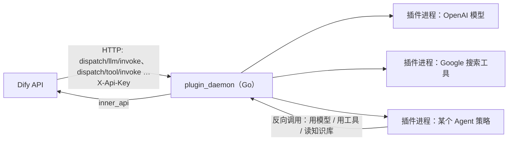

# 第 26 章 插件系统

> 本章目标：理解平台为什么需要插件、插件可以扩展哪些能力；对比“进程内加载”和“独立守护进程”两种架构；实现 mini-dify 的插件加载器和一个示例插件（贡献工具和模型）。
> 前置：第 4 章（Provider 注册）、第 10 章（节点注册）、第 19 章（ToolProvider）。对应代码：mini-dify **v1.0** `backend/app/plugins.py`、`plugins/text_tools/`。

## 26.1 问题：平台的能力怎么开放给第三方

平台方不可能自己实现所有东西：几百家模型供应商、几千种工具、各种数据源、各种 Agent 策略……必须让第三方也能扩展。插件系统要回答五个问题：

1. **扩展点**：插件能贡献什么？（模型、工具、Agent 策略、节点、数据源、触发器、HTTP 端点……）
2. **契约**：插件长什么样？（清单文件 + 入口 + 注册 API）
3. **隔离**：一个有 bug 或者恶意的插件，能不能读你的数据库、拖垮整个平台？
4. **依赖**：插件 A 需要 `requests==2.20`，插件 B 需要 `requests==2.32`，怎么办？
5. **分发**：怎么安装、升级、卸载？怎么保证插件没有被篡改过？

## 26.2 Dify 是怎么做的：plugin_daemon

Dify 1.0 把模型、工具等能力几乎全部做成了插件，并且用一个**独立的服务**来运行它们：

```yaml
# docker/docker-compose.yaml:573
plugin_daemon:
  image: langgenius/dify-plugin-daemon:0.6.10-local
  environment:
    DB_DATABASE: dify_plugin                       # 有自己独立的数据库
    SERVER_PORT: 5002
    SERVER_KEY: ...                                # API 调用 daemon 时使用的密钥
    MAX_PLUGIN_PACKAGE_SIZE: 52428800
    DIFY_INNER_API_URL: http://api:5001            # daemon 回调 API 的地址（反向调用）
```



### 26.2.1 API 调用插件

所有调用都通过 `api/core/plugin/impl/` 发给 daemon。`base.py` 封装了请求的细节：

```python
# api/core/plugin/impl/base.py
plugin_daemon_inner_api_baseurl = URL(str(dify_config.PLUGIN_DAEMON_URL))       # 51
def _request(...):                                                               # 121
    prepared_headers["X-Api-Key"] = dify_config.PLUGIN_DAEMON_KEY                # 180
def _request_with_plugin_daemon_response_stream(...):                            # 352 流式响应
```

各类能力对应不同的客户端：`model.py`（第 4 章的 `invoke_llm` 就在这里）、`tool.py`、`agent.py`、`datasource.py`、`trigger.py`、`endpoint.py`……

### 26.2.2 插件反向调用平台

插件经常需要用到平台的能力：Agent 策略插件要调用模型和工具，工具插件可能要读取知识库。插件**不能直接连接 Dify 的数据库**，只能通过 daemon 回调 API 的内部接口：

```
api/core/plugin/backwards_invocation/   app.py  model.py  tool.py  node.py  encrypt.py
api/controllers/inner_api/plugin/       plugin.py  agent_config.py  skills.py  wraps.py
```

这条反向调用的通道，就是平台**主动开放给插件的能力边界**：插件能做的事，仅限于这些接口允许的范围。

### 26.2.3 包、签名与市场

插件被打包成 `.difypkg` 文件，包含 manifest（类型、权限声明、资源限制……）、代码和依赖声明。Dify Marketplace 上的插件经过官方签名，安装时会校验签名，自部署时可以选择是否允许安装未签名的插件。每个插件运行在自己的环境里（本地模式下是独立的进程和虚拟环境，也支持 Serverless 部署），所以依赖不会互相冲突。

## 26.3 两种架构的对比

| | 进程内加载（mini-dify） | 独立守护进程（Dify） |
|---|---|---|
| 实现复杂度 | 约 100 行 | 一个独立的 Go 服务 + 协议 + 打包工具 |
| 调用开销 | 普通函数调用 | 一次 HTTP / RPC 请求 |
| 隔离 | **无**：插件可以 import 平台的任何模块、读环境变量、连接数据库 | 进程隔离，只能通过反向调用接口访问平台 |
| 崩溃影响 | 可能拖垮整个 API 进程 | 只影响这个插件 |
| 依赖冲突 | 所有插件共用一个 Python 环境 | 每个插件独立 |
| 热安装 / 卸载 | 需要重启 | 支持 |
| 适用场景 | 自用、可信的扩展 | 开放生态、第三方插件 |

结论：**只要你要运行“不是自己写的代码”，就必须做隔离。** mini-dify 的加载器适合用来理解“插件契约”，以及给自己的平台加上可信的扩展。

## 26.4 从零实现

### 26.4.1 插件长什么样

```
plugins/text_tools/
├── manifest.yaml
└── plugin.py
```

```yaml
# plugins/text_tools/manifest.yaml
name: text_tools
version: 1.0.0
author: mini-dify book
description: 文本小工具（UUID、Base64、字符统计）+ 一个“倒序复读”演示模型
entry: plugin:register          # 模块名:函数名
```

```python
# plugins/text_tools/plugin.py
class UUIDTool(Tool):
    name = "uuid"; label = "生成 UUID"; description = "Generate a random UUID4."
    def invoke(self, args): return ToolResult(text=str(uuid.uuid4()))

class Base64Tool(Tool): ...

class ReverseEchoProvider(ModelProvider):
    """一个玩具模型：把用户的消息倒过来说一遍。用 `reverse/echo` 调用。"""
    name = "reverse"
    def invoke(self, model, messages, *, tools=None, params=None):
        text = next((m.content for m in reversed(messages) if m.role == "user"), "")[::-1]
        for ch in text:
            yield LLMChunk(delta=ch)
        yield LLMChunk(finish_reason="stop", usage=Usage(len(text), len(text)))

def register(api):                          # 插件只能通过 api 对象向平台注册
    api.add_tool_provider(ToolProvider("text", "文本工具（插件）", "plugin", "UUID / Base64", [UUIDTool(), Base64Tool()]))
    api.add_model_provider(ReverseEchoProvider())
```

一个插件就这样同时贡献了**工具**和**模型**两种能力。

### 26.4.2 加载器

```python
# backend/app/plugins.py
class PluginAPI:
    """插件唯一被允许接触的接口。"""
    def __init__(self, plugin: LoadedPlugin): self._plugin = plugin
    def add_tool_provider(self, provider):
        provider.id = f"plugin:{self._plugin.name}/{provider.id}"     # 加上命名空间，避免和其他插件的 ID 冲突
        provider.type = "plugin"
        _tool_providers.append(provider)
        self._plugin.contributes.append(f"tool provider {provider.name}")
    def add_model_provider(self, provider):
        register_provider(provider)                                    # 第 4 章的注册表
        self._plugin.contributes.append(f"model provider {provider.name}")
    def add_node(self, node_cls):
        register_node(node_cls)                                        # 第 10 章的注册表
        self._plugin.contributes.append(f"node {node_cls.node_type}")

def load_plugins(directory=None) -> list[LoadedPlugin]:
    for manifest_path in sorted(Path(directory or settings.plugins_dir).glob("*/manifest.yaml")):
        manifest = yaml.safe_load(manifest_path.read_text()) or {}
        plugin = LoadedPlugin(name=..., version=..., path=...)
        try:
            module_name, _, func_name = manifest.get("entry", "plugin:register").partition(":")
            spec = importlib.util.spec_from_file_location(f"mini_dify_plugin_{plugin.name}",
                                                          manifest_path.parent / f"{module_name}.py")
            module = importlib.util.module_from_spec(spec)
            sys.modules[spec.name] = module
            spec.loader.exec_module(module)
            getattr(module, func_name or "register")(PluginAPI(plugin))
        except Exception as e:                                         # 一个插件坏了，不能影响平台启动
            plugin.error = f"{type(e).__name__}: {e}"
        _loaded.append(plugin)
    return _loaded
```

在 `main.py` 的 lifespan 里调用 `load_plugins()`。`/api/health` 会返回每个插件的加载状态和它贡献了哪些能力（`contributes`），加载失败的插件会显示错误原因。

**`PluginAPI` 的意义**：虽然在同一个进程里，插件技术上可以 import 任何模块，但我们**约定**插件只能通过 `api` 对象和平台交互。这个约定就是插件契约。将来想把插件移到独立的进程里运行时，只需要把 `PluginAPI` 换成一个 RPC 客户端，插件代码本身不用改。这和 Dify 用反向调用接口来限定插件能力边界，是同样的思路。

## 26.5 运行与验证

```bash
cd code/mini-dify && git checkout v1.0 && cd backend
uv run pytest -q tests/test_platform.py::test_plugin_contributes_tools_and_model
curl -s localhost:5001/api/health | python3 -m json.tool | grep -A6 plugins
```

验证内容：`text_tools` 插件加载成功，并且没有错误；工具列表里出现了 `plugin:text_tools/text`；调用 base64 工具，输入 "hi" 得到 "aGk="；`get_model("reverse/echo")` 收到 "abc" 后回复 "cba"。

在 UI 中：工具页会出现“文本工具（插件）”；任何 LLM 节点的模型都可以改成 provider `reverse`、name `echo`。

## 26.6 练习

1. **巩固**：列出 mini-dify 的插件能做、但 Dify 的插件做不到的三件危险的事。
2. **扩展**：把插件放到子进程里运行：插件进程通过 stdin/stdout 收发 JSON-RPC（没错，和 MCP 一样的帧格式），平台侧的 `PluginAPI` 变成一个代理。实现工具的调用即可。
3. **读源码**：读 Dify 的 `api/core/plugin/backwards_invocation/model.py`，说说插件反向调用模型时，平台怎么知道应该用哪个租户的凭证、扣谁的额度。

## 26.7 延伸阅读

- Dify 插件开发文档：<https://docs.dify.ai/plugins>
- `langgenius/dify-plugin-daemon`（Go）：插件运行时
- `langgenius/dify-plugin-sdks`：插件 SDK
