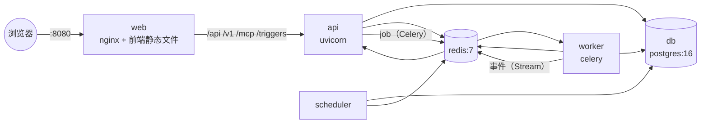

# 第 28 章 触发器与部署

> 本章目标：让工作流“自己跑起来”：Webhook 触发、Cron 定时触发；然后用 Docker Compose 把整个平台（Postgres + Redis + API + Worker + Scheduler + Nginx）一条命令部署起来。
> 前置：第 24、25 章。对应代码：mini-dify **v1.0** `backend/app/scheduler.py`、`app/api/service.py`（webhook）、`backend/Dockerfile`、`frontend/Dockerfile`、`docker/`。

## 28.1 问题：不是每次运行都有人点按钮

到目前为止，运行都是人发起的（点击运行、调用 API）。但很多自动化场景需要的是：

- **事件驱动**：GitHub 有新 Issue、表单有人提交、支付成功……这些外部系统可以发一个 Webhook 过来；
- **时间驱动**：每天早上 9 点生成日报，每小时同步一次数据。

## 28.2 Dify 是怎么做的

### 28.2.1 触发器是一种“开始节点”

Dify 把触发器做成了**根节点**（执行类型为 ROOT，第 9 章）：`api/core/workflow/nodes/trigger_webhook/`、`trigger_schedule/`、`trigger_plugin/`（插件提供的触发器，比如“收到 Slack 消息”）。一个工作流可以有多个触发器作为入口，graphon 的 `mark_inactive_root_branches` 会根据这一次是被哪个触发器启动的，只激活对应的那个分支（第 9 章的延伸阅读）。

**Webhook**（`api/controllers/trigger/webhook.py:60`）：

```python
@bp.route("/webhook/<string:webhook_id>", methods=["GET", "POST", "PUT", "PATCH", "DELETE", "HEAD", "OPTIONS"])
```

请求体、查询参数、请求头都可以映射成工作流的输入。还有一个 `webhook-debug` 路由（第 101 行），方便在编辑器里调试。

**定时触发**：`api/schedule/workflow_schedule_task.py` 由 Celery Beat 周期性调用：

```python
def poll_workflow_schedules():                                     # 18
    ... 熔断：单次轮询派发的数量达到上限就停下，下一轮再继续（第 44 行起）
def _fetch_due_schedules(session):                                 # 55
    select(WorkflowSchedulePlan)
      .where(WorkflowSchedulePlan.next_run_at <= now, ...)
      .order_by(WorkflowSchedulePlan.next_run_at.asc())
      .with_for_update(skip_locked=True)                           # 82 ← 关键
      .limit(dify_config.WORKFLOW_SCHEDULE_POLLER_BATCH_SIZE)
def _process_schedules(session, schedules, producer=None):         # 89
    next_run_at = calculate_next_run_at(...)                       # 先算出下一次运行时间并写回
    schedule.next_run_at = next_run_at
    ...                                                            # 投递到 schedule_executor 队列
```

这里有两个值得学习的设计：

1. **存储 `next_run_at`，而不是每一轮都重新计算 cron 是否匹配**：只需要查询“到期的”计划，而且 `next_run_at` 上可以建索引，计划数量再多也能快速查出来；
2. **`SELECT ... FOR UPDATE SKIP LOCKED`**：多个轮询实例同时运行时，每个实例只会锁住并取走**别人没有锁住**的那些行，天然实现了任务分配，不会重复触发，也不需要额外的分布式锁。

## 28.3 从零实现

### 28.3.1 Webhook

```python
# backend/app/api/service.py
@router.post("/triggers/webhook/{app_id}/{token}", status_code=202)
def webhook(app_id, token, payload: dict = Body(default_factory=dict)):
    app = 查询 App
    if app is None or app.webhook_token != token:
        raise HTTPException(404, "webhook 不存在")          # token 不对也返回 404，不暴露应用是否存在
    if app.mode != "workflow":
        raise HTTPException(400, "Webhook 只支持 Workflow 应用")
    job = run_async(GenerateRequest(app=app, workflow=_published(app), inputs=payload,
                                    user_id="webhook", triggered_from="webhook"))
    return {"workflow_run_id": job.run_id, "task_id": job.task_id, "status": "accepted"}
```

- 返回 **202 Accepted**，而不是等工作流跑完再响应：大多数 Webhook 发送方都有超时限制（GitHub 是 10 秒），而且失败了还会重试；
- URL 里的随机 token 就是访问凭证，每个应用一个（`App.webhook_token`）；
- 调用方之后可以通过 `GET /v1/workflows/run/{run_id}` 查询结果（需要 API Key）。

### 28.3.2 Cron 解析（手写）

```python
# backend/app/scheduler.py
_RANGES = [(0, 59), (0, 23), (1, 31), (1, 12), (0, 7)]      # 分 时 日 月 周

def _field(spec, lo, hi) -> set[int]:
    values = set()
    for part in spec.split(","):                              # 列表：1,15,30
        step = 1
        if "/" in part:                                       # 步长：*/15、9-18/2
            part, step_s = part.split("/", 1)
            step = int(step_s)                                # （省略了对 0 和非数字的校验）
        if part in ("*", ""):  start, end = lo, hi
        elif "-" in part:      start, end = map(int, part.split("-", 1))   # 范围：1-5
        else:                  start = end = int(part)
        if start < lo or end > hi or start > end:
            raise CronError(...)
        values.update(range(start, end + 1, step))
    return values

def cron_matches(expr, when) -> bool:
    minute, hour, dom, month, dow = parse_cron(expr)
    weekday = (when.weekday() + 1) % 7      # Python：周一=0 → cron：周日=0
    return when.minute in minute and when.hour in hour and when.day in dom and when.month in month and weekday in dow
```

最容易出错的是**星期的换算**：Python 的 `weekday()` 里周一是 0，cron 里周日是 0（7 也表示周日）。测试专门覆盖了“周日写成 7”和“工作日 9 点到 18 点每 15 分钟”这两种情况。

> 简化说明：标准 cron 中，“日”和“周”两个字段**都**有限定时，它们之间是“或”的关系（任意一个满足即可）。我们统一按“与”处理。一般用不到这种写法，但要知道两者有这个差异。

### 28.3.3 调度循环

```python
def tick(now=None) -> list[str]:
    now = (now or datetime.now()).replace(second=0, microsecond=0)
    stamp = now.isoformat()
    due = []
    with session_scope() as s:                                # ① 在一个事务里：找出到期的计划，并“认领”这一分钟
        for app in 所有 workflow 应用:
            sched = app.schedule or {}
            if not sched.get("enabled") or sched.get("last_run_at") == stamp:
                continue                                      # 这一分钟已经触发过了
            if not cron_matches(sched["cron"], now):
                continue
            wf = get_published(s, app)
            if wf is None:
                continue
            app.schedule = {**sched, "last_run_at": stamp}    # 认领
            due.append((app, wf, sched.get("inputs") or {}))
    # ② 事务已经提交，再去启动运行
    for app, wf, inputs in due:
        run_async(GenerateRequest(app=app, workflow=wf, inputs=inputs, user_id="scheduler", triggered_from="schedule"))
```

调度器每 20 秒调用一次 `tick`。同一分钟内会被调用多次，但 `last_run_at == stamp` 保证同一分钟只触发一次。

### 28.3.4 写作时踩到的坑：事务里套事务导致 SQLite 锁库

`tick` 最初的版本是这样写的：

```python
with session_scope() as s:
    for app in ...:
        ...
        app.schedule = {..., "last_run_at": stamp}
        s.flush()                                  # ← 写操作：这个事务拿到了 SQLite 的写锁
        run_async(GenerateRequest(...))            # ← prepare() 里开了另一个 session，也要写数据库
```

测试结果：`sqlite3.OperationalError: database is locked`，等了 5 秒（`busy_timeout`）之后失败。

原因：SQLite 同一时刻**只允许一个写入者**。外层事务 `flush` 之后就一直持有写锁，直到提交；而 `run_async` → `prepare` 在**另一个连接**上尝试写入，只能等外层事务释放锁，可外层事务又要等 `run_async` 返回才能提交。这就形成了死锁，最后由超时打破。

修复方法：拆成两个阶段，**先提交认领，再在事务之外启动运行**（就是上面的最终版本）。

这正是 Dify 在 `api/AGENTS.md` 中写下的那条规则：

> Keep write transactions explicit and bounded. Do not perform external I/O inside an open transaction unless a documented consistency contract requires it.

换成 Postgres 也一样有问题：它虽然允许并发写入，但长事务会一直持有行锁和连接，在高并发下同样会出问题。**无论用什么数据库，事务都应该短，而且不要在事务里做“其他事情”。**

### 28.3.5 调度器跑在哪里

- 单进程模式（开发时）：API 启动时在后台开一个线程（`SCHEDULER_ENABLED=true`）；
- Docker Compose：一个独立的 `scheduler` 服务（`python -m app.scheduler`），**只部署一个实例**，API 那边设置 `SCHEDULER_ENABLED=false`。

为什么只能部署一个实例？因为我们的“认领”是先读后写的（read-then-write），两个实例同时读到“这一分钟还没触发”，就会各自触发一次。要支持多实例，就得像 Dify 一样使用 `FOR UPDATE SKIP LOCKED`，或者用一条带条件的 UPDATE 来原子地认领（练习 2）。Dify 的 `worker_beat` 服务同样只部署一个实例（Celery Beat 本身就是单实例的），但它实际执行的轮询任务即使并发运行也是安全的。

## 28.4 部署：Docker Compose

### 28.4.1 拓扑



和 Dify 的 `docker-compose.yaml` 对照：api ↔ api、worker ↔ worker、scheduler ↔ worker_beat、web（nginx）↔ web + nginx、db ↔ db_postgres、redis ↔ redis。我们没有 sandbox、plugin_daemon、ssrf_proxy 和向量库这几个服务，第 26、27 章讲过对应的替代方案。

### 28.4.2 后端镜像

```dockerfile
# backend/Dockerfile（构建上下文是仓库根目录）
FROM python:3.12-slim
ENV PYTHONUNBUFFERED=1 UV_LINK_MODE=copy UV_COMPILE_BYTECODE=1
RUN pip install --no-cache-dir uv
WORKDIR /app/backend
COPY backend/pyproject.toml backend/uv.lock ./
RUN uv sync --frozen --no-dev --no-install-project      # 先只装依赖：只要依赖不变，这一层就能复用缓存
COPY backend/ ./
COPY plugins /app/plugins
COPY examples /app/examples
ENV PATH="/app/backend/.venv/bin:$PATH" PLUGINS_DIR=/app/plugins STORAGE_DIR=/app/storage
CMD ["uvicorn", "app.main:app", "--host", "0.0.0.0", "--port", "5001"]
```

同一个镜像跑三个服务（api / worker / scheduler），只是启动命令不同。为什么只开一个 uvicorn worker？因为每个 worker 进程启动时都会执行 `create_all()`，多个进程同时执行就可能产生竞争。生产环境应该把数据库迁移作为单独的一步先执行，然后就可以随意增加 worker 数或副本数。

### 28.4.3 前端镜像与 nginx

```dockerfile
# frontend/Dockerfile
FROM node:22-alpine AS build
WORKDIR /web
COPY frontend/package.json frontend/package-lock.json ./
RUN npm ci
COPY frontend/ ./
RUN npm run build
FROM nginx:1.27-alpine
COPY --from=build /web/dist /usr/share/nginx/html
COPY docker/nginx.conf /etc/nginx/conf.d/default.conf
```

```nginx
# docker/nginx.conf
location ~ ^/(api|v1|mcp|triggers)/ {
    proxy_pass http://api:5001;
    proxy_buffering off;          # SSE：不要缓冲（第 6 章）
    proxy_cache off;
    proxy_read_timeout 3600s;     # 长时间运行的工作流，流不能被提前断开
}
location / {
    root /usr/share/nginx/html;
    try_files $uri /index.html;   # 单页应用：/apps/xxx/workflow 这样的路径由前端路由处理
}
```

**这三行代理配置缺一不可**：少了 `proxy_buffering off`，文字会一大块一大块地蹦出来；少了 `proxy_read_timeout`，nginx 默认 60 秒没有收到数据就会断开连接（这时 ping 心跳就派上用场了）；少了 `try_files`，用户刷新编辑器页面就会看到 404。

### 28.4.4 docker-compose.yml 的关键部分

```yaml
x-backend: &backend                         # YAML 锚点：三个后端服务共用同一份配置
  build: {context: .., dockerfile: backend/Dockerfile}
  image: mini-dify-backend:1.0
  environment: &backend-env
    DATABASE_URL: postgresql+psycopg://mini:mini@db:5432/mini_dify
    REDIS_URL: redis://redis:6379/0
    EXECUTION_MODE: worker                  # 工作流和索引任务都交给 worker
    SCHEDULER_ENABLED: "false"
    SECRET_KEY: ${SECRET_KEY:-please-change-this-secret}
    MCP_ALLOW_STDIO: "false"                # 共享服务器上，绝不允许租户启动进程（第 20 章）
    ...
  depends_on:
    db: {condition: service_healthy}
    redis: {condition: service_healthy}

services:
  db:        {image: postgres:16-alpine, healthcheck: pg_isready ...}
  redis:     {image: redis:7-alpine, healthcheck: redis-cli ping}
  api:       {<<: *backend, healthcheck: python -c "urllib.request.urlopen('http://localhost:5001/api/health')"}
  worker:    {<<: *backend, command: [celery, -A, app.tasks.celery_app, worker, -l, info, -c, "4"],
              depends_on: {api: {condition: service_healthy}}}      # 等 api 把表建好
  scheduler: {<<: *backend, command: [python, -m, app.scheduler], depends_on: {api: {condition: service_healthy}}}
  web:       {build: frontend/Dockerfile, ports: ["${WEB_PORT:-8080}:80"]}
```

几个值得注意的地方：

- **healthcheck + `depends_on: condition: service_healthy`** 保证启动顺序：数据库和 Redis 就绪 → api 建表完成并且健康检查通过 → worker、scheduler、web 再启动；
- python-slim 镜像里没有 curl，所以健康检查直接用 Python 的 urllib 来做；
- 换 Postgres 只需要改 `DATABASE_URL`：SQLAlchemy 屏蔽了 SQLite 和 Postgres 之间的差异，代码一行都不用改。这也是第 2 章选择 SQLAlchemy 的原因之一。

## 28.5 运行与验证

```bash
cd code/mini-dify/docker
docker compose up -d --build
docker compose ps          # 6 个服务，db / redis / api 显示 healthy
# 打开 http://localhost:8080 ，注册账号
```

写作时实际部署（端口改成了 8089）后，用无头浏览器完成了一整套端到端验证：

```
logged in: owner...@mini.dev · owner
run: 状态：succeeded | （mock）我收到了：来自 docker compose          ← 工作流由 Celery worker 执行，事件经 Redis Stream 回传
DIALOG 发布成功：2026-10-08 04:34:37.118711
api key: app-8889… share: /share/59ef335b5e194380
service api: succeeded （mock）我收到了：Service API 调用            ← /v1 接口
share page: （mock）我收到了：公开访客                                ← 不登录访问分享页
kb top hit: score 0.496 · ... 发货时间：下单后48小时内发货。            ← 文档由 worker 异步索引
webhook run: succeeded webhook {'result': '（mock）我收到了：webhook 来了'}
mcp call: {"result": "（mock）我收到了：via MCP"}                       ← 经过 nginx 访问 MCP Server
```

单元测试：

```bash
cd code/mini-dify/backend
uv run pytest -q tests/test_platform.py -k "webhook or cron or schedule"
```

- `test_webhook_trigger_runs_async`：token 错误返回 404；正确的请求返回 202，稍后查询到运行状态为 succeeded，triggered_from 是 webhook；
- `test_cron_parser`：工作日、周日写成 7、非法表达式；
- `test_schedule_tick_starts_due_runs_once`：非法的 cron 表达式保存时被拒绝；同一分钟内调用两次 `tick` 只触发一次；下一分钟不匹配就不触发。

## 28.6 练习

1. **巩固**：为什么 Webhook 应该返回 202 而不是 200，并且立即返回？
2. **扩展**：把调度器改成 Dify 的方式：在 `App.schedule` 里存 `next_run_at`；每次轮询用 `UPDATE apps SET schedule = ... WHERE id = ? AND schedule->>'next_run_at' = ?` 来原子地认领。这样就可以同时运行多个调度器实例了。
3. **扩展**：给部署加上 HTTPS（Caddy 或 certbot，参考 Dify 的 `docker/certbot/`），并按照第 27 章的要求，设置一个强随机的 `SECRET_KEY`。

## 28.7 延伸阅读

- PostgreSQL 文档：`SELECT ... FOR UPDATE SKIP LOCKED`（用数据库实现任务队列的经典写法）
- Dify `docker/README.md`：生产部署、SSL、OpenTelemetry、环境变量组织
