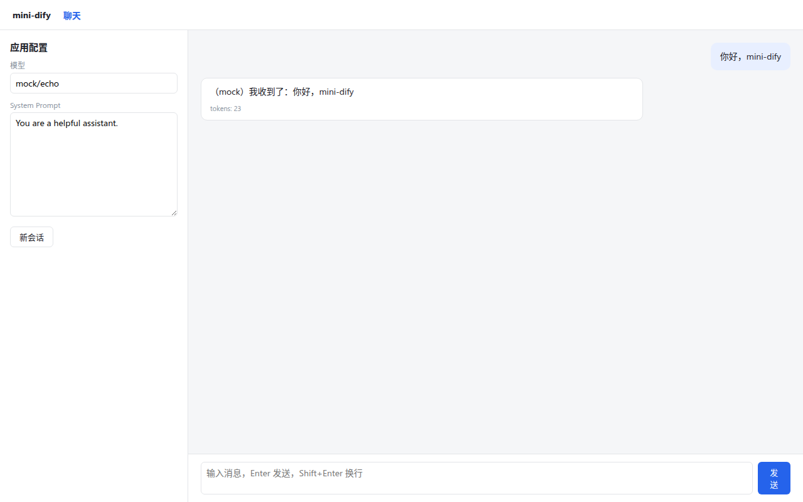

# Lab 1：mini-dify v0.1 —— 能流式对话的聊天应用

> 目标：从一个空目录开始，写出一个前后端都能运行的流式聊天应用。它包含模型抽象（mock + OpenAI 兼容）、提示词模板、带 token 预算的记忆、SSE 和 React 聊天界面。
> 完成后的代码：`code/mini-dify` 的 tag **v0.1**（`git checkout v0.1`）。

## 最终效果



> 截图拍摄于写作时的第一次运行，“发送”按钮被挤成竖排的问题在后面的“踩坑记录”里修复了。

## 第 1 步：后端骨架（5 分钟）

```bash
mkdir -p mini-dify/backend/app/{llm,api,prompt} mini-dify/backend/tests mini-dify/frontend
cd mini-dify/backend
```

`pyproject.toml`：

```toml
[project]
name = "mini-dify"
version = "0.1.0"
requires-python = ">=3.11"
dependencies = ["fastapi>=0.115", "uvicorn[standard]>=0.30", "httpx>=0.27", "pydantic>=2.7", "python-dotenv>=1.0"]

[dependency-groups]
dev = ["pytest>=8"]

[tool.pytest.ini_options]
testpaths = ["tests"]
pythonpath = ["."]
```

```bash
uv sync
touch app/__init__.py app/api/__init__.py app/prompt/__init__.py
```

写 `app/config.py`，内容是一个 frozen dataclass，从环境变量读取 `DEFAULT_MODEL`、`OPENAI_BASE_URL`、`OPENAI_API_KEY`、`MOCK_DELAY`、`MEMORY_MAX_TOKENS`。完整代码见仓库，第 4 章有讲解。

**检查点**：`uv run python -c "from app.config import settings; print(settings)"` 能打印出默认配置。

## 第 2 步：模型层（第 4 章）

按以下顺序写文件，每写完一个就在 Python 里 import 一下，确保没有语法错误：

| 顺序 | 文件 | 要点 |
|---|---|---|
| 1 | `app/llm/entities.py` | `Message`、`ToolCall`、`ToolSpec`、`Usage`、`LLMChunk`；`to_openai()` 方法 |
| 2 | `app/llm/tokens.py` | `estimate_tokens`：中文 1 字 1 token，其余约 4 字符 1 token |
| 3 | `app/llm/base.py` | `ModelProvider.invoke()` 抽象方法、`collect()` |
| 4 | `app/llm/mock.py` | 逐字 yield，最后一片带 usage；多轮时说“第 N 轮” |
| 5 | `app/llm/openai_compat.py` | httpx 流式请求；按 `index` 拼接 tool_calls |
| 6 | `app/llm/manager.py` | `register_provider`、`ModelInstance`、`get_model("provider/model")` |
| 7 | `app/llm/__init__.py` | 统一导出 |

**检查点**：

```bash
uv run python -c "
from app.llm import get_model, Message, collect
print(collect(get_model('mock/echo').invoke([Message('user','hi')])))"
```

输出 `LLMChunk(delta='（mock）我收到了：hi', tool_calls=[], finish_reason='stop', usage=Usage(...))`。

## 第 3 步：模板与记忆（第 5 章）

- `app/prompt/template.py`：`extract_variables`、`render`（找不到的变量保持原样）；
- `app/memory.py`：`ConversationStore`（加锁的内存字典）、`history_within_budget`。

## 第 4 步：SSE 与聊天接口（第 6 章）

- `app/sse.py`：`sse_line`、`sse_response`（带 `X-Accel-Buffering: no`）；
- `app/api/chat.py`：`POST /api/chat-messages`。流程是渲染 system → 拼接历史 → 加入本轮问题 → 流式调用 → `message` 事件 → 成功后写入历史 → `message_end` 事件；
- `app/main.py`：`create_app()`，挂 CORS 中间件，加 `/api/health`，注册 chat 路由。

**检查点**：

```bash
uv run uvicorn app.main:app --reload --port 5001
curl -s localhost:5001/api/health          # {"status":"ok","providers":["mock","openai"]}
curl -N -X POST localhost:5001/api/chat-messages -H 'Content-Type: application/json' -d '{"query":"你好"}'
```

## 第 5 步：测试

`tests/conftest.py` 把 `MOCK_DELAY` 设为 0（测试时不需要模拟打字效果）；`tests/test_chat.py` 覆盖以下用例：

```python
def test_chat_streams_and_remembers(): ...         # 第二轮回复包含“第 2 轮”
def test_unknown_provider_reports_error_event(): ...# 未知 provider → 最后一个事件是 error
def test_template(): ...
def test_history_budget_drops_oldest_turns(): ...
```

```bash
uv run pytest -q     # 4 passed
```

## 第 6 步：前端

```bash
cd ../frontend
npm init -y   # 然后把 package.json 改成 "type": "module"，加入 dev/build 脚本
npm install react react-dom react-router-dom
npm install -D vite @vitejs/plugin-react typescript @types/react @types/react-dom
```

需要写的文件：

| 文件 | 内容 |
|---|---|
| `vite.config.ts` | 开发服务器端口 3000，把 `/api` 代理到 `http://localhost:5001`，这样浏览器只面对同一个源，不存在跨域问题 |
| `tsconfig.json`、`index.html` | 常规配置 |
| `src/lib/sse.ts` | `ssePost`（第 6 章的两个坑都要处理） |
| `src/pages/ChatPage.tsx` | 左侧：模型、System Prompt、“新会话”按钮；右侧：消息列表和输入框；每个 `message` 事件都用 `patchLast` 不可变地更新最后一条气泡 |
| `src/main.tsx`、`src/styles.css` | 路由和样式 |

`ChatPage` 的核心逻辑：

```tsx
await ssePost('/api/chat-messages',
  { query: q, conversation_id: conversationId.current, system_prompt: systemPrompt, model },
  (e) => {
    if (e.event === 'message') {
      conversationId.current = e.conversation_id
      patchLast((it) => ({ ...it, content: it.content + e.answer }))
    } else if (e.event === 'message_end') {
      patchLast((it) => ({ ...it, usage: e.metadata.usage }))
    } else if (e.event === 'error') {
      patchLast((it) => ({ ...it, content: e.message, error: true }))
    }
  },
  abort.current.signal)
```

**检查点**：

```bash
npm run build      # 类型检查 + 构建通过
npm run dev        # 打开 http://localhost:3000
```

发两句话，第二句的回复里会出现“这是我们第 2 轮对话”。

## 第 7 步：换成真实模型

```bash
# backend/.env
DEFAULT_MODEL=openai/qwen2.5:7b
OPENAI_BASE_URL=http://localhost:11434/v1
OPENAI_API_KEY=ollama
```

或者不改 `.env`，直接在页面左侧的“模型”输入框里填 `openai/<模型名>`。

## 本 Lab 的验收清单

- [ ] `uv run pytest -q` 全部通过
- [ ] curl 能看到逐行出现的 `message` 事件，最后是 `message_end`，里面有 usage
- [ ] 浏览器中文字逐字出现，“停止”按钮能中断接收
- [ ] 新会话按钮会清空记忆；同一会话里第二轮能体现记忆
- [ ] 模型名写错时，界面显示错误信息，而不是一直卡在加载状态

## 写作时踩到的坑（真实记录）

1. **按钮文字竖排**：flex 布局下“发送”按钮被挤成了竖排的两个字。修复方法是给按钮加 `white-space: nowrap`。这是写作时用无头浏览器截图才发现的，所以 **UI 一定要真的打开看一眼**。
2. **pytest 找不到 `app` 模块**：需要在 `pyproject.toml` 的 pytest 配置里加 `pythonpath = ["."]`。

## 下一步

v0.1 只能“问一句、答一句”。Part III 要做的是让用户能编排**任意多步骤**的流程，这就需要一个图执行引擎。
