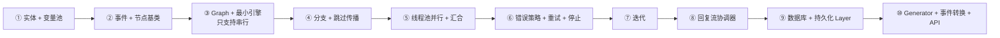

# Lab 2：mini-dify v0.2 —— DAG 工作流引擎 + 控制台 API

> 目标：在 v0.1 的基础上，加入工作流引擎（变量池、并行、分支、汇合、迭代、错误策略、回复流）、持久化，以及一套和 Dify 同构的控制台 API。完成后，用 curl 提交一张 JSON 图，就能流式看到每个节点的执行过程。
> 起点：`git checkout v0.1`；终点：`git checkout v0.2`；查看全部改动：`git diff v0.1 v0.2 --stat`。

## 推荐的构建顺序

不要试图一口气写完。按照**“先串行、再分支、再并行、再容器”**的顺序，每一步都先写测试：



### ① 实体与变量池（第 7、8 章）

```bash
uv add "sqlalchemy>=2.0" "jinja2>=3.1" "pyyaml>=6"
mkdir -p app/workflow/nodes
```

- `app/workflow/entities.py`：`NodeType`、`NodeState`、`ExecutionType`、`ErrorStrategy`、`RunStatus`、`EdgeConfig`、`NodeConfig`、`GraphConfig`、`RetryConfig`、`BaseNodeData`、`NodeRunResult`；
- `app/workflow/variables.py`：`VariablePool`、`VARIABLE_TEMPLATE`、`value_to_text`、`infer_type`、`template_selectors`、`split_template`。

**检查点**：运行第 8 章 8.5 节的脚本，输出完全一致。

### ② 事件与节点基类（第 9、10 章）

- `app/workflow/events.py`：图级事件（Started/Succeeded/PartialSucceeded/Failed/Aborted）、节点事件（Started/StreamChunk/Succeeded/Failed/Exception/Retry）、边事件、迭代事件、`ResponseChunk`；
- `app/workflow/nodes/base.py`：`RunContext`、`Node`（`run()` / `_run()` / `event()` / `effective_execution_type` / `variable_selectors`）；
- `app/workflow/nodes/registry.py`。

先写 Start、End、模板转换三个最简单的节点，就足够测试引擎了。

### ③ 最小引擎：只支持串行

先写一个只会“所有出边 TAKEN”的 `GraphEngine`，没有线程池，节点同步运行。用 `tests/helpers.py` 的 `node()` / `edge()` / `run_graph()` 写出第一个测试：

```python
def test_linear():
    events, pool, _ = run_graph(
        [START, code("double", "return {'y': x * 2}", ["start", "x"]), end(["double", "y"])],
        [edge("start", "double"), edge("double", "end")],
        {"x": 21},
    )
    assert events[-1].outputs == {"result": 42}
```

### ④ 分支与跳过传播

加入 IF/ELSE 节点（`if_else.py`）、变量聚合节点，以及引擎的 `_take_branch` / `_skip_edge` / `_is_ready`。测试是第 9 章的例 B，x=99 和 x=1 两种情况都要覆盖。

### ⑤ 并行

把同步执行改成 `ThreadPoolExecutor` + 事件队列。这一步结构变化最大：

- `_enqueue` 改为 `submit(self._execute, node, delay)`；
- `run()` 的主循环改为 `events.get(timeout=0.1)` → `_handle`；
- 记住不变量：**状态只在 dispatcher 线程里修改**。

**检查点**：`test_parallel_branches_run_concurrently_and_join_waits_for_both` 通过，两个 0.5 秒的节点总耗时小于 1.5 秒。

### ⑥ 错误策略、重试、停止（第 12 章）

`_on_failed`、`commands.py`、`_process_commands`。5 个测试：终止、默认值、异常分支、重试、停止。

### ⑦ 迭代（第 11 章）

`iteration.py`。注意两个坑：每轮要有**独立的停止标志**；子图的边事件不要转发出去。

### ⑧ 回复流协调器（第 10 章）

`response.py`，以及 LLM 节点（`llm.py`）。两个测试：模板顺序、未选中分支上的 Answer 不输出任何内容。

### ⑨ 数据库与持久化（第 13 章）

- `app/db.py`：engine、WAL 模式、`session_scope`、`init_db`；
- `app/models.py`：`App`、`Workflow`、`WorkflowRun`、`NodeExecution`、`Conversation`、`Message`；
- `app/apps/persistence.py`：`PersistenceLayer`；
- `app/workflow/layers.py`：`Layer`、`ExecutionLimitsLayer`。

### ⑩ Generator、事件转换、API（第 3、6 章）

- `app/apps/converter.py`：引擎事件 → Dify 风格的 SSE 字典（Workflow 用 `text_chunk`，Chatflow 用 `message` 和 `message_end`）；
- `app/apps/generator.py`：准备 → 工作线程 → 队列 → `stream()`（带 ping），以及 `TaskRegistry`（停止）和 `blocking()`；
- `app/services/workflow_service.py`：默认图、草稿、乐观锁、发布；
- `app/services/dsl.py`、`app/services/single_node.py`；
- `app/api/apps.py`：所有路由；`app/main.py`：lifespan 里调用 `init_db()`。

## 完整的 API 一览（v0.2）

| 方法 | 路径 | 作用 |
|---|---|---|
| GET / POST | `/api/apps` | 应用列表 / 创建应用（`mode`: workflow 或 advanced-chat） |
| GET / PATCH / DELETE | `/api/apps/{id}` | 查看 / 修改 / 删除 |
| GET / POST | `/api/apps/{id}/workflows/draft` | 获取草稿 / 保存草稿（带 hash，冲突返回 409） |
| GET | `/api/apps/{id}/workflows/draft/checklist` | 图校验的问题列表 |
| POST | `/api/apps/{id}/workflows/publish` | 发布（校验不通过返回 400 和问题列表） |
| POST | `/api/apps/{id}/workflows/draft/run` | 运行草稿（SSE；`response_mode=blocking` 时返回 JSON） |
| POST | `/api/apps/{id}/workflow-runs/tasks/{task_id}/stop` | 停止运行 |
| GET | `/api/apps/{id}/workflow-runs[/{run_id}[/node-executions]]` | 运行记录 |
| GET / POST | `/api/apps/{id}/workflows/draft/nodes/{node_id}/variables` / `run` | 单步调试 |
| GET / POST | `/api/apps/{id}/export` / `/api/apps/import` | DSL 导出 / 导入 |

## 端到端演示

```bash
cd backend && uv run uvicorn app.main:app --port 5001
```

**1. 一张带并行和汇合的图**（直接写 JSON，不用画布）：

```bash
APP=$(curl -s -X POST localhost:5001/api/apps -H 'Content-Type: application/json' -d '{"name":"并行演示"}' \
      | python3 -c 'import sys,json;print(json.load(sys.stdin)["id"])')
HASH=$(curl -s localhost:5001/api/apps/$APP/workflows/draft | python3 -c 'import sys,json;print(json.load(sys.stdin)["hash"])')

cat > /tmp/graph.json <<'EOF'
{"nodes": [
  {"id": "start", "data": {"type": "start", "title": "开始", "variables": [{"variable": "q", "type": "text-input"}]}},
  {"id": "a", "data": {"type": "code", "title": "慢任务A", "code": "def main():\n    import time; time.sleep(1)\n    return {'v': 'A'}\n", "outputs": {"v": {"type": "string"}}}},
  {"id": "b", "data": {"type": "code", "title": "慢任务B", "code": "def main():\n    import time; time.sleep(1)\n    return {'v': 'B'}\n", "outputs": {"v": {"type": "string"}}}},
  {"id": "join", "data": {"type": "template-transform", "title": "汇合",
     "variables": [{"variable": "a", "value_selector": ["a", "v"]}, {"variable": "b", "value_selector": ["b", "v"]}],
     "template": "{{ a }}+{{ b }}"}},
  {"id": "end", "data": {"type": "end", "title": "结束", "outputs": [{"variable": "r", "value_selector": ["join", "output"]}]}}
],
"edges": [
  {"id": "e1", "source": "start", "target": "a"}, {"id": "e2", "source": "start", "target": "b"},
  {"id": "e3", "source": "a", "target": "join"}, {"id": "e4", "source": "b", "target": "join"},
  {"id": "e5", "source": "join", "target": "end"}
]}
EOF
python3 -c "import json;print(json.dumps({'graph': json.load(open('/tmp/graph.json')), 'hash': '$HASH'}))" \
  | curl -s -X POST localhost:5001/api/apps/$APP/workflows/draft -H 'Content-Type: application/json' -d @-

time curl -sN -X POST localhost:5001/api/apps/$APP/workflows/draft/run -H 'Content-Type: application/json' \
     -d '{"inputs":{"q":"x"}}' | grep -o '"event": "[a-z_]*"\|"node_id": "[a-z]*"\|"r": "[^"]*"'
```

可以看到：a 和 b 的 `node_started` 几乎同时出现，`join` 在两者都完成之后才开始；总耗时约 1 秒而不是 2 秒，最终输出 `"r": "A+B"`。

**2. 停止**：MOCK_DELAY 设大一些，然后从另一个终端调用 stop（第 3 章 3.11 节有完整命令）。写作时的实际结果是：`workflow_finished` 的 `status` 为 `"stopped"`，`error` 为 `"用户停止"`。

**3. Chatflow 的记忆**：

```bash
CHAT=$(curl -s -X POST localhost:5001/api/apps -H 'Content-Type: application/json' -d '{"name":"chat","mode":"advanced-chat"}' \
       | python3 -c 'import sys,json;print(json.load(sys.stdin)["id"])')
CONV=$(curl -sN -X POST localhost:5001/api/apps/$CHAT/workflows/draft/run -H 'Content-Type: application/json' \
       -d '{"query":"第一句"}' | grep message_end | sed 's/data: //' | python3 -c 'import sys,json;print(json.load(sys.stdin)["conversation_id"])')
curl -sN -X POST localhost:5001/api/apps/$CHAT/workflows/draft/run -H 'Content-Type: application/json' \
     -d "{\"query\":\"第二句\",\"conversation_id\":\"$CONV\"}" | grep '"event": "message"' | tail -3
# 最后几个片段会拼出“这是我们第 2 轮对话”
```

## 验收清单

- [ ] `uv run pytest -q`：22 个测试全部通过（v0.2 的数量），连续多跑几次也不出现偶发失败
- [ ] 并行演示总耗时约 1 秒
- [ ] stop 之后状态为 stopped，下游节点没有执行
- [ ] `workflow-runs` 和 `node-executions` 能查到完整记录
- [ ] 用旧 hash 保存草稿返回 409；有问题的图发布时返回 400 和问题列表

## 写作时踩到的坑（真实记录）

先说两个**写完代码自查时发现、在跑测试之前就修掉的**隐患（没有实际触发过，但值得你知道）：

- **汇合节点可能被执行两次**：跳过传播和走边可能在同一次遍历中返回同一个汇合节点。修复方法是给 `_enqueue` 加幂等检查：节点状态不是 UNKNOWN 就跳过。
- **迭代的一轮失败可能停掉整个工作流**：如果所有轮次共用外层的 `stop_event` 就会这样。修复方法是每轮使用独立的停止标志，再通过 `parent` 链接到外层。

下面三个是**测试或实际运行时真正踩到的**：

1. **`'EdgeTaken' object has no attribute 'node_id'`**：迭代把子图的边事件也转发了出去。修复方法有两处：子图的边事件不转发；`_is_own()` 先判断事件是不是 `NodeEvent`。
2. **迭代内部的 token 没有计入总数**：修复方法是把每轮子引擎的 `total_tokens` 汇总到迭代节点的结果里。
3. **`pkill -f uvicorn` 把执行这条命令的 shell 也一起杀掉了**：`-f` 会匹配完整的命令行，而这条命令自己的命令行里就包含 "uvicorn"。改用 `fuser -k 5001/tcp` 按端口结束进程，或者用 `grep "[u]vicorn"` 这种写法，让模式匹配不到自身。

## 下一步

现在只能手写 JSON 来编排工作流。Part IV 会在浏览器里实现一个可以拖拽编排的画布，并且可以直接在画布上调试运行。
