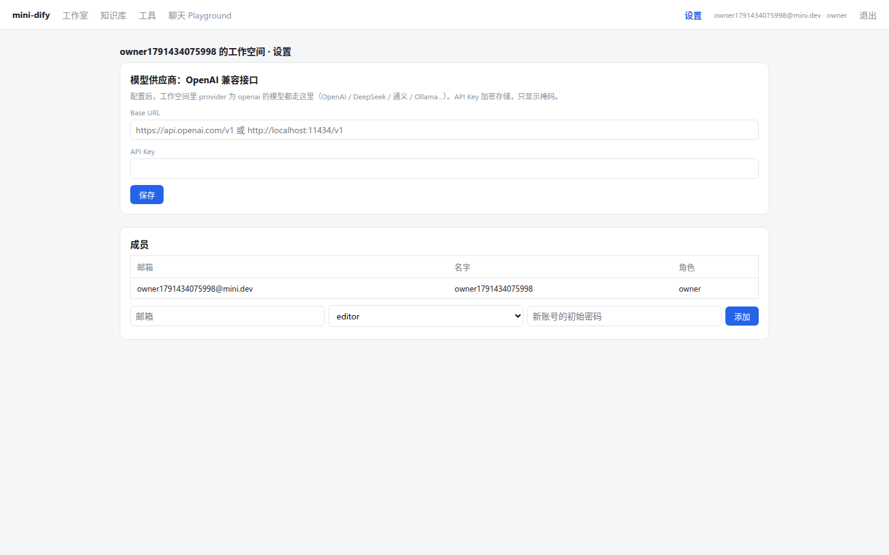
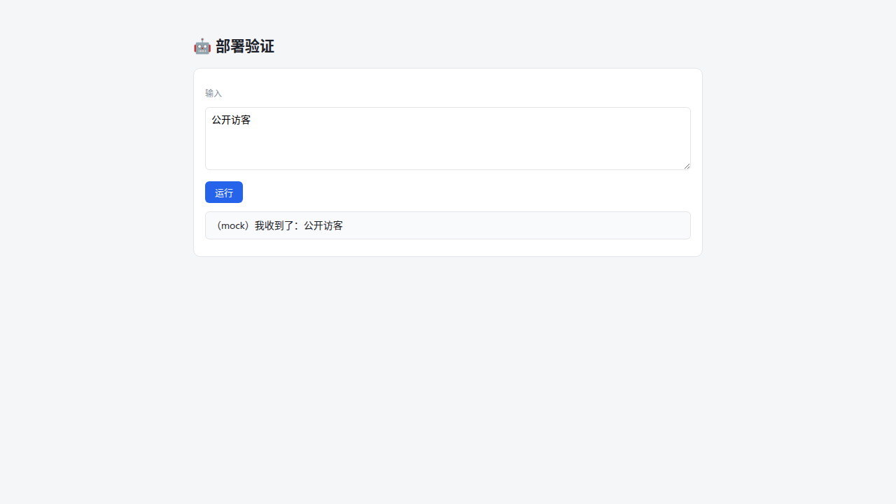

# Lab 6：mini-dify v1.0 —— 平台化与一键部署

> 目标：多租户与权限、API Key 与 Service API、分享页、Webhook 和定时触发、插件、SSRF 防护 / 沙箱 / 凭证加密、Redis 事件总线 + Celery Worker、Docker Compose 一键部署。
> 起点 `v0.5`，终点 `v1.0`。这是改动最大的一版：`git diff v0.5 v1.0 --stat`。

## 依赖

```bash
cd backend && uv add "cryptography>=42" "redis>=5" "celery>=5.4" "psycopg[binary]>=3.2"
```

## 构建顺序

| 步骤 | 内容 | 章节 |
|---|---|---|
| 1 | `config.py` 增加平台相关配置；`security/ssrf.py`、`sandbox.py`、`crypto.py`，并接入 HTTP 节点、代码节点和 MCP 客户端 | 27 |
| 2 | `models.py`：`Tenant`、`Account`、`TenantMember`、`ApiToken`、`ProviderCredential`；各业务表增加 `tenant_id`；App 增加分享、Webhook、定时相关的字段 | 24 |
| 3 | `auth.py`（依赖注入）、`api/auth.py`（注册、登录、成员、模型凭证） | 24 |
| 4 | `get_model(spec, tenant_id)` 读取工作空间凭证；`RunContext.tenant_id` 一路传到 LLM、Agent、检索、工具 | 24 |
| 5 | `plugins.py` + `plugins/text_tools/` | 26 |
| 6 | `tasks/bus.py`、`channels.py`、`celery_app.py`、`__init__.py`（submit） | 25 |
| 7 | `apps/generator.py` 重构为 prepare / execute / generate / run_async | 25 |
| 8 | `api/apps.py`、`datasets.py`、`tools.py`、`chat.py` 全部加上 ctx 和租户隔离；API Key、触发器配置接口 | 24、28 |
| 9 | `scheduler.py`、`api/service.py`（/v1、/api/web、/triggers/webhook）、MCP Server 增加鉴权 | 24、28 |
| 10 | 测试：`conftest` 增加登录态 client 夹具；`test_platform.py` | — |
| 11 | 前端：`lib/auth.ts`、api 和 sse 带上鉴权头、登录页、设置页、PublishPanel、分享页、路由守卫 | 24 |
| 12 | `backend/Dockerfile`、`frontend/Dockerfile`、`docker/nginx.conf`、`docker/docker-compose.yml` | 28 |

## 三种运行方式

**① 单进程开发模式**（和以前一样，只是需要先注册账号）：

```bash
cd backend && cp .env.example .env && uv sync && uv run uvicorn app.main:app --reload --port 5001
cd frontend && npm install && npm run dev        # http://localhost:3000 → 注册
```

**② 本地多进程模式**（体验横向扩展）：

```bash
docker run -d --rm -p 6379:6379 redis:7-alpine
cd backend
export REDIS_URL=redis://localhost:6379/0 EXECUTION_MODE=worker SCHEDULER_ENABLED=false
uv run uvicorn app.main:app --port 5001 &
uv run celery -A app.tasks.celery_app worker -l info -c 4 &
uv run python -m app.scheduler &
```

**③ Docker Compose**：

```bash
cd docker && docker compose up -d --build        # http://localhost:8080
```

## 端到端验收（写作时在 Docker Compose 环境中实际执行过）

| 步骤 | 预期 |
|---|---|
| 未登录访问 `/` | 跳转到 `/login` |
| 注册 | 自动创建工作空间，角色为 owner |
| 新建 Workflow 应用并运行 | 由 worker 执行，事件通过 Redis Stream 流式回传，状态 succeeded |
| 发布 → 访问与触发 → 创建 API Key | 显示 key 和 curl 示例 |
| 用 key 调用 `/v1/workflows/run`（blocking） | succeeded，triggered_from = api |
| 开启分享，在无痕窗口打开分享链接 | 不登录也能运行 |
| 知识库上传文本 | worker 异步完成索引，召回测试能命中 |
| 调用 Webhook URL | 返回 202 和 run_id，稍后查询到 succeeded |
| 用 MCP 客户端访问 `/mcp/{app_id}`（带 Bearer key） | tools/list 和 tools/call 都正常 |
| 设置 → 模型供应商 | key 只显示掩码，数据库里存的是密文 |
| 设置 → 成员 → 添加一个 normal 成员并用他登录 | 能查看应用，但新建应用会被拒绝（403） |





## 测试

```bash
cd backend
uv run pytest -q                                              # 52 passed, 1 skipped（Redis 测试）
docker run -d --rm -p 6399:6379 redis:7-alpine
REDIS_TEST_URL=redis://localhost:6399/0 uv run pytest -q      # 53 passed
```

## 写作时踩到的坑与补上的漏洞（真实记录）

1. **SQLite 锁库**：调度器在事务里调用了 `run_async`（第 28 章 28.3.4）。
2. **租户过滤让旧测试失败**：测试辅助函数没有带 tenant_id，检索不到数据。我们选择修改测试，而不是放宽过滤条件（第 24 章）。
3. **`pkill -f` 杀掉了自己**：改用 `grep "[a]pp..."` 的写法（第 25 章）。
4. **E2E 测试脚本选错了元素**：第一个 `code.mono` 是 Webhook URL，而不是 API Key。改为按内容 `app-` 来选（测试脚本的 bug）。
5. **SSRF 防护拦住了自己的验证脚本**：本地脚本访问 localhost 被拒绝。这说明防护确实在起作用。给脚本加上 `SSRF_ALLOW_PRIVATE=true` 就可以了。
6. **写书时对照 Dify 发现的三个漏洞**（都已修复，并在 v1.0 tag 上加了回归测试）：
   - 工作流即工具没有调用深度限制 → 增加 `MAX_CALL_DEPTH=5`（第 19 章）；
   - stdio MCP 在多租户场景下等于允许远程执行命令 → 增加 `MCP_ALLOW_STDIO` 开关，Compose 里设为关闭（第 20 章）；
   - 迭代并发度只有前端做了限制 → 后端也限制为最多 10（第 27 章）。

## 下一步

恭喜，你已经从零写出了一个完整的 AI 平台。附录 A 是一张“概念 → Dify 源码”的地图。接下来最好的学习方式，是挑一个你最感兴趣的模块，打开 Dify 对应的目录，对照你自己写的版本，看看它多处理了哪些情况，以及为什么要处理这些情况。
